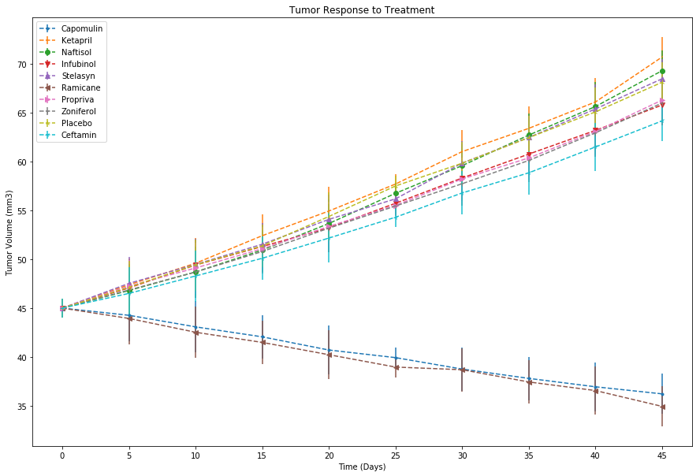

## Pymaceuticals Inc.
### - Capomulin and Ramicane were the only one effective in reducing tumor size by around 10 mm3. Other drugs increased it by atleast 15 mm3 to almost 25 mm3.
### - Capomulin and Ramicane showed the lowest of spread of cancer the with lower than 1.5 matastatic sites. Other drugs showed higher than 1.5 metastatic sites and highest at around 3.0 metastatic sites.
### - Capomulin and Ramicane boasts a 80% survival rate. Other drugs range from 60% to lowest of around 30%.


```python
import matplotlib.pyplot as plt
from scipy.stats import sem
import numpy as np
import pandas as pd

df_clinic = pd.read_csv("clinicaltrial_data.csv")
df_mouse = pd.read_csv("mouse_drug_data.csv")

df = pd.merge(df_clinic,df_mouse,on='Mouse ID')
markers = ['.',",","o","v","^","<",">","1","2","3","4","8","s","p","P","*","h","H","+","x","X","D","d","|","_"]
drug_names = df.Drug.unique()
```

## Tumor Response to Treament


```python
df_tumor = df.groupby(['Drug','Timepoint'])['Tumor Volume (mm3)'].mean()
df_tumor = df_tumor.reset_index(['Drug','Timepoint'])

tumor_vol = [df_tumor.loc[df_tumor['Drug'] == i]['Tumor Volume (mm3)'] for i in drug_names]

df_tumor_final = pd.DataFrame({drug_names[i]: tumor_vol[i] for i in range(len(drug_names))})
df_tumor_final['Timepoint'] = df_tumor['Timepoint']
df_tumor_final = df_tumor_final.groupby('Timepoint').mean()
df_tumor_final
```


<div>
<style>
    .dataframe thead tr:only-child th {
        text-align: right;
    }

    .dataframe thead th {
        text-align: left;
    }

    .dataframe tbody tr th {
        vertical-align: top;
    }
</style>
<table border="1" class="dataframe">
  <thead>
    <tr style="text-align: right;">
      <th></th>
      <th>Capomulin</th>
      <th>Ceftamin</th>
      <th>Infubinol</th>
      <th>Ketapril</th>
      <th>Naftisol</th>
      <th>Placebo</th>
      <th>Propriva</th>
      <th>Ramicane</th>
      <th>Stelasyn</th>
      <th>Zoniferol</th>
    </tr>
    <tr>
      <th>Timepoint</th>
      <th></th>
      <th></th>
      <th></th>
      <th></th>
      <th></th>
      <th></th>
      <th></th>
      <th></th>
      <th></th>
      <th></th>
    </tr>
  </thead>
  <tbody>
    <tr>
      <th>0</th>
      <td>45.000000</td>
      <td>45.000000</td>
      <td>45.000000</td>
      <td>45.000000</td>
      <td>45.000000</td>
      <td>45.000000</td>
      <td>45.000000</td>
      <td>45.000000</td>
      <td>45.000000</td>
      <td>45.000000</td>
    </tr>
    <tr>
      <th>5</th>
      <td>44.266086</td>
      <td>46.503051</td>
      <td>47.062001</td>
      <td>47.389175</td>
      <td>46.796098</td>
      <td>47.125589</td>
      <td>47.248967</td>
      <td>43.944859</td>
      <td>47.527452</td>
      <td>46.851818</td>
    </tr>
    <tr>
      <th>10</th>
      <td>43.084291</td>
      <td>48.285125</td>
      <td>49.403909</td>
      <td>49.582269</td>
      <td>48.694210</td>
      <td>49.423329</td>
      <td>49.101541</td>
      <td>42.531957</td>
      <td>49.463844</td>
      <td>48.689881</td>
    </tr>
    <tr>
      <th>15</th>
      <td>42.064317</td>
      <td>50.094055</td>
      <td>51.296397</td>
      <td>52.399974</td>
      <td>50.933018</td>
      <td>51.359742</td>
      <td>51.067318</td>
      <td>41.495061</td>
      <td>51.529409</td>
      <td>50.779059</td>
    </tr>
    <tr>
      <th>20</th>
      <td>40.716325</td>
      <td>52.157049</td>
      <td>53.197691</td>
      <td>54.920935</td>
      <td>53.644087</td>
      <td>54.364417</td>
      <td>53.346737</td>
      <td>40.238325</td>
      <td>54.067395</td>
      <td>53.170334</td>
    </tr>
    <tr>
      <th>25</th>
      <td>39.939528</td>
      <td>54.287674</td>
      <td>55.715252</td>
      <td>57.678982</td>
      <td>56.731968</td>
      <td>57.482574</td>
      <td>55.504138</td>
      <td>38.974300</td>
      <td>56.166123</td>
      <td>55.432935</td>
    </tr>
    <tr>
      <th>30</th>
      <td>38.769339</td>
      <td>56.769517</td>
      <td>58.299397</td>
      <td>60.994507</td>
      <td>59.559509</td>
      <td>59.809063</td>
      <td>58.196374</td>
      <td>38.703137</td>
      <td>59.826738</td>
      <td>57.713531</td>
    </tr>
    <tr>
      <th>35</th>
      <td>37.816839</td>
      <td>58.827548</td>
      <td>60.742461</td>
      <td>63.371686</td>
      <td>62.685087</td>
      <td>62.420615</td>
      <td>60.350199</td>
      <td>37.451996</td>
      <td>62.440699</td>
      <td>60.089372</td>
    </tr>
    <tr>
      <th>40</th>
      <td>36.958001</td>
      <td>61.467895</td>
      <td>63.162824</td>
      <td>66.068580</td>
      <td>65.600754</td>
      <td>65.052675</td>
      <td>63.045537</td>
      <td>36.574081</td>
      <td>65.356386</td>
      <td>62.916692</td>
    </tr>
    <tr>
      <th>45</th>
      <td>36.236114</td>
      <td>64.132421</td>
      <td>65.755562</td>
      <td>70.662958</td>
      <td>69.265506</td>
      <td>68.084082</td>
      <td>66.258529</td>
      <td>34.955595</td>
      <td>68.438310</td>
      <td>65.960888</td>
    </tr>
  </tbody>
</table>
</div>


```python
df_tumor_x = list(df_tumor_final.index.values)
df_tumor_y = [list(df_tumor.loc[df_tumor['Drug'] == drug_names[i]]['Tumor Volume (mm3)']) for i in range(len(drug_names))]
df_tumor_se = [sem(i) for i in df_tumor_y]

plt.figure(figsize=(15,10))
for i in range(len(drug_names)):
    plt.errorbar(df_tumor_x,df_tumor_y[i],yerr=df_tumor_se,marker=markers[i],label=drug_names[i],linestyle='--')

plt.legend(loc='best')
plt.title("Tumor Response to Treatment")
plt.xlabel("Time (Days)")
plt.ylabel("Tumor Volume (mm3)")
plt.xticks(list(df_tumor_x))
plt.show()
```





## Metastatic Response to Treatment


```python
df_meta = df.groupby(['Drug','Timepoint'])['Metastatic Sites'].mean()
df_meta = df_meta.reset_index(['Drug','Timepoint'])

meta_sites = [df_meta.loc[df_meta['Drug'] == i]['Metastatic Sites'] for i in drug_names]

df_meta_final = pd.DataFrame({drug_names[i]: meta_sites[i] for i in range(len(drug_names))})
df_meta_final['Timepoint'] = df_meta['Timepoint']
df_meta_final = df_meta_final.groupby('Timepoint').mean()
df_meta_final
```


<div>
<style>
    .dataframe thead tr:only-child th {
        text-align: right;
    }

    .dataframe thead th {
        text-align: left;
    }

    .dataframe tbody tr th {
        vertical-align: top;
    }
</style>
<table border="1" class="dataframe">
  <thead>
    <tr style="text-align: right;">
      <th></th>
      <th>Capomulin</th>
      <th>Ceftamin</th>
      <th>Infubinol</th>
      <th>Ketapril</th>
      <th>Naftisol</th>
      <th>Placebo</th>
      <th>Propriva</th>
      <th>Ramicane</th>
      <th>Stelasyn</th>
      <th>Zoniferol</th>
    </tr>
    <tr>
      <th>Timepoint</th>
      <th></th>
      <th></th>
      <th></th>
      <th></th>
      <th></th>
      <th></th>
      <th></th>
      <th></th>
      <th></th>
      <th></th>
    </tr>
  </thead>
  <tbody>
    <tr>
      <th>0</th>
      <td>0.000000</td>
      <td>0.000000</td>
      <td>0.000000</td>
      <td>0.000000</td>
      <td>0.000000</td>
      <td>0.000000</td>
      <td>0.000000</td>
      <td>0.000000</td>
      <td>0.000000</td>
      <td>0.000000</td>
    </tr>
    <tr>
      <th>5</th>
      <td>0.160000</td>
      <td>0.380952</td>
      <td>0.280000</td>
      <td>0.304348</td>
      <td>0.260870</td>
      <td>0.375000</td>
      <td>0.320000</td>
      <td>0.120000</td>
      <td>0.240000</td>
      <td>0.166667</td>
    </tr>
    <tr>
      <th>10</th>
      <td>0.320000</td>
      <td>0.600000</td>
      <td>0.666667</td>
      <td>0.590909</td>
      <td>0.523810</td>
      <td>0.833333</td>
      <td>0.565217</td>
      <td>0.250000</td>
      <td>0.478261</td>
      <td>0.500000</td>
    </tr>
    <tr>
      <th>15</th>
      <td>0.375000</td>
      <td>0.789474</td>
      <td>0.904762</td>
      <td>0.842105</td>
      <td>0.857143</td>
      <td>1.250000</td>
      <td>0.764706</td>
      <td>0.333333</td>
      <td>0.782609</td>
      <td>0.809524</td>
    </tr>
    <tr>
      <th>20</th>
      <td>0.652174</td>
      <td>1.111111</td>
      <td>1.050000</td>
      <td>1.210526</td>
      <td>1.150000</td>
      <td>1.526316</td>
      <td>1.000000</td>
      <td>0.347826</td>
      <td>0.952381</td>
      <td>1.294118</td>
    </tr>
    <tr>
      <th>25</th>
      <td>0.818182</td>
      <td>1.500000</td>
      <td>1.277778</td>
      <td>1.631579</td>
      <td>1.500000</td>
      <td>1.941176</td>
      <td>1.357143</td>
      <td>0.652174</td>
      <td>1.157895</td>
      <td>1.687500</td>
    </tr>
    <tr>
      <th>30</th>
      <td>1.090909</td>
      <td>1.937500</td>
      <td>1.588235</td>
      <td>2.055556</td>
      <td>2.066667</td>
      <td>2.266667</td>
      <td>1.615385</td>
      <td>0.782609</td>
      <td>1.388889</td>
      <td>1.933333</td>
    </tr>
    <tr>
      <th>35</th>
      <td>1.181818</td>
      <td>2.071429</td>
      <td>1.666667</td>
      <td>2.294118</td>
      <td>2.266667</td>
      <td>2.642857</td>
      <td>2.300000</td>
      <td>0.952381</td>
      <td>1.562500</td>
      <td>2.285714</td>
    </tr>
    <tr>
      <th>40</th>
      <td>1.380952</td>
      <td>2.357143</td>
      <td>2.100000</td>
      <td>2.733333</td>
      <td>2.466667</td>
      <td>3.166667</td>
      <td>2.777778</td>
      <td>1.100000</td>
      <td>1.583333</td>
      <td>2.785714</td>
    </tr>
    <tr>
      <th>45</th>
      <td>1.476190</td>
      <td>2.692308</td>
      <td>2.111111</td>
      <td>3.363636</td>
      <td>2.538462</td>
      <td>3.272727</td>
      <td>2.571429</td>
      <td>1.250000</td>
      <td>1.727273</td>
      <td>3.071429</td>
    </tr>
  </tbody>
</table>
</div>


```python
df_meta_x = list(df_meta_final.index.values)
df_meta_y = [list(df_meta.loc[df_meta['Drug'] == drug_names[i]]['Metastatic Sites'])for i in range(len(drug_names))]
df_meta_se = [sem(i) for i in df_meta_y]

plt.figure(figsize=(15,10))
for i in range(len(drug_names)):
    plt.errorbar(df_meta_x,df_meta_y[i],yerr=df_meta_se,marker=markers[i],label=drug_names[i], linestyle="--")
     
plt.legend(loc='best')
plt.title("Metastatic Spread During Treatment")
plt.xlabel("Time (Days)")
plt.ylabel("Metastatic Sites")
plt.xticks(list(df_meta_x))
plt.show()
```


## Survival Rates


```python
df_live = df.groupby(['Drug','Timepoint'])['Mouse ID'].count()
df_live = df_live.reset_index(['Drug','Timepoint'])

alive_mouse = [df_live.loc[df_live['Drug'] == i]['Mouse ID'] for i in drug_names]

df_live_final = pd.DataFrame({drug_names[i]: alive_mouse[i] for i in range(len(drug_names))})
df_live_final['Timepoint'] = df_live['Timepoint']
df_live_final = df_live_final.groupby('Timepoint').mean()
df_live_final
```


<div>
<style>
    .dataframe thead tr:only-child th {
        text-align: right;
    }

    .dataframe thead th {
        text-align: left;
    }

    .dataframe tbody tr th {
        vertical-align: top;
    }
</style>
<table border="1" class="dataframe">
  <thead>
    <tr style="text-align: right;">
      <th></th>
      <th>Capomulin</th>
      <th>Ceftamin</th>
      <th>Infubinol</th>
      <th>Ketapril</th>
      <th>Naftisol</th>
      <th>Placebo</th>
      <th>Propriva</th>
      <th>Ramicane</th>
      <th>Stelasyn</th>
      <th>Zoniferol</th>
    </tr>
    <tr>
      <th>Timepoint</th>
      <th></th>
      <th></th>
      <th></th>
      <th></th>
      <th></th>
      <th></th>
      <th></th>
      <th></th>
      <th></th>
      <th></th>
    </tr>
  </thead>
  <tbody>
    <tr>
      <th>0</th>
      <td>25.0</td>
      <td>25.0</td>
      <td>25.0</td>
      <td>25.0</td>
      <td>25.0</td>
      <td>25.0</td>
      <td>26.0</td>
      <td>25.0</td>
      <td>26.0</td>
      <td>25.0</td>
    </tr>
    <tr>
      <th>5</th>
      <td>25.0</td>
      <td>21.0</td>
      <td>25.0</td>
      <td>23.0</td>
      <td>23.0</td>
      <td>24.0</td>
      <td>25.0</td>
      <td>25.0</td>
      <td>25.0</td>
      <td>24.0</td>
    </tr>
    <tr>
      <th>10</th>
      <td>25.0</td>
      <td>20.0</td>
      <td>21.0</td>
      <td>22.0</td>
      <td>21.0</td>
      <td>24.0</td>
      <td>23.0</td>
      <td>24.0</td>
      <td>23.0</td>
      <td>22.0</td>
    </tr>
    <tr>
      <th>15</th>
      <td>24.0</td>
      <td>19.0</td>
      <td>21.0</td>
      <td>19.0</td>
      <td>21.0</td>
      <td>20.0</td>
      <td>17.0</td>
      <td>24.0</td>
      <td>23.0</td>
      <td>21.0</td>
    </tr>
    <tr>
      <th>20</th>
      <td>23.0</td>
      <td>18.0</td>
      <td>20.0</td>
      <td>19.0</td>
      <td>20.0</td>
      <td>19.0</td>
      <td>17.0</td>
      <td>23.0</td>
      <td>21.0</td>
      <td>17.0</td>
    </tr>
    <tr>
      <th>25</th>
      <td>22.0</td>
      <td>18.0</td>
      <td>18.0</td>
      <td>19.0</td>
      <td>18.0</td>
      <td>17.0</td>
      <td>14.0</td>
      <td>23.0</td>
      <td>19.0</td>
      <td>16.0</td>
    </tr>
    <tr>
      <th>30</th>
      <td>22.0</td>
      <td>16.0</td>
      <td>17.0</td>
      <td>18.0</td>
      <td>15.0</td>
      <td>15.0</td>
      <td>13.0</td>
      <td>23.0</td>
      <td>18.0</td>
      <td>15.0</td>
    </tr>
    <tr>
      <th>35</th>
      <td>22.0</td>
      <td>14.0</td>
      <td>12.0</td>
      <td>17.0</td>
      <td>15.0</td>
      <td>14.0</td>
      <td>10.0</td>
      <td>21.0</td>
      <td>16.0</td>
      <td>14.0</td>
    </tr>
    <tr>
      <th>40</th>
      <td>21.0</td>
      <td>14.0</td>
      <td>10.0</td>
      <td>15.0</td>
      <td>15.0</td>
      <td>12.0</td>
      <td>9.0</td>
      <td>20.0</td>
      <td>12.0</td>
      <td>14.0</td>
    </tr>
    <tr>
      <th>45</th>
      <td>21.0</td>
      <td>13.0</td>
      <td>9.0</td>
      <td>11.0</td>
      <td>13.0</td>
      <td>11.0</td>
      <td>7.0</td>
      <td>20.0</td>
      <td>11.0</td>
      <td>14.0</td>
    </tr>
  </tbody>
</table>
</div>


```python
df_live_x = list(df_live_final.index.values)
df_live_y = [list(map(lambda x: x/max(df_live.loc[df_live['Drug'] == drug_names[i]]['Mouse ID']) * 100, df_live.loc[df_live['Drug'] == drug_names[i]]['Mouse ID'])) for i in range(len(drug_names))]
df_live_se = [sem(i) for i in df_live_y]

plt.figure(figsize=(15,10))
for i in range(len(drug_names)):
    plt.errorbar(df_live_x,df_live_y[i],yerr=df_live_se,marker=markers[i],label=drug_names[i],linestyle='--')
    
plt.legend(loc='best')
plt.title("Survival Rate While in Treatment")
plt.xlabel("Time (Days)")
plt.ylabel("Survival Rates (%)")
plt.xticks(list(df_live_x))
plt.show()
```


## Summary Bar Graph


```python
df_tumor_change = round((df_tumor_final.iloc[9]-df_tumor_final.iloc[0])/df_tumor_final.iloc[0]*100)
colors = ['r' if i > 0 else 'g' for i in df_tumor_change]
        
df_tumor_change.plot(x=list(range(len(df_tumor_change))),kind="bar",color=colors,figsize=(20,10),rot=0,
                                            width=1,title="Tumor Change Over 45 Day Treatment",edgecolor='black')

for i in range(len(df_tumor_change)):
    if df_tumor_change[i] > 0:
        plt.text(-0.1+i,2.5,str(int(df_tumor_change[i]))+"%",color='w',fontsize=15)
    else:
        plt.text(-0.15+i,-3.5,str(int(df_tumor_change[i]))+"%",color='w',fontsize=15)
        
plt.grid(linestyle='--')        
plt.xlabel("Drugs")
plt.ylabel("Tumor Volume Change (%)")
plt.show()
```


```python

```
