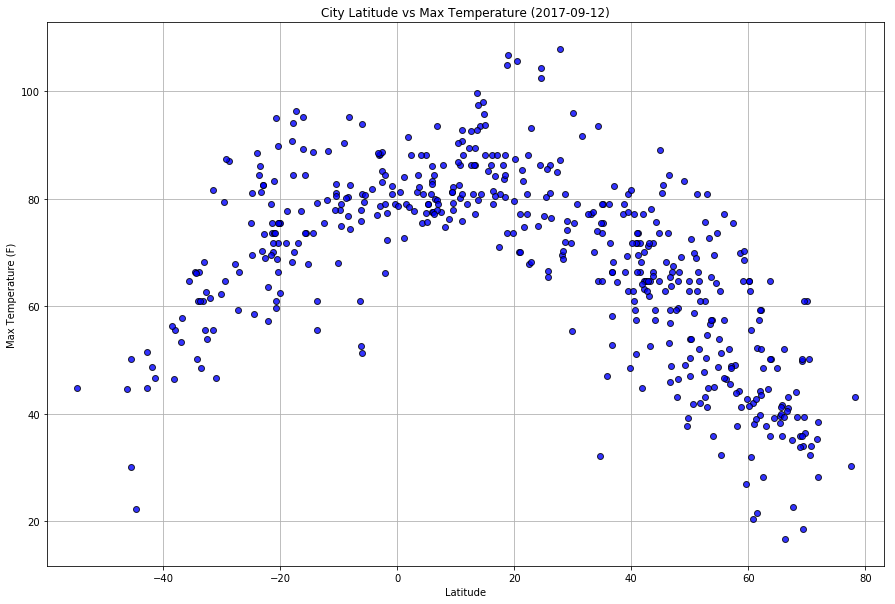
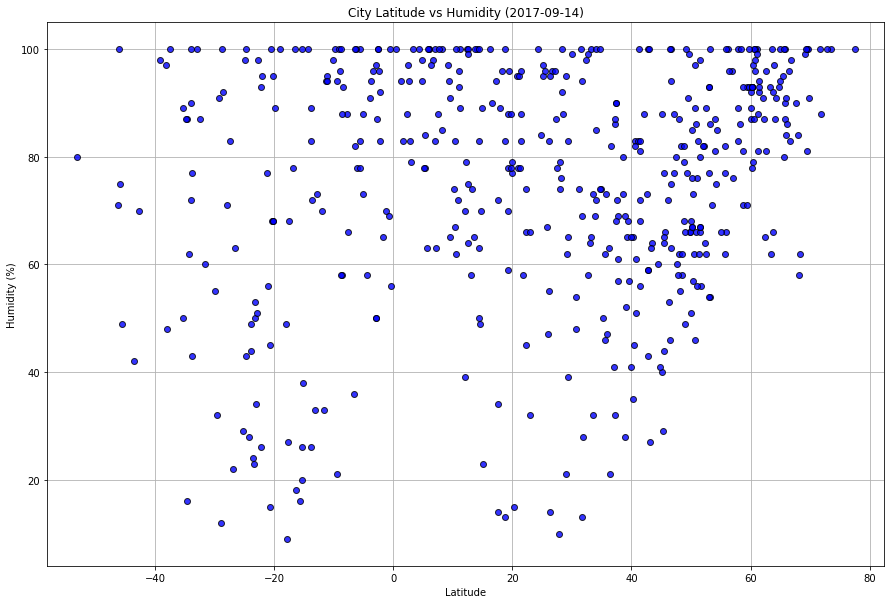
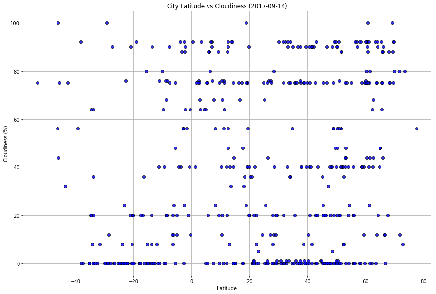
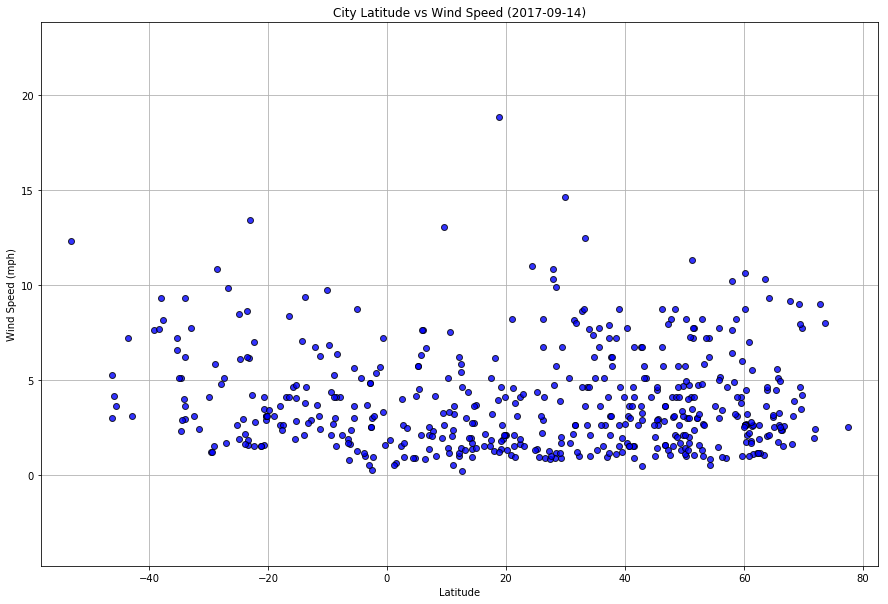

## WeatherPy
### - Cities that are in the range of +- 20 degrees of the equator (0 degree latitude) are the hottest.
### - Cities that are above 60 degree latitude are more likely to be humid.
### - Hard to deduce any info regarding wind speed or cloudiness compared to latitude with this data.


```python
# dependencies
import requests as req
import datetime
import time
import json
from citipy import citipy
import matplotlib.pyplot as plt
import pandas as pd
import random
```


```python
# base url & personal api key
url = "http://api.openweathermap.org/data/2.5/weather"
api_key = "25bc90a1196e6f153eece0bc0b0fc9eb"
df = pd.DataFrame(columns = ['City','Country','Date','Latitude','Longitude',
                            'Max_Temp','Humidity','Cloudiness','Wind_Speed'])
df
```


<div>
<style>
    .dataframe thead tr:only-child th {
        text-align: right;
    }

    .dataframe thead th {
        text-align: left;
    }

    .dataframe tbody tr th {
        vertical-align: top;
    }
</style>
<table border="1" class="dataframe">
  <thead>
    <tr style="text-align: right;">
      <th></th>
      <th>City</th>
      <th>Country</th>
      <th>Date</th>
      <th>Latitude</th>
      <th>Longitude</th>
      <th>Max_Temp</th>
      <th>Humidity</th>
      <th>Cloudiness</th>
      <th>Wind_Speed</th>
    </tr>
  </thead>
  <tbody>
  </tbody>
</table>
</div>


## Generate Cities List


```python
# 3000 sets of lat & long
lat_list = map(lambda x: x / 100, random.sample(range(-9000,9000), 3000))
lng_list = map(lambda x: x / 100, random.sample(range(-18000,18000), 3000))
latlng = list(zip(lat_list,lng_list))

# UNIQUE list of cities from above 3000 sets of lat & long
cities = list(set(list(
    map(lambda x: x.city_name, 
        [citipy.nearest_city(latlng[i][0],latlng[i][1]) for i in range(len(latlng))]))))
```

## Perform API Calls


```python
# api calls of 500 unique cities and adding necessary data to df
for i in range(500):
    query_url = "{}?appid={}&q={}".format(url,api_key,cities[i])
    if i%50 == 0:
        time.sleep(50)
        
    try:
        weather_json = req.get(query_url).json()
        print("*"*50)
        print("API Call {} | City Number: {}, City Name: {}".format(i+1,
                                    weather_json['id'],weather_json['name']))
        print(query_url)
    except:
        print("API call fail T.T")
        break
    
    try:
        df.set_value(i,'City',weather_json['name'])
        df.set_value(i,'Country',weather_json['sys']['country'])
        df.set_value(i,'Date',datetime.datetime.fromtimestamp(weather_json['dt']))
        df.set_value(i,'Latitude',weather_json['coord']['lat'])
        df.set_value(i,'Longitude',weather_json['coord']['lon'])
        df.set_value(i,'Max_Temp',weather_json['main']['temp_max'])
        df.set_value(i,'Humidity',weather_json['main']['humidity'])
        df.set_value(i,'Cloudiness',weather_json['clouds']['all'])
        df.set_value(i,'Wind_Speed',weather_json['wind']['speed'])
    except:
        print('error T.T')
        continue
        
# Save the DataFrame as a csv
df.to_csv("0_WeatherOf500Cities.csv", encoding="utf-8", index=False)
df.head()
```

    **************************************************
    API Call 1 | City Number: 2356228, City Name: Reo
    http://api.openweathermap.org/data/2.5/weather?appid=25bc90a1196e6f153eece0bc0b0fc9eb&q=reo
    **************************************************
    API Call 2 | City Number: 2169535, City Name: Dalby
    http://api.openweathermap.org/data/2.5/weather?appid=25bc90a1196e6f153eece0bc0b0fc9eb&q=dalby
    **************************************************
    API Call 3 | City Number: 935215, City Name: Saint-Philippe
    http://api.openweathermap.org/data/2.5/weather?appid=25bc90a1196e6f153eece0bc0b0fc9eb&q=saint-philippe
    **************************************************
    API Call 4 | City Number: 2017155, City Name: Saskylakh
    http://api.openweathermap.org/data/2.5/weather?appid=25bc90a1196e6f153eece0bc0b0fc9eb&q=saskylakh
    **************************************************
    API Call 5 | City Number: 3545981, City Name: Niquero
    http://api.openweathermap.org/data/2.5/weather?appid=25bc90a1196e6f153eece0bc0b0fc9eb&q=niquero
    **************************************************
    API Call 6 | City Number: 1263997, City Name: Mamallapuram
    http://api.openweathermap.org/data/2.5/weather?appid=25bc90a1196e6f153eece0bc0b0fc9eb&q=mamallapuram
    **************************************************
    API Call 7 | City Number: 64814, City Name: Bandarbeyla
    http://api.openweathermap.org/data/2.5/weather?appid=25bc90a1196e6f153eece0bc0b0fc9eb&q=bandarbeyla
    **************************************************
    API Call 8 | City Number: 1636426, City Name: Manggar
    http://api.openweathermap.org/data/2.5/weather?appid=25bc90a1196e6f153eece0bc0b0fc9eb&q=manggar
    **************************************************
    API Call 9 | City Number: 4278471, City Name: Russell
    http://api.openweathermap.org/data/2.5/weather?appid=25bc90a1196e6f153eece0bc0b0fc9eb&q=russell
    **************************************************
    API Call 10 | City Number: 2377457, City Name: Nouadhibou
    http://api.openweathermap.org/data/2.5/weather?appid=25bc90a1196e6f153eece0bc0b0fc9eb&q=nouadhibou
    **************************************************
    API Call 11 | City Number: 3521972, City Name: Panaba
    http://api.openweathermap.org/data/2.5/weather?appid=25bc90a1196e6f153eece0bc0b0fc9eb&q=panaba
    **************************************************
    API Call 12 | City Number: 1529484, City Name: Hami
    http://api.openweathermap.org/data/2.5/weather?appid=25bc90a1196e6f153eece0bc0b0fc9eb&q=hami
    **************************************************
    API Call 13 | City Number: 1861280, City Name: Itoman
    http://api.openweathermap.org/data/2.5/weather?appid=25bc90a1196e6f153eece0bc0b0fc9eb&q=itoman
    **************************************************
    API Call 14 | City Number: 1259784, City Name: Phek
    http://api.openweathermap.org/data/2.5/weather?appid=25bc90a1196e6f153eece0bc0b0fc9eb&q=phek
    **************************************************
    API Call 15 | City Number: 2400547, City Name: Gamba
    http://api.openweathermap.org/data/2.5/weather?appid=25bc90a1196e6f153eece0bc0b0fc9eb&q=gamba
    **************************************************
    API Call 16 | City Number: 1270576, City Name: Gyanpur
    http://api.openweathermap.org/data/2.5/weather?appid=25bc90a1196e6f153eece0bc0b0fc9eb&q=airai
    **************************************************
    API Call 17 | City Number: 542356, City Name: Krasnogorskoye
    http://api.openweathermap.org/data/2.5/weather?appid=25bc90a1196e6f153eece0bc0b0fc9eb&q=artyk
    **************************************************
    API Call 18 | City Number: 1990589, City Name: Teluknaga
    http://api.openweathermap.org/data/2.5/weather?appid=25bc90a1196e6f153eece0bc0b0fc9eb&q=teluknaga
    **************************************************
    API Call 19 | City Number: 2065594, City Name: Mount Isa
    http://api.openweathermap.org/data/2.5/weather?appid=25bc90a1196e6f153eece0bc0b0fc9eb&q=mount isa
    **************************************************
    API Call 20 | City Number: 1261853, City Name: Narasannapeta
    http://api.openweathermap.org/data/2.5/weather?appid=25bc90a1196e6f153eece0bc0b0fc9eb&q=narasannapeta
    **************************************************
    API Call 21 | City Number: 3379316, City Name: Bom Sucesso
    http://api.openweathermap.org/data/2.5/weather?appid=25bc90a1196e6f153eece0bc0b0fc9eb&q=lethem
    **************************************************
    API Call 22 | City Number: 3472473, City Name: Alto Araguaia
    http://api.openweathermap.org/data/2.5/weather?appid=25bc90a1196e6f153eece0bc0b0fc9eb&q=alto araguaia
    **************************************************
    API Call 23 | City Number: 2021041, City Name: Kyra
    http://api.openweathermap.org/data/2.5/weather?appid=25bc90a1196e6f153eece0bc0b0fc9eb&q=kyra
    **************************************************
    API Call 24 | City Number: 2068655, City Name: Katherine
    http://api.openweathermap.org/data/2.5/weather?appid=25bc90a1196e6f153eece0bc0b0fc9eb&q=katherine
    **************************************************
    API Call 25 | City Number: 2643044, City Name: Margate
    http://api.openweathermap.org/data/2.5/weather?appid=25bc90a1196e6f153eece0bc0b0fc9eb&q=margate
    **************************************************
    API Call 26 | City Number: 3458132, City Name: Mairinque
    http://api.openweathermap.org/data/2.5/weather?appid=25bc90a1196e6f153eece0bc0b0fc9eb&q=mairinque
    **************************************************
    API Call 27 | City Number: 3356832, City Name: Hentiesbaai
    http://api.openweathermap.org/data/2.5/weather?appid=25bc90a1196e6f153eece0bc0b0fc9eb&q=henties bay
    **************************************************
    API Call 28 | City Number: 1489401, City Name: Toora-Khem
    http://api.openweathermap.org/data/2.5/weather?appid=25bc90a1196e6f153eece0bc0b0fc9eb&q=toora-khem
    **************************************************
    API Call 29 | City Number: 3446752, City Name: Taquarituba
    http://api.openweathermap.org/data/2.5/weather?appid=25bc90a1196e6f153eece0bc0b0fc9eb&q=taquarituba
    **************************************************
    API Call 30 | City Number: 2123814, City Name: Leningradskiy
    http://api.openweathermap.org/data/2.5/weather?appid=25bc90a1196e6f153eece0bc0b0fc9eb&q=leningradskiy
    **************************************************
    API Call 31 | City Number: 1214026, City Name: Sabang
    http://api.openweathermap.org/data/2.5/weather?appid=25bc90a1196e6f153eece0bc0b0fc9eb&q=sabang
    **************************************************
    API Call 32 | City Number: 5924351, City Name: Clyde River
    http://api.openweathermap.org/data/2.5/weather?appid=25bc90a1196e6f153eece0bc0b0fc9eb&q=clyde river
    **************************************************
    API Call 33 | City Number: 1252795, City Name: Yanam
    http://api.openweathermap.org/data/2.5/weather?appid=25bc90a1196e6f153eece0bc0b0fc9eb&q=yanam
    **************************************************
    API Call 34 | City Number: 4036284, City Name: Alofi
    http://api.openweathermap.org/data/2.5/weather?appid=25bc90a1196e6f153eece0bc0b0fc9eb&q=alofi
    **************************************************
    API Call 35 | City Number: 1586350, City Name: Cam Ranh
    http://api.openweathermap.org/data/2.5/weather?appid=25bc90a1196e6f153eece0bc0b0fc9eb&q=cam ranh
    **************************************************
    API Call 36 | City Number: 5855927, City Name: Hilo
    http://api.openweathermap.org/data/2.5/weather?appid=25bc90a1196e6f153eece0bc0b0fc9eb&q=hilo
    **************************************************
    API Call 37 | City Number: 2129376, City Name: Kushiro
    http://api.openweathermap.org/data/2.5/weather?appid=25bc90a1196e6f153eece0bc0b0fc9eb&q=kushiro
    **************************************************
    API Call 38 | City Number: 3012319, City Name: Joigny
    http://api.openweathermap.org/data/2.5/weather?appid=25bc90a1196e6f153eece0bc0b0fc9eb&q=joigny
    **************************************************
    API Call 39 | City Number: 2155415, City Name: New Norfolk
    http://api.openweathermap.org/data/2.5/weather?appid=25bc90a1196e6f153eece0bc0b0fc9eb&q=new norfolk
    **************************************************
    API Call 40 | City Number: 3576994, City Name: Cockburn Town
    http://api.openweathermap.org/data/2.5/weather?appid=25bc90a1196e6f153eece0bc0b0fc9eb&q=cockburn town
    **************************************************
    API Call 41 | City Number: 1814093, City Name: Dali
    http://api.openweathermap.org/data/2.5/weather?appid=25bc90a1196e6f153eece0bc0b0fc9eb&q=dali
    **************************************************
    API Call 42 | City Number: 2171845, City Name: Cessnock
    http://api.openweathermap.org/data/2.5/weather?appid=25bc90a1196e6f153eece0bc0b0fc9eb&q=cessnock
    **************************************************
    API Call 43 | City Number: 964420, City Name: Port Elizabeth
    http://api.openweathermap.org/data/2.5/weather?appid=25bc90a1196e6f153eece0bc0b0fc9eb&q=port elizabeth
    **************************************************
    API Call 44 | City Number: 2173323, City Name: Bundaberg
    http://api.openweathermap.org/data/2.5/weather?appid=25bc90a1196e6f153eece0bc0b0fc9eb&q=bundaberg
    **************************************************
    API Call 45 | City Number: 5848280, City Name: Kapaa
    http://api.openweathermap.org/data/2.5/weather?appid=25bc90a1196e6f153eece0bc0b0fc9eb&q=kapaa
    **************************************************
    API Call 46 | City Number: 2122574, City Name: Ola
    http://api.openweathermap.org/data/2.5/weather?appid=25bc90a1196e6f153eece0bc0b0fc9eb&q=ola
    **************************************************
    API Call 47 | City Number: 576558, City Name: Bezhta
    http://api.openweathermap.org/data/2.5/weather?appid=25bc90a1196e6f153eece0bc0b0fc9eb&q=bezhta
    **************************************************
    API Call 48 | City Number: 3881102, City Name: Machali
    http://api.openweathermap.org/data/2.5/weather?appid=25bc90a1196e6f153eece0bc0b0fc9eb&q=machali
    **************************************************
    API Call 49 | City Number: 2171722, City Name: Charters Towers
    http://api.openweathermap.org/data/2.5/weather?appid=25bc90a1196e6f153eece0bc0b0fc9eb&q=charters towers
    **************************************************
    API Call 50 | City Number: 2173911, City Name: Broken Hill
    http://api.openweathermap.org/data/2.5/weather?appid=25bc90a1196e6f153eece0bc0b0fc9eb&q=broken hill
    **************************************************
    API Call 51 | City Number: 292968, City Name: Abu Dhabi
    http://api.openweathermap.org/data/2.5/weather?appid=25bc90a1196e6f153eece0bc0b0fc9eb&q=abu dhabi
    **************************************************
    API Call 52 | City Number: 1716963, City Name: Conduaga
    http://api.openweathermap.org/data/2.5/weather?appid=25bc90a1196e6f153eece0bc0b0fc9eb&q=candawaga
    **************************************************
    API Call 53 | City Number: 5849297, City Name: Kihei
    http://api.openweathermap.org/data/2.5/weather?appid=25bc90a1196e6f153eece0bc0b0fc9eb&q=kihei
    **************************************************
    API Call 54 | City Number: 2309528, City Name: Luba
    http://api.openweathermap.org/data/2.5/weather?appid=25bc90a1196e6f153eece0bc0b0fc9eb&q=luba
    **************************************************
    API Call 55 | City Number: 2206894, City Name: Hokitika
    http://api.openweathermap.org/data/2.5/weather?appid=25bc90a1196e6f153eece0bc0b0fc9eb&q=hokitika
    **************************************************
    API Call 56 | City Number: 1499428, City Name: Mamontovo
    http://api.openweathermap.org/data/2.5/weather?appid=25bc90a1196e6f153eece0bc0b0fc9eb&q=mamontovo
    **************************************************
    API Call 57 | City Number: 2016977, City Name: Serebryanyy Bor
    http://api.openweathermap.org/data/2.5/weather?appid=25bc90a1196e6f153eece0bc0b0fc9eb&q=serebryanyy bor
    **************************************************
    API Call 58 | City Number: 2511930, City Name: Requena
    http://api.openweathermap.org/data/2.5/weather?appid=25bc90a1196e6f153eece0bc0b0fc9eb&q=requena
    **************************************************
    API Call 59 | City Number: 3073599, City Name: Klimkovice
    http://api.openweathermap.org/data/2.5/weather?appid=25bc90a1196e6f153eece0bc0b0fc9eb&q=klimkovice
    **************************************************
    API Call 60 | City Number: 3415667, City Name: Isafjoerdur
    http://api.openweathermap.org/data/2.5/weather?appid=25bc90a1196e6f153eece0bc0b0fc9eb&q=bolungarvik
    **************************************************
    API Call 61 | City Number: 3420768, City Name: Qasigiannguit
    http://api.openweathermap.org/data/2.5/weather?appid=25bc90a1196e6f153eece0bc0b0fc9eb&q=qasigiannguit
    **************************************************
    API Call 62 | City Number: 1734199, City Name: Tawau
    http://api.openweathermap.org/data/2.5/weather?appid=25bc90a1196e6f153eece0bc0b0fc9eb&q=tawau
    **************************************************
    API Call 63 | City Number: 2093059, City Name: Kundiawa
    http://api.openweathermap.org/data/2.5/weather?appid=25bc90a1196e6f153eece0bc0b0fc9eb&q=kundiawa
    **************************************************
    API Call 64 | City Number: 658225, City Name: Helsinki
    http://api.openweathermap.org/data/2.5/weather?appid=25bc90a1196e6f153eece0bc0b0fc9eb&q=lolua
    **************************************************
    API Call 65 | City Number: 1714733, City Name: Dingle
    http://api.openweathermap.org/data/2.5/weather?appid=25bc90a1196e6f153eece0bc0b0fc9eb&q=dingle
    **************************************************
    API Call 66 | City Number: 2035601, City Name: Nenjiang
    http://api.openweathermap.org/data/2.5/weather?appid=25bc90a1196e6f153eece0bc0b0fc9eb&q=nenjiang
    **************************************************
    API Call 67 | City Number: 2297810, City Name: Mumford
    http://api.openweathermap.org/data/2.5/weather?appid=25bc90a1196e6f153eece0bc0b0fc9eb&q=mumford
    **************************************************
    API Call 68 | City Number: 3467577, City Name: Canavieiras
    http://api.openweathermap.org/data/2.5/weather?appid=25bc90a1196e6f153eece0bc0b0fc9eb&q=canavieiras
    **************************************************
    API Call 69 | City Number: 5101766, City Name: New Milford
    http://api.openweathermap.org/data/2.5/weather?appid=25bc90a1196e6f153eece0bc0b0fc9eb&q=new milford
    **************************************************
    API Call 70 | City Number: 2112309, City Name: Katsuura
    http://api.openweathermap.org/data/2.5/weather?appid=25bc90a1196e6f153eece0bc0b0fc9eb&q=katsuura
    **************************************************
    API Call 71 | City Number: 1519938, City Name: Karatau
    http://api.openweathermap.org/data/2.5/weather?appid=25bc90a1196e6f153eece0bc0b0fc9eb&q=karatau
    **************************************************
    API Call 72 | City Number: 4993659, City Name: Garden City
    http://api.openweathermap.org/data/2.5/weather?appid=25bc90a1196e6f153eece0bc0b0fc9eb&q=garden city
    **************************************************
    API Call 73 | City Number: 2610806, City Name: Vagur
    http://api.openweathermap.org/data/2.5/weather?appid=25bc90a1196e6f153eece0bc0b0fc9eb&q=vagur
    **************************************************
    API Call 74 | City Number: 5961417, City Name: Gimli
    http://api.openweathermap.org/data/2.5/weather?appid=25bc90a1196e6f153eece0bc0b0fc9eb&q=gimli
    **************************************************
    API Call 75 | City Number: 1861416, City Name: Ishigaki
    http://api.openweathermap.org/data/2.5/weather?appid=25bc90a1196e6f153eece0bc0b0fc9eb&q=ishigaki
    **************************************************
    API Call 76 | City Number: 4033557, City Name: Tautira
    http://api.openweathermap.org/data/2.5/weather?appid=25bc90a1196e6f153eece0bc0b0fc9eb&q=tautira
    **************************************************
    API Call 77 | City Number: 4034551, City Name: Faanui
    http://api.openweathermap.org/data/2.5/weather?appid=25bc90a1196e6f153eece0bc0b0fc9eb&q=faanui
    **************************************************
    API Call 78 | City Number: 3393536, City Name: Olinda
    http://api.openweathermap.org/data/2.5/weather?appid=25bc90a1196e6f153eece0bc0b0fc9eb&q=olinda
    **************************************************
    API Call 79 | City Number: 1278969, City Name: Along
    http://api.openweathermap.org/data/2.5/weather?appid=25bc90a1196e6f153eece0bc0b0fc9eb&q=along
    **************************************************
    API Call 80 | City Number: 2022572, City Name: Khatanga
    http://api.openweathermap.org/data/2.5/weather?appid=25bc90a1196e6f153eece0bc0b0fc9eb&q=khatanga
    **************************************************
    API Call 81 | City Number: 3831208, City Name: Qaanaaq
    http://api.openweathermap.org/data/2.5/weather?appid=25bc90a1196e6f153eece0bc0b0fc9eb&q=qaanaaq
    **************************************************
    API Call 82 | City Number: 1282826, City Name: Salyan
    http://api.openweathermap.org/data/2.5/weather?appid=25bc90a1196e6f153eece0bc0b0fc9eb&q=halalo
    **************************************************
    API Call 83 | City Number: 545467, City Name: Konevo
    http://api.openweathermap.org/data/2.5/weather?appid=25bc90a1196e6f153eece0bc0b0fc9eb&q=konevo
    **************************************************
    API Call 84 | City Number: 1106643, City Name: Quatre Cocos
    http://api.openweathermap.org/data/2.5/weather?appid=25bc90a1196e6f153eece0bc0b0fc9eb&q=quatre cocos
    **************************************************
    API Call 85 | City Number: 3981391, City Name: Tomatlan
    http://api.openweathermap.org/data/2.5/weather?appid=25bc90a1196e6f153eece0bc0b0fc9eb&q=tomatlan
    **************************************************
    API Call 86 | City Number: 147982, City Name: Imishli
    http://api.openweathermap.org/data/2.5/weather?appid=25bc90a1196e6f153eece0bc0b0fc9eb&q=imisli
    **************************************************
    API Call 87 | City Number: 2063056, City Name: Port Augusta
    http://api.openweathermap.org/data/2.5/weather?appid=25bc90a1196e6f153eece0bc0b0fc9eb&q=port augusta
    **************************************************
    API Call 88 | City Number: 3374083, City Name: Bathsheba
    http://api.openweathermap.org/data/2.5/weather?appid=25bc90a1196e6f153eece0bc0b0fc9eb&q=bathsheba
    **************************************************
    API Call 89 | City Number: 245338, City Name: Am Timan
    http://api.openweathermap.org/data/2.5/weather?appid=25bc90a1196e6f153eece0bc0b0fc9eb&q=am timan
    **************************************************
    API Call 90 | City Number: 293842, City Name: Qiryat Gat
    http://api.openweathermap.org/data/2.5/weather?appid=25bc90a1196e6f153eece0bc0b0fc9eb&q=gat
    **************************************************
    API Call 91 | City Number: 2033196, City Name: Zhangjiakou
    http://api.openweathermap.org/data/2.5/weather?appid=25bc90a1196e6f153eece0bc0b0fc9eb&q=zhangjiakou
    **************************************************
    API Call 92 | City Number: 379102, City Name: Al Mijlad
    http://api.openweathermap.org/data/2.5/weather?appid=25bc90a1196e6f153eece0bc0b0fc9eb&q=babanusah
    **************************************************
    API Call 93 | City Number: 1083724, City Name: Ambanja
    http://api.openweathermap.org/data/2.5/weather?appid=25bc90a1196e6f153eece0bc0b0fc9eb&q=ambanja
    **************************************************
    API Call 94 | City Number: 8010683, City Name: Porto Santo
    http://api.openweathermap.org/data/2.5/weather?appid=25bc90a1196e6f153eece0bc0b0fc9eb&q=porto santo
    **************************************************
    API Call 95 | City Number: 1259338, City Name: Pratapgarh
    http://api.openweathermap.org/data/2.5/weather?appid=25bc90a1196e6f153eece0bc0b0fc9eb&q=pratapgarh
    **************************************************
    API Call 96 | City Number: 2020584, City Name: Magistralnyy
    http://api.openweathermap.org/data/2.5/weather?appid=25bc90a1196e6f153eece0bc0b0fc9eb&q=magistralnyy
    **************************************************
    API Call 97 | City Number: 1512218, City Name: Aban
    http://api.openweathermap.org/data/2.5/weather?appid=25bc90a1196e6f153eece0bc0b0fc9eb&q=aban
    **************************************************
    API Call 98 | City Number: 3871336, City Name: Santiago
    http://api.openweathermap.org/data/2.5/weather?appid=25bc90a1196e6f153eece0bc0b0fc9eb&q=santiago
    **************************************************
    API Call 99 | City Number: 1489499, City Name: Togur
    http://api.openweathermap.org/data/2.5/weather?appid=25bc90a1196e6f153eece0bc0b0fc9eb&q=togur
    **************************************************
    API Call 100 | City Number: 3448903, City Name: Sao Joao da Barra
    http://api.openweathermap.org/data/2.5/weather?appid=25bc90a1196e6f153eece0bc0b0fc9eb&q=sao joao da barra
    **************************************************
    API Call 101 | City Number: 3932145, City Name: Pisco
    http://api.openweathermap.org/data/2.5/weather?appid=25bc90a1196e6f153eece0bc0b0fc9eb&q=pisco
    **************************************************
    API Call 102 | City Number: 1625929, City Name: Sungaipenuh
    http://api.openweathermap.org/data/2.5/weather?appid=25bc90a1196e6f153eece0bc0b0fc9eb&q=sungaipenuh
    **************************************************
    API Call 103 | City Number: 933726, City Name: Hukuntsi
    http://api.openweathermap.org/data/2.5/weather?appid=25bc90a1196e6f153eece0bc0b0fc9eb&q=hukuntsi
    **************************************************
    API Call 104 | City Number: 3382160, City Name: Cayenne
    http://api.openweathermap.org/data/2.5/weather?appid=25bc90a1196e6f153eece0bc0b0fc9eb&q=cayenne
    **************************************************
    API Call 105 | City Number: 1634718, City Name: Muncar
    http://api.openweathermap.org/data/2.5/weather?appid=25bc90a1196e6f153eece0bc0b0fc9eb&q=muncar
    **************************************************
    API Call 106 | City Number: 515879, City Name: Oktyabrskiy
    http://api.openweathermap.org/data/2.5/weather?appid=25bc90a1196e6f153eece0bc0b0fc9eb&q=oktyabrskiy
    **************************************************
    API Call 107 | City Number: 5229794, City Name: Mitchell
    http://api.openweathermap.org/data/2.5/weather?appid=25bc90a1196e6f153eece0bc0b0fc9eb&q=mitchell
    **************************************************
    API Call 108 | City Number: 2067089, City Name: Maningrida
    http://api.openweathermap.org/data/2.5/weather?appid=25bc90a1196e6f153eece0bc0b0fc9eb&q=milingimbi
    **************************************************
    API Call 109 | City Number: 2180815, City Name: Tuatapere
    http://api.openweathermap.org/data/2.5/weather?appid=25bc90a1196e6f153eece0bc0b0fc9eb&q=tuatapere
    **************************************************
    API Call 110 | City Number: 2952767, City Name: Barenburg
    http://api.openweathermap.org/data/2.5/weather?appid=25bc90a1196e6f153eece0bc0b0fc9eb&q=barentsburg
    **************************************************
    API Call 111 | City Number: 537598, City Name: Kuzovatovo
    http://api.openweathermap.org/data/2.5/weather?appid=25bc90a1196e6f153eece0bc0b0fc9eb&q=kuzovatovo
    **************************************************
    API Call 112 | City Number: 934475, City Name: Grande Riviere Sud Est
    http://api.openweathermap.org/data/2.5/weather?appid=25bc90a1196e6f153eece0bc0b0fc9eb&q=grand river south east
    **************************************************
    API Call 113 | City Number: 2446796, City Name: Bilma
    http://api.openweathermap.org/data/2.5/weather?appid=25bc90a1196e6f153eece0bc0b0fc9eb&q=bilma
    **************************************************
    API Call 114 | City Number: 3448011, City Name: Saquarema
    http://api.openweathermap.org/data/2.5/weather?appid=25bc90a1196e6f153eece0bc0b0fc9eb&q=saquarema
    **************************************************
    API Call 115 | City Number: 1788402, City Name: Xiongzhou
    http://api.openweathermap.org/data/2.5/weather?appid=25bc90a1196e6f153eece0bc0b0fc9eb&q=xiongzhou
    **************************************************
    API Call 116 | City Number: 3573374, City Name: The Valley
    http://api.openweathermap.org/data/2.5/weather?appid=25bc90a1196e6f153eece0bc0b0fc9eb&q=the valley
    **************************************************
    API Call 117 | City Number: 2084442, City Name: Vanimo
    http://api.openweathermap.org/data/2.5/weather?appid=25bc90a1196e6f153eece0bc0b0fc9eb&q=vanimo
    **************************************************
    API Call 118 | City Number: 1498161, City Name: Muzhi
    http://api.openweathermap.org/data/2.5/weather?appid=25bc90a1196e6f153eece0bc0b0fc9eb&q=muzhi
    **************************************************
    API Call 119 | City Number: 187585, City Name: Marsabit
    http://api.openweathermap.org/data/2.5/weather?appid=25bc90a1196e6f153eece0bc0b0fc9eb&q=marsabit
    **************************************************
    API Call 120 | City Number: 1636308, City Name: Manokwari
    http://api.openweathermap.org/data/2.5/weather?appid=25bc90a1196e6f153eece0bc0b0fc9eb&q=manokwari
    **************************************************
    API Call 121 | City Number: 3988265, City Name: Sahuaripa
    http://api.openweathermap.org/data/2.5/weather?appid=25bc90a1196e6f153eece0bc0b0fc9eb&q=sahuaripa
    **************************************************
    API Call 122 | City Number: 286987, City Name: Nizwa
    http://api.openweathermap.org/data/2.5/weather?appid=25bc90a1196e6f153eece0bc0b0fc9eb&q=nizwa
    **************************************************
    API Call 123 | City Number: 3838874, City Name: Rio Cuarto
    http://api.openweathermap.org/data/2.5/weather?appid=25bc90a1196e6f153eece0bc0b0fc9eb&q=rio cuarto
    **************************************************
    API Call 124 | City Number: 128008, City Name: Herowabad
    http://api.openweathermap.org/data/2.5/weather?appid=25bc90a1196e6f153eece0bc0b0fc9eb&q=khalkhal
    **************************************************
    API Call 125 | City Number: 6111696, City Name: Port-Cartier
    http://api.openweathermap.org/data/2.5/weather?appid=25bc90a1196e6f153eece0bc0b0fc9eb&q=port-cartier
    **************************************************
    API Call 126 | City Number: 1265310, City Name: Laharpur
    http://api.openweathermap.org/data/2.5/weather?appid=25bc90a1196e6f153eece0bc0b0fc9eb&q=laharpur
    **************************************************
    API Call 127 | City Number: 5314245, City Name: Show Low
    http://api.openweathermap.org/data/2.5/weather?appid=25bc90a1196e6f153eece0bc0b0fc9eb&q=show low
    **************************************************
    API Call 128 | City Number: 3899695, City Name: Ancud
    http://api.openweathermap.org/data/2.5/weather?appid=25bc90a1196e6f153eece0bc0b0fc9eb&q=ancud
    **************************************************
    API Call 129 | City Number: 698627, City Name: Oleksandrivka
    http://api.openweathermap.org/data/2.5/weather?appid=25bc90a1196e6f153eece0bc0b0fc9eb&q=oleksandrivka
    **************************************************
    API Call 130 | City Number: 1735553, City Name: Tanah Merah
    http://api.openweathermap.org/data/2.5/weather?appid=25bc90a1196e6f153eece0bc0b0fc9eb&q=kuala krai
    **************************************************
    API Call 131 | City Number: 2250645, City Name: Kedougou
    http://api.openweathermap.org/data/2.5/weather?appid=25bc90a1196e6f153eece0bc0b0fc9eb&q=kedougou
    **************************************************
    API Call 132 | City Number: 3578851, City Name: Marigot
    http://api.openweathermap.org/data/2.5/weather?appid=25bc90a1196e6f153eece0bc0b0fc9eb&q=marigot
    **************************************************
    API Call 133 | City Number: 6063191, City Name: Mackenzie
    http://api.openweathermap.org/data/2.5/weather?appid=25bc90a1196e6f153eece0bc0b0fc9eb&q=mackenzie
    **************************************************
    API Call 134 | City Number: 55671, City Name: Kismaayo
    http://api.openweathermap.org/data/2.5/weather?appid=25bc90a1196e6f153eece0bc0b0fc9eb&q=kismayo
    **************************************************
    API Call 135 | City Number: 2095038, City Name: Kainantu
    http://api.openweathermap.org/data/2.5/weather?appid=25bc90a1196e6f153eece0bc0b0fc9eb&q=kainantu
    **************************************************
    API Call 136 | City Number: 3436199, City Name: Azul
    http://api.openweathermap.org/data/2.5/weather?appid=25bc90a1196e6f153eece0bc0b0fc9eb&q=azul
    **************************************************
    API Call 137 | City Number: 4167694, City Name: Panama City
    http://api.openweathermap.org/data/2.5/weather?appid=25bc90a1196e6f153eece0bc0b0fc9eb&q=panama city
    **************************************************
    API Call 138 | City Number: 2126123, City Name: Chokurdakh
    http://api.openweathermap.org/data/2.5/weather?appid=25bc90a1196e6f153eece0bc0b0fc9eb&q=chokurdakh
    **************************************************
    API Call 139 | City Number: 6324729, City Name: Halifax
    http://api.openweathermap.org/data/2.5/weather?appid=25bc90a1196e6f153eece0bc0b0fc9eb&q=halifax
    **************************************************
    API Call 140 | City Number: 4481682, City Name: New Bern
    http://api.openweathermap.org/data/2.5/weather?appid=25bc90a1196e6f153eece0bc0b0fc9eb&q=new bern
    **************************************************
    API Call 141 | City Number: 1337605, City Name: Mahibadhoo
    http://api.openweathermap.org/data/2.5/weather?appid=25bc90a1196e6f153eece0bc0b0fc9eb&q=mahibadhoo
    **************************************************
    API Call 142 | City Number: 2961459, City Name: Skibbereen
    http://api.openweathermap.org/data/2.5/weather?appid=25bc90a1196e6f153eece0bc0b0fc9eb&q=skibbereen
    **************************************************
    API Call 143 | City Number: 7647230, City Name: Koukkuniemi
    http://api.openweathermap.org/data/2.5/weather?appid=25bc90a1196e6f153eece0bc0b0fc9eb&q=nedjo
    **************************************************
    API Call 144 | City Number: 2381334, City Name: Atar
    http://api.openweathermap.org/data/2.5/weather?appid=25bc90a1196e6f153eece0bc0b0fc9eb&q=atar
    **************************************************
    API Call 145 | City Number: 3421982, City Name: Maniitsoq
    http://api.openweathermap.org/data/2.5/weather?appid=25bc90a1196e6f153eece0bc0b0fc9eb&q=maniitsoq
    **************************************************
    API Call 146 | City Number: 2082539, City Name: Merauke
    http://api.openweathermap.org/data/2.5/weather?appid=25bc90a1196e6f153eece0bc0b0fc9eb&q=merauke
    **************************************************
    API Call 147 | City Number: 1648636, City Name: Bitung
    http://api.openweathermap.org/data/2.5/weather?appid=25bc90a1196e6f153eece0bc0b0fc9eb&q=bitung
    **************************************************
    API Call 148 | City Number: 777019, City Name: Vardo
    http://api.openweathermap.org/data/2.5/weather?appid=25bc90a1196e6f153eece0bc0b0fc9eb&q=vardo
    **************************************************
    API Call 149 | City Number: 1805270, City Name: Jishou
    http://api.openweathermap.org/data/2.5/weather?appid=25bc90a1196e6f153eece0bc0b0fc9eb&q=jishou
    **************************************************
    API Call 150 | City Number: 3835869, City Name: Santiago del Estero
    http://api.openweathermap.org/data/2.5/weather?appid=25bc90a1196e6f153eece0bc0b0fc9eb&q=santiago del estero
    **************************************************
    API Call 151 | City Number: 607610, City Name: Zhanaozen
    http://api.openweathermap.org/data/2.5/weather?appid=25bc90a1196e6f153eece0bc0b0fc9eb&q=zhanaozen
    **************************************************
    API Call 152 | City Number: 1521315, City Name: Lisakovsk
    http://api.openweathermap.org/data/2.5/weather?appid=25bc90a1196e6f153eece0bc0b0fc9eb&q=lisakovsk
    **************************************************
    API Call 153 | City Number: 4845585, City Name: Westport
    http://api.openweathermap.org/data/2.5/weather?appid=25bc90a1196e6f153eece0bc0b0fc9eb&q=westport
    **************************************************
    API Call 154 | City Number: 6080782, City Name: Mount Forest
    http://api.openweathermap.org/data/2.5/weather?appid=25bc90a1196e6f153eece0bc0b0fc9eb&q=mount forest
    **************************************************
    API Call 155 | City Number: 2399001, City Name: Mayumba
    http://api.openweathermap.org/data/2.5/weather?appid=25bc90a1196e6f153eece0bc0b0fc9eb&q=mayumba
    **************************************************
    API Call 156 | City Number: 3833367, City Name: Ushuaia
    http://api.openweathermap.org/data/2.5/weather?appid=25bc90a1196e6f153eece0bc0b0fc9eb&q=ushuaia
    **************************************************
    API Call 157 | City Number: 1491428, City Name: Solton
    http://api.openweathermap.org/data/2.5/weather?appid=25bc90a1196e6f153eece0bc0b0fc9eb&q=solton
    **************************************************
    API Call 158 | City Number: 5380437, City Name: Pacific Grove
    http://api.openweathermap.org/data/2.5/weather?appid=25bc90a1196e6f153eece0bc0b0fc9eb&q=pacific grove
    **************************************************
    API Call 159 | City Number: 3666082, City Name: Departamento del Vichada
    http://api.openweathermap.org/data/2.5/weather?appid=25bc90a1196e6f153eece0bc0b0fc9eb&q=cumaribo
    **************************************************
    API Call 160 | City Number: 5321473, City Name: Winslow
    http://api.openweathermap.org/data/2.5/weather?appid=25bc90a1196e6f153eece0bc0b0fc9eb&q=winslow
    **************************************************
    API Call 161 | City Number: 5062458, City Name: West Fargo
    http://api.openweathermap.org/data/2.5/weather?appid=25bc90a1196e6f153eece0bc0b0fc9eb&q=west fargo
    **************************************************
    API Call 162 | City Number: 1732385, City Name: Aborlan
    http://api.openweathermap.org/data/2.5/weather?appid=25bc90a1196e6f153eece0bc0b0fc9eb&q=aborlan
    **************************************************
    API Call 163 | City Number: 364933, City Name: Umm Kaddadah
    http://api.openweathermap.org/data/2.5/weather?appid=25bc90a1196e6f153eece0bc0b0fc9eb&q=umm kaddadah
    **************************************************
    API Call 164 | City Number: 2742416, City Name: Barcelos
    http://api.openweathermap.org/data/2.5/weather?appid=25bc90a1196e6f153eece0bc0b0fc9eb&q=barcelos
    **************************************************
    API Call 165 | City Number: 686090, City Name: Asau
    http://api.openweathermap.org/data/2.5/weather?appid=25bc90a1196e6f153eece0bc0b0fc9eb&q=asau
    **************************************************
    API Call 166 | City Number: 1496633, City Name: Novovarshavka
    http://api.openweathermap.org/data/2.5/weather?appid=25bc90a1196e6f153eece0bc0b0fc9eb&q=novovarshavka
    **************************************************
    API Call 167 | City Number: 1489508, City Name: Toguchin
    http://api.openweathermap.org/data/2.5/weather?appid=25bc90a1196e6f153eece0bc0b0fc9eb&q=toguchin
    **************************************************
    API Call 168 | City Number: 3572462, City Name: Dunmore Town
    http://api.openweathermap.org/data/2.5/weather?appid=25bc90a1196e6f153eece0bc0b0fc9eb&q=dunmore town
    **************************************************
    API Call 169 | City Number: 3021670, City Name: Dax
    http://api.openweathermap.org/data/2.5/weather?appid=25bc90a1196e6f153eece0bc0b0fc9eb&q=dax
    **************************************************
    API Call 170 | City Number: 1631637, City Name: Pemangkat
    http://api.openweathermap.org/data/2.5/weather?appid=25bc90a1196e6f153eece0bc0b0fc9eb&q=pemangkat
    **************************************************
    API Call 171 | City Number: 777682, City Name: Skjervoy
    http://api.openweathermap.org/data/2.5/weather?appid=25bc90a1196e6f153eece0bc0b0fc9eb&q=skjervoy
    **************************************************
    API Call 172 | City Number: 935214, City Name: Saint-Pierre
    http://api.openweathermap.org/data/2.5/weather?appid=25bc90a1196e6f153eece0bc0b0fc9eb&q=saint-pierre
    **************************************************
    API Call 173 | City Number: 556268, City Name: Ostrovnoy
    http://api.openweathermap.org/data/2.5/weather?appid=25bc90a1196e6f153eece0bc0b0fc9eb&q=ostrovnoy
    **************************************************
    API Call 174 | City Number: 1717787, City Name: Catuday
    http://api.openweathermap.org/data/2.5/weather?appid=25bc90a1196e6f153eece0bc0b0fc9eb&q=catuday
    **************************************************
    API Call 175 | City Number: 178077, City Name: Wote
    http://api.openweathermap.org/data/2.5/weather?appid=25bc90a1196e6f153eece0bc0b0fc9eb&q=wote
    **************************************************
    API Call 176 | City Number: 2137773, City Name: Vao
    http://api.openweathermap.org/data/2.5/weather?appid=25bc90a1196e6f153eece0bc0b0fc9eb&q=vao
    **************************************************
    API Call 177 | City Number: 3146487, City Name: Maloy
    http://api.openweathermap.org/data/2.5/weather?appid=25bc90a1196e6f153eece0bc0b0fc9eb&q=raudeberg
    **************************************************
    API Call 178 | City Number: 212730, City Name: Kisangani
    http://api.openweathermap.org/data/2.5/weather?appid=25bc90a1196e6f153eece0bc0b0fc9eb&q=kisangani
    **************************************************
    API Call 179 | City Number: 1223738, City Name: Weligama
    http://api.openweathermap.org/data/2.5/weather?appid=25bc90a1196e6f153eece0bc0b0fc9eb&q=weligama
    **************************************************
    API Call 180 | City Number: 5955902, City Name: Fort Nelson
    http://api.openweathermap.org/data/2.5/weather?appid=25bc90a1196e6f153eece0bc0b0fc9eb&q=fort nelson
    **************************************************
    API Call 181 | City Number: 1267390, City Name: Kavaratti
    http://api.openweathermap.org/data/2.5/weather?appid=25bc90a1196e6f153eece0bc0b0fc9eb&q=kavaratti
    **************************************************
    API Call 182 | City Number: 2025456, City Name: Chernyshevskiy
    http://api.openweathermap.org/data/2.5/weather?appid=25bc90a1196e6f153eece0bc0b0fc9eb&q=chernyshevskiy
    **************************************************
    API Call 183 | City Number: 962367, City Name: Richards Bay
    http://api.openweathermap.org/data/2.5/weather?appid=25bc90a1196e6f153eece0bc0b0fc9eb&q=richards bay
    **************************************************
    API Call 184 | City Number: 1283742, City Name: Achham
    http://api.openweathermap.org/data/2.5/weather?appid=25bc90a1196e6f153eece0bc0b0fc9eb&q=warqla
    **************************************************
    API Call 185 | City Number: 2100633, City Name: Arawa
    http://api.openweathermap.org/data/2.5/weather?appid=25bc90a1196e6f153eece0bc0b0fc9eb&q=arawa
    **************************************************
    API Call 186 | City Number: 1249931, City Name: Beruwala
    http://api.openweathermap.org/data/2.5/weather?appid=25bc90a1196e6f153eece0bc0b0fc9eb&q=beruwala
    **************************************************
    API Call 187 | City Number: 2119283, City Name: Zyryanka
    http://api.openweathermap.org/data/2.5/weather?appid=25bc90a1196e6f153eece0bc0b0fc9eb&q=zyryanka
    **************************************************
    API Call 188 | City Number: 2281120, City Name: Tabou
    http://api.openweathermap.org/data/2.5/weather?appid=25bc90a1196e6f153eece0bc0b0fc9eb&q=tabou
    **************************************************
    API Call 189 | City Number: 1583992, City Name: Turan
    http://api.openweathermap.org/data/2.5/weather?appid=25bc90a1196e6f153eece0bc0b0fc9eb&q=da nang
    **************************************************
    API Call 190 | City Number: 1633419, City Name: Padang
    http://api.openweathermap.org/data/2.5/weather?appid=25bc90a1196e6f153eece0bc0b0fc9eb&q=padang
    **************************************************
    API Call 191 | City Number: 6185377, City Name: Yellowknife
    http://api.openweathermap.org/data/2.5/weather?appid=25bc90a1196e6f153eece0bc0b0fc9eb&q=yellowknife
    **************************************************
    API Call 192 | City Number: 3170069, City Name: Porto Torres
    http://api.openweathermap.org/data/2.5/weather?appid=25bc90a1196e6f153eece0bc0b0fc9eb&q=porto torres
    **************************************************
    API Call 193 | City Number: 5983720, City Name: Iqaluit
    http://api.openweathermap.org/data/2.5/weather?appid=25bc90a1196e6f153eece0bc0b0fc9eb&q=iqaluit
    **************************************************
    API Call 194 | City Number: 934479, City Name: Grand Gaube
    http://api.openweathermap.org/data/2.5/weather?appid=25bc90a1196e6f153eece0bc0b0fc9eb&q=grand gaube
    **************************************************
    API Call 195 | City Number: 3869716, City Name: Tocopilla
    http://api.openweathermap.org/data/2.5/weather?appid=25bc90a1196e6f153eece0bc0b0fc9eb&q=tocopilla
    **************************************************
    API Call 196 | City Number: 6144312, City Name: Sept-Iles
    http://api.openweathermap.org/data/2.5/weather?appid=25bc90a1196e6f153eece0bc0b0fc9eb&q=sept-iles
    **************************************************
    API Call 197 | City Number: 1015776, City Name: Bredasdorp
    http://api.openweathermap.org/data/2.5/weather?appid=25bc90a1196e6f153eece0bc0b0fc9eb&q=bredasdorp
    **************************************************
    API Call 198 | City Number: 1622318, City Name: Waingapu
    http://api.openweathermap.org/data/2.5/weather?appid=25bc90a1196e6f153eece0bc0b0fc9eb&q=waingapu
    **************************************************
    API Call 199 | City Number: 1648082, City Name: Boyolangu
    http://api.openweathermap.org/data/2.5/weather?appid=25bc90a1196e6f153eece0bc0b0fc9eb&q=boyolangu
    **************************************************
    API Call 200 | City Number: 2037494, City Name: Erdaojiang
    http://api.openweathermap.org/data/2.5/weather?appid=25bc90a1196e6f153eece0bc0b0fc9eb&q=erdaojiang
    **************************************************
    API Call 201 | City Number: 2610343, City Name: Vestmanna
    http://api.openweathermap.org/data/2.5/weather?appid=25bc90a1196e6f153eece0bc0b0fc9eb&q=vestmanna
    **************************************************
    API Call 202 | City Number: 3374333, City Name: Praia
    http://api.openweathermap.org/data/2.5/weather?appid=25bc90a1196e6f153eece0bc0b0fc9eb&q=praia
    **************************************************
    API Call 203 | City Number: 128226, City Name: Kermanshah
    http://api.openweathermap.org/data/2.5/weather?appid=25bc90a1196e6f153eece0bc0b0fc9eb&q=kermanshah
    **************************************************
    API Call 204 | City Number: 3462284, City Name: Gramado
    http://api.openweathermap.org/data/2.5/weather?appid=25bc90a1196e6f153eece0bc0b0fc9eb&q=gramado
    **************************************************
    API Call 205 | City Number: 2451274, City Name: Sialo
    http://api.openweathermap.org/data/2.5/weather?appid=25bc90a1196e6f153eece0bc0b0fc9eb&q=yerani
    **************************************************
    API Call 206 | City Number: 1800498, City Name: Mingshui
    http://api.openweathermap.org/data/2.5/weather?appid=25bc90a1196e6f153eece0bc0b0fc9eb&q=mingshui
    **************************************************
    API Call 207 | City Number: 4885265, City Name: Bolingbrook
    http://api.openweathermap.org/data/2.5/weather?appid=25bc90a1196e6f153eece0bc0b0fc9eb&q=abonnema
    **************************************************
    API Call 208 | City Number: 506029, City Name: Poshekhonye
    http://api.openweathermap.org/data/2.5/weather?appid=25bc90a1196e6f153eece0bc0b0fc9eb&q=poshekhonye
    **************************************************
    API Call 209 | City Number: 3175096, City Name: Lasa
    http://api.openweathermap.org/data/2.5/weather?appid=25bc90a1196e6f153eece0bc0b0fc9eb&q=lasa
    **************************************************
    API Call 210 | City Number: 2460954, City Name: Araouane
    http://api.openweathermap.org/data/2.5/weather?appid=25bc90a1196e6f153eece0bc0b0fc9eb&q=araouane
    **************************************************
    API Call 211 | City Number: 6137404, City Name: Saint-Andre-Avellin
    http://api.openweathermap.org/data/2.5/weather?appid=25bc90a1196e6f153eece0bc0b0fc9eb&q=saint-andre-avellin
    **************************************************
    API Call 212 | City Number: 2015852, City Name: Svetlaya
    http://api.openweathermap.org/data/2.5/weather?appid=25bc90a1196e6f153eece0bc0b0fc9eb&q=svetlaya
    **************************************************
    API Call 213 | City Number: 2158767, City Name: Mareeba
    http://api.openweathermap.org/data/2.5/weather?appid=25bc90a1196e6f153eece0bc0b0fc9eb&q=mareeba
    **************************************************
    API Call 214 | City Number: 3445026, City Name: Vila Velha
    http://api.openweathermap.org/data/2.5/weather?appid=25bc90a1196e6f153eece0bc0b0fc9eb&q=vila velha
    **************************************************
    API Call 215 | City Number: 1054463, City Name: Tsiroanomandidy
    http://api.openweathermap.org/data/2.5/weather?appid=25bc90a1196e6f153eece0bc0b0fc9eb&q=tsiroanomandidy
    **************************************************
    API Call 216 | City Number: 2287778, City Name: Jacqueville
    http://api.openweathermap.org/data/2.5/weather?appid=25bc90a1196e6f153eece0bc0b0fc9eb&q=jacqueville
    **************************************************
    API Call 217 | City Number: 2032614, City Name: Baruun-Urt
    http://api.openweathermap.org/data/2.5/weather?appid=25bc90a1196e6f153eece0bc0b0fc9eb&q=baruun-urt
    **************************************************
    API Call 218 | City Number: 3653523, City Name: Palora
    http://api.openweathermap.org/data/2.5/weather?appid=25bc90a1196e6f153eece0bc0b0fc9eb&q=palora
    **************************************************
    API Call 219 | City Number: 1254241, City Name: Tonk
    http://api.openweathermap.org/data/2.5/weather?appid=25bc90a1196e6f153eece0bc0b0fc9eb&q=tonk
    **************************************************
    API Call 220 | City Number: 2033225, City Name: Zalantun
    http://api.openweathermap.org/data/2.5/weather?appid=25bc90a1196e6f153eece0bc0b0fc9eb&q=zalantun
    **************************************************
    API Call 221 | City Number: 4031742, City Name: Egvekinot
    http://api.openweathermap.org/data/2.5/weather?appid=25bc90a1196e6f153eece0bc0b0fc9eb&q=egvekinot
    **************************************************
    API Call 222 | City Number: 1012080, City Name: Dalton
    http://api.openweathermap.org/data/2.5/weather?appid=25bc90a1196e6f153eece0bc0b0fc9eb&q=faya
    **************************************************
    API Call 223 | City Number: 3519927, City Name: San Andres Huaxpaltepec
    http://api.openweathermap.org/data/2.5/weather?appid=25bc90a1196e6f153eece0bc0b0fc9eb&q=huazolotitlan
    **************************************************
    API Call 224 | City Number: 503682, City Name: Putyatino
    http://api.openweathermap.org/data/2.5/weather?appid=25bc90a1196e6f153eece0bc0b0fc9eb&q=putyatino
    **************************************************
    API Call 225 | City Number: 3347019, City Name: Namibe
    http://api.openweathermap.org/data/2.5/weather?appid=25bc90a1196e6f153eece0bc0b0fc9eb&q=namibe
    **************************************************
    API Call 226 | City Number: 469512, City Name: Yaksatovo
    http://api.openweathermap.org/data/2.5/weather?appid=25bc90a1196e6f153eece0bc0b0fc9eb&q=yaksatovo
    **************************************************
    API Call 227 | City Number: 1488903, City Name: Turukhansk
    http://api.openweathermap.org/data/2.5/weather?appid=25bc90a1196e6f153eece0bc0b0fc9eb&q=turukhansk
    **************************************************
    API Call 228 | City Number: 1696899, City Name: Ozamiz City
    http://api.openweathermap.org/data/2.5/weather?appid=25bc90a1196e6f153eece0bc0b0fc9eb&q=tabiauea
    **************************************************
    API Call 229 | City Number: 1489962, City Name: Tavda
    http://api.openweathermap.org/data/2.5/weather?appid=25bc90a1196e6f153eece0bc0b0fc9eb&q=tavda
    **************************************************
    API Call 230 | City Number: 3351663, City Name: Benguela
    http://api.openweathermap.org/data/2.5/weather?appid=25bc90a1196e6f153eece0bc0b0fc9eb&q=benguela
    **************************************************
    API Call 231 | City Number: 3366880, City Name: Hermanus
    http://api.openweathermap.org/data/2.5/weather?appid=25bc90a1196e6f153eece0bc0b0fc9eb&q=hermanus
    **************************************************
    API Call 232 | City Number: 988698, City Name: Knysna
    http://api.openweathermap.org/data/2.5/weather?appid=25bc90a1196e6f153eece0bc0b0fc9eb&q=knysna
    **************************************************
    API Call 233 | City Number: 5847411, City Name: Kahului
    http://api.openweathermap.org/data/2.5/weather?appid=25bc90a1196e6f153eece0bc0b0fc9eb&q=kahului
    **************************************************
    API Call 234 | City Number: 3395981, City Name: Maceio
    http://api.openweathermap.org/data/2.5/weather?appid=25bc90a1196e6f153eece0bc0b0fc9eb&q=maceio
    **************************************************
    API Call 235 | City Number: 1508054, City Name: Chernogorsk
    http://api.openweathermap.org/data/2.5/weather?appid=25bc90a1196e6f153eece0bc0b0fc9eb&q=chernogorsk
    **************************************************
    API Call 236 | City Number: 6173635, City Name: Vegreville
    http://api.openweathermap.org/data/2.5/weather?appid=25bc90a1196e6f153eece0bc0b0fc9eb&q=vegreville
    **************************************************
    API Call 237 | City Number: 3926462, City Name: Urcos
    http://api.openweathermap.org/data/2.5/weather?appid=25bc90a1196e6f153eece0bc0b0fc9eb&q=urcos
    **************************************************
    API Call 238 | City Number: 5146277, City Name: Avon
    http://api.openweathermap.org/data/2.5/weather?appid=25bc90a1196e6f153eece0bc0b0fc9eb&q=avon
    **************************************************
    API Call 239 | City Number: 489135, City Name: Staraya Mayna
    http://api.openweathermap.org/data/2.5/weather?appid=25bc90a1196e6f153eece0bc0b0fc9eb&q=staraya mayna
    **************************************************
    API Call 240 | City Number: 3986600, City Name: San Jeronimito
    http://api.openweathermap.org/data/2.5/weather?appid=25bc90a1196e6f153eece0bc0b0fc9eb&q=san jeronimito
    **************************************************
    API Call 241 | City Number: 371745, City Name: Kutum
    http://api.openweathermap.org/data/2.5/weather?appid=25bc90a1196e6f153eece0bc0b0fc9eb&q=kutum
    **************************************************
    API Call 242 | City Number: 2290836, City Name: Boundiali
    http://api.openweathermap.org/data/2.5/weather?appid=25bc90a1196e6f153eece0bc0b0fc9eb&q=boundiali
    **************************************************
    API Call 243 | City Number: 2175819, City Name: Biloela
    http://api.openweathermap.org/data/2.5/weather?appid=25bc90a1196e6f153eece0bc0b0fc9eb&q=biloela
    **************************************************
    API Call 244 | City Number: 2729907, City Name: Longyearbyen
    http://api.openweathermap.org/data/2.5/weather?appid=25bc90a1196e6f153eece0bc0b0fc9eb&q=longyearbyen
    **************************************************
    API Call 245 | City Number: 4255151, City Name: Bud
    http://api.openweathermap.org/data/2.5/weather?appid=25bc90a1196e6f153eece0bc0b0fc9eb&q=bud
    **************************************************
    API Call 246 | City Number: 4471851, City Name: Hope Mills
    http://api.openweathermap.org/data/2.5/weather?appid=25bc90a1196e6f153eece0bc0b0fc9eb&q=hope mills
    **************************************************
    API Call 247 | City Number: 6690297, City Name: Saint-Leu
    http://api.openweathermap.org/data/2.5/weather?appid=25bc90a1196e6f153eece0bc0b0fc9eb&q=saint-leu
    **************************************************
    API Call 248 | City Number: 2412778, City Name: Kuntaur
    http://api.openweathermap.org/data/2.5/weather?appid=25bc90a1196e6f153eece0bc0b0fc9eb&q=kuntaur
    **************************************************
    API Call 249 | City Number: 2027044, City Name: Batagay
    http://api.openweathermap.org/data/2.5/weather?appid=25bc90a1196e6f153eece0bc0b0fc9eb&q=batagay
    **************************************************
    API Call 250 | City Number: 3467760, City Name: Campo Formoso
    http://api.openweathermap.org/data/2.5/weather?appid=25bc90a1196e6f153eece0bc0b0fc9eb&q=campo formoso
    **************************************************
    API Call 251 | City Number: 3430863, City Name: Mar del Plata
    http://api.openweathermap.org/data/2.5/weather?appid=25bc90a1196e6f153eece0bc0b0fc9eb&q=mar del plata
    **************************************************
    API Call 252 | City Number: 1576303, City Name: Lao Cai
    http://api.openweathermap.org/data/2.5/weather?appid=25bc90a1196e6f153eece0bc0b0fc9eb&q=lao cai
    **************************************************
    API Call 253 | City Number: 3407882, City Name: Altamira
    http://api.openweathermap.org/data/2.5/weather?appid=25bc90a1196e6f153eece0bc0b0fc9eb&q=altamira
    **************************************************
    API Call 254 | City Number: 570086, City Name: Chagoda
    http://api.openweathermap.org/data/2.5/weather?appid=25bc90a1196e6f153eece0bc0b0fc9eb&q=chagda
    **************************************************
    API Call 255 | City Number: 1510377, City Name: Belyy Yar
    http://api.openweathermap.org/data/2.5/weather?appid=25bc90a1196e6f153eece0bc0b0fc9eb&q=belyy yar
    **************************************************
    API Call 256 | City Number: 5838198, City Name: Sheridan
    http://api.openweathermap.org/data/2.5/weather?appid=25bc90a1196e6f153eece0bc0b0fc9eb&q=sheridan
    **************************************************
    API Call 257 | City Number: 448600, City Name: Al Khālidīyah
    http://api.openweathermap.org/data/2.5/weather?appid=25bc90a1196e6f153eece0bc0b0fc9eb&q=wahran
    **************************************************
    API Call 258 | City Number: 2206874, City Name: Waipawa
    http://api.openweathermap.org/data/2.5/weather?appid=25bc90a1196e6f153eece0bc0b0fc9eb&q=waipawa
    **************************************************
    API Call 259 | City Number: 5843495, City Name: Worland
    http://api.openweathermap.org/data/2.5/weather?appid=25bc90a1196e6f153eece0bc0b0fc9eb&q=worland
    **************************************************
    API Call 260 | City Number: 1526038, City Name: Atbasar
    http://api.openweathermap.org/data/2.5/weather?appid=25bc90a1196e6f153eece0bc0b0fc9eb&q=atbasar
    **************************************************
    API Call 261 | City Number: 2347470, City Name: Bauchi
    http://api.openweathermap.org/data/2.5/weather?appid=25bc90a1196e6f153eece0bc0b0fc9eb&q=bauchi
    **************************************************
    API Call 262 | City Number: 6545158, City Name: Trevi
    http://api.openweathermap.org/data/2.5/weather?appid=25bc90a1196e6f153eece0bc0b0fc9eb&q=illoqqortoormiut
    **************************************************
    API Call 263 | City Number: 4032243, City Name: Vaini
    http://api.openweathermap.org/data/2.5/weather?appid=25bc90a1196e6f153eece0bc0b0fc9eb&q=vaini
    **************************************************
    API Call 264 | City Number: 3369174, City Name: Calvinia
    http://api.openweathermap.org/data/2.5/weather?appid=25bc90a1196e6f153eece0bc0b0fc9eb&q=calvinia
    **************************************************
    API Call 265 | City Number: 3939168, City Name: Huarmey
    http://api.openweathermap.org/data/2.5/weather?appid=25bc90a1196e6f153eece0bc0b0fc9eb&q=huarmey
    **************************************************
    API Call 266 | City Number: 4020109, City Name: Atuona
    http://api.openweathermap.org/data/2.5/weather?appid=25bc90a1196e6f153eece0bc0b0fc9eb&q=atuona
    **************************************************
    API Call 267 | City Number: 3372707, City Name: Ribeira Grande
    http://api.openweathermap.org/data/2.5/weather?appid=25bc90a1196e6f153eece0bc0b0fc9eb&q=ribeira grande
    **************************************************
    API Call 268 | City Number: 1185270, City Name: Bandarban
    http://api.openweathermap.org/data/2.5/weather?appid=25bc90a1196e6f153eece0bc0b0fc9eb&q=bandarban
    **************************************************
    API Call 269 | City Number: 6078372, City Name: Moosonee
    http://api.openweathermap.org/data/2.5/weather?appid=25bc90a1196e6f153eece0bc0b0fc9eb&q=moose factory
    **************************************************
    API Call 270 | City Number: 2068110, City Name: Kununurra
    http://api.openweathermap.org/data/2.5/weather?appid=25bc90a1196e6f153eece0bc0b0fc9eb&q=kununurra
    **************************************************
    API Call 271 | City Number: 3393106, City Name: Paragominas
    http://api.openweathermap.org/data/2.5/weather?appid=25bc90a1196e6f153eece0bc0b0fc9eb&q=paragominas
    **************************************************
    API Call 272 | City Number: 610091, City Name: Chingirlau
    http://api.openweathermap.org/data/2.5/weather?appid=25bc90a1196e6f153eece0bc0b0fc9eb&q=chingirlau
    **************************************************
    API Call 273 | City Number: 3674676, City Name: Mitu
    http://api.openweathermap.org/data/2.5/weather?appid=25bc90a1196e6f153eece0bc0b0fc9eb&q=mitu
    **************************************************
    API Call 274 | City Number: 2316748, City Name: Bolobo
    http://api.openweathermap.org/data/2.5/weather?appid=25bc90a1196e6f153eece0bc0b0fc9eb&q=bolobo
    **************************************************
    API Call 275 | City Number: 3466704, City Name: Castro
    http://api.openweathermap.org/data/2.5/weather?appid=25bc90a1196e6f153eece0bc0b0fc9eb&q=castro
    **************************************************
    API Call 276 | City Number: 1026014, City Name: Tete
    http://api.openweathermap.org/data/2.5/weather?appid=25bc90a1196e6f153eece0bc0b0fc9eb&q=tete
    **************************************************
    API Call 277 | City Number: 5969025, City Name: Haines Junction
    http://api.openweathermap.org/data/2.5/weather?appid=25bc90a1196e6f153eece0bc0b0fc9eb&q=haines junction
    **************************************************
    API Call 278 | City Number: 3354077, City Name: Opuwo
    http://api.openweathermap.org/data/2.5/weather?appid=25bc90a1196e6f153eece0bc0b0fc9eb&q=opuwo
    **************************************************
    API Call 279 | City Number: 647751, City Name: Lohja
    http://api.openweathermap.org/data/2.5/weather?appid=25bc90a1196e6f153eece0bc0b0fc9eb&q=rungata
    **************************************************
    API Call 280 | City Number: 1715335, City Name: Davila
    http://api.openweathermap.org/data/2.5/weather?appid=25bc90a1196e6f153eece0bc0b0fc9eb&q=davila
    **************************************************
    API Call 281 | City Number: 2178753, City Name: Kirakira
    http://api.openweathermap.org/data/2.5/weather?appid=25bc90a1196e6f153eece0bc0b0fc9eb&q=kirakira
    **************************************************
    API Call 282 | City Number: 1790437, City Name: Zhuhai
    http://api.openweathermap.org/data/2.5/weather?appid=25bc90a1196e6f153eece0bc0b0fc9eb&q=zhuhai
    **************************************************
    API Call 283 | City Number: 2188942, City Name: Kawerau
    http://api.openweathermap.org/data/2.5/weather?appid=25bc90a1196e6f153eece0bc0b0fc9eb&q=kawerau
    **************************************************
    API Call 284 | City Number: 2013279, City Name: Vostok
    http://api.openweathermap.org/data/2.5/weather?appid=25bc90a1196e6f153eece0bc0b0fc9eb&q=vostok
    **************************************************
    API Call 285 | City Number: 2132606, City Name: Samarai
    http://api.openweathermap.org/data/2.5/weather?appid=25bc90a1196e6f153eece0bc0b0fc9eb&q=samarai
    **************************************************
    API Call 286 | City Number: 4031637, City Name: Lavrentiya
    http://api.openweathermap.org/data/2.5/weather?appid=25bc90a1196e6f153eece0bc0b0fc9eb&q=lavrentiya
    **************************************************
    API Call 287 | City Number: 1486321, City Name: Yar-Sale
    http://api.openweathermap.org/data/2.5/weather?appid=25bc90a1196e6f153eece0bc0b0fc9eb&q=yar-sale
    **************************************************
    API Call 288 | City Number: 178443, City Name: Wajir
    http://api.openweathermap.org/data/2.5/weather?appid=25bc90a1196e6f153eece0bc0b0fc9eb&q=wajir
    **************************************************
    API Call 289 | City Number: 1515029, City Name: Ulaangom
    http://api.openweathermap.org/data/2.5/weather?appid=25bc90a1196e6f153eece0bc0b0fc9eb&q=ulaangom
    **************************************************
    API Call 290 | City Number: 4013679, City Name: Coahuayana
    http://api.openweathermap.org/data/2.5/weather?appid=25bc90a1196e6f153eece0bc0b0fc9eb&q=coahuayana
    **************************************************
    API Call 291 | City Number: 565407, City Name: Dombarovskiy
    http://api.openweathermap.org/data/2.5/weather?appid=25bc90a1196e6f153eece0bc0b0fc9eb&q=dombarovskiy
    **************************************************
    API Call 292 | City Number: 5703670, City Name: Elko
    http://api.openweathermap.org/data/2.5/weather?appid=25bc90a1196e6f153eece0bc0b0fc9eb&q=elko
    **************************************************
    API Call 293 | City Number: 1684803, City Name: Tabuk
    http://api.openweathermap.org/data/2.5/weather?appid=25bc90a1196e6f153eece0bc0b0fc9eb&q=tabuk
    **************************************************
    API Call 294 | City Number: 2036581, City Name: Jiamusi
    http://api.openweathermap.org/data/2.5/weather?appid=25bc90a1196e6f153eece0bc0b0fc9eb&q=jiamusi
    **************************************************
    API Call 295 | City Number: 2450849, City Name: Sokolo
    http://api.openweathermap.org/data/2.5/weather?appid=25bc90a1196e6f153eece0bc0b0fc9eb&q=sokolo
    **************************************************
    API Call 296 | City Number: 2279172, City Name: Zuenoula
    http://api.openweathermap.org/data/2.5/weather?appid=25bc90a1196e6f153eece0bc0b0fc9eb&q=zuenoula
    **************************************************
    API Call 297 | City Number: 2419622, City Name: Kerouane
    http://api.openweathermap.org/data/2.5/weather?appid=25bc90a1196e6f153eece0bc0b0fc9eb&q=kerouane
    **************************************************
    API Call 298 | City Number: 3665202, City Name: Aripuana
    http://api.openweathermap.org/data/2.5/weather?appid=25bc90a1196e6f153eece0bc0b0fc9eb&q=aripuana
    **************************************************
    API Call 299 | City Number: 3421193, City Name: Paamiut
    http://api.openweathermap.org/data/2.5/weather?appid=25bc90a1196e6f153eece0bc0b0fc9eb&q=paamiut
    **************************************************
    API Call 300 | City Number: 3466165, City Name: Cidreira
    http://api.openweathermap.org/data/2.5/weather?appid=25bc90a1196e6f153eece0bc0b0fc9eb&q=cidreira
    **************************************************
    API Call 301 | City Number: 3374036, City Name: Bridgetown
    http://api.openweathermap.org/data/2.5/weather?appid=25bc90a1196e6f153eece0bc0b0fc9eb&q=bridgetown
    **************************************************
    API Call 302 | City Number: 2738381, City Name: Lata
    http://api.openweathermap.org/data/2.5/weather?appid=25bc90a1196e6f153eece0bc0b0fc9eb&q=lata
    **************************************************
    API Call 303 | City Number: 5710360, City Name: Winnemucca
    http://api.openweathermap.org/data/2.5/weather?appid=25bc90a1196e6f153eece0bc0b0fc9eb&q=winnemucca
    **************************************************
    API Call 304 | City Number: 1528998, City Name: Yumen
    http://api.openweathermap.org/data/2.5/weather?appid=25bc90a1196e6f153eece0bc0b0fc9eb&q=yumen
    **************************************************
    API Call 305 | City Number: 3195222, City Name: Metkovic
    http://api.openweathermap.org/data/2.5/weather?appid=25bc90a1196e6f153eece0bc0b0fc9eb&q=metkovic
    **************************************************
    API Call 306 | City Number: 665790, City Name: Sulina
    http://api.openweathermap.org/data/2.5/weather?appid=25bc90a1196e6f153eece0bc0b0fc9eb&q=sulina
    **************************************************
    API Call 307 | City Number: 1280957, City Name: Jiayuguan
    http://api.openweathermap.org/data/2.5/weather?appid=25bc90a1196e6f153eece0bc0b0fc9eb&q=jiayuguan
    **************************************************
    API Call 308 | City Number: 2138285, City Name: Tadine
    http://api.openweathermap.org/data/2.5/weather?appid=25bc90a1196e6f153eece0bc0b0fc9eb&q=tadine
    **************************************************
    API Call 309 | City Number: 1853483, City Name: Oyama
    http://api.openweathermap.org/data/2.5/weather?appid=25bc90a1196e6f153eece0bc0b0fc9eb&q=oyama
    **************************************************
    API Call 310 | City Number: 1623197, City Name: Tual
    http://api.openweathermap.org/data/2.5/weather?appid=25bc90a1196e6f153eece0bc0b0fc9eb&q=tual
    **************************************************
    API Call 311 | City Number: 2014694, City Name: Tyrma
    http://api.openweathermap.org/data/2.5/weather?appid=25bc90a1196e6f153eece0bc0b0fc9eb&q=tyrma
    **************************************************
    API Call 312 | City Number: 5572400, City Name: Susanville
    http://api.openweathermap.org/data/2.5/weather?appid=25bc90a1196e6f153eece0bc0b0fc9eb&q=susanville
    **************************************************
    API Call 313 | City Number: 3416888, City Name: Grindavik
    http://api.openweathermap.org/data/2.5/weather?appid=25bc90a1196e6f153eece0bc0b0fc9eb&q=grindavik
    **************************************************
    API Call 314 | City Number: 2092164, City Name: Lorengau
    http://api.openweathermap.org/data/2.5/weather?appid=25bc90a1196e6f153eece0bc0b0fc9eb&q=lorengau
    **************************************************
    API Call 315 | City Number: 5126787, City Name: Middle Island
    http://api.openweathermap.org/data/2.5/weather?appid=25bc90a1196e6f153eece0bc0b0fc9eb&q=middle island
    **************************************************
    API Call 316 | City Number: 4030556, City Name: Rikitea
    http://api.openweathermap.org/data/2.5/weather?appid=25bc90a1196e6f153eece0bc0b0fc9eb&q=rikitea
    **************************************************
    API Call 317 | City Number: 3467673, City Name: Campo Verde
    http://api.openweathermap.org/data/2.5/weather?appid=25bc90a1196e6f153eece0bc0b0fc9eb&q=campo verde
    **************************************************
    API Call 318 | City Number: 1848933, City Name: Waki
    http://api.openweathermap.org/data/2.5/weather?appid=25bc90a1196e6f153eece0bc0b0fc9eb&q=waki
    **************************************************
    API Call 319 | City Number: 2125693, City Name: Evensk
    http://api.openweathermap.org/data/2.5/weather?appid=25bc90a1196e6f153eece0bc0b0fc9eb&q=evensk
    **************************************************
    API Call 320 | City Number: 2514651, City Name: Los Llanos de Aridane
    http://api.openweathermap.org/data/2.5/weather?appid=25bc90a1196e6f153eece0bc0b0fc9eb&q=los llanos de aridane
    **************************************************
    API Call 321 | City Number: 608324, City Name: Shetpe
    http://api.openweathermap.org/data/2.5/weather?appid=25bc90a1196e6f153eece0bc0b0fc9eb&q=shetpe
    **************************************************
    API Call 322 | City Number: 2035836, City Name: Manzhouli
    http://api.openweathermap.org/data/2.5/weather?appid=25bc90a1196e6f153eece0bc0b0fc9eb&q=manzhouli
    **************************************************
    API Call 323 | City Number: 3598787, City Name: Champerico
    http://api.openweathermap.org/data/2.5/weather?appid=25bc90a1196e6f153eece0bc0b0fc9eb&q=champerico
    **************************************************
    API Call 324 | City Number: 2015306, City Name: Tiksi
    http://api.openweathermap.org/data/2.5/weather?appid=25bc90a1196e6f153eece0bc0b0fc9eb&q=tiksi
    **************************************************
    API Call 325 | City Number: 3424607, City Name: Tasiilaq
    http://api.openweathermap.org/data/2.5/weather?appid=25bc90a1196e6f153eece0bc0b0fc9eb&q=tasiilaq
    **************************************************
    API Call 326 | City Number: 3387928, City Name: Senador Jose Porfirio
    http://api.openweathermap.org/data/2.5/weather?appid=25bc90a1196e6f153eece0bc0b0fc9eb&q=senador jose porfirio
    **************************************************
    API Call 327 | City Number: 3372760, City Name: Praia da Vitoria
    http://api.openweathermap.org/data/2.5/weather?appid=25bc90a1196e6f153eece0bc0b0fc9eb&q=praia da vitoria
    **************************************************
    API Call 328 | City Number: 1062663, City Name: Mahajanga
    http://api.openweathermap.org/data/2.5/weather?appid=25bc90a1196e6f153eece0bc0b0fc9eb&q=mahajanga
    **************************************************
    API Call 329 | City Number: 1516048, City Name: Hovd
    http://api.openweathermap.org/data/2.5/weather?appid=25bc90a1196e6f153eece0bc0b0fc9eb&q=hovd
    **************************************************
    API Call 330 | City Number: 5563839, City Name: Fortuna
    http://api.openweathermap.org/data/2.5/weather?appid=25bc90a1196e6f153eece0bc0b0fc9eb&q=fortuna
    **************************************************
    API Call 331 | City Number: 2120591, City Name: Tilichiki
    http://api.openweathermap.org/data/2.5/weather?appid=25bc90a1196e6f153eece0bc0b0fc9eb&q=tilichiki
    **************************************************
    API Call 332 | City Number: 561515, City Name: Giaginskaya
    http://api.openweathermap.org/data/2.5/weather?appid=25bc90a1196e6f153eece0bc0b0fc9eb&q=giaginskaya
    **************************************************
    API Call 333 | City Number: 1272864, City Name: Dharchula
    http://api.openweathermap.org/data/2.5/weather?appid=25bc90a1196e6f153eece0bc0b0fc9eb&q=dharchula
    **************************************************
    API Call 334 | City Number: 1508260, City Name: Novobirilyussy
    http://api.openweathermap.org/data/2.5/weather?appid=25bc90a1196e6f153eece0bc0b0fc9eb&q=novobirilyussy
    **************************************************
    API Call 335 | City Number: 1807143, City Name: Huangyan
    http://api.openweathermap.org/data/2.5/weather?appid=25bc90a1196e6f153eece0bc0b0fc9eb&q=huangyan
    **************************************************
    API Call 336 | City Number: 542788, City Name: Krasnaya Gora
    http://api.openweathermap.org/data/2.5/weather?appid=25bc90a1196e6f153eece0bc0b0fc9eb&q=krasnaya gora
    **************************************************
    API Call 337 | City Number: 1224061, City Name: Wattegama
    http://api.openweathermap.org/data/2.5/weather?appid=25bc90a1196e6f153eece0bc0b0fc9eb&q=wattegama
    **************************************************
    API Call 338 | City Number: 1106677, City Name: Bambous Virieux
    http://api.openweathermap.org/data/2.5/weather?appid=25bc90a1196e6f153eece0bc0b0fc9eb&q=bambous virieux
    **************************************************
    API Call 339 | City Number: 5601615, City Name: Mountain Home
    http://api.openweathermap.org/data/2.5/weather?appid=25bc90a1196e6f153eece0bc0b0fc9eb&q=mountain home
    **************************************************
    API Call 340 | City Number: 3139597, City Name: Sistranda
    http://api.openweathermap.org/data/2.5/weather?appid=25bc90a1196e6f153eece0bc0b0fc9eb&q=sistranda
    **************************************************
    API Call 341 | City Number: 256662, City Name: Mouzaki
    http://api.openweathermap.org/data/2.5/weather?appid=25bc90a1196e6f153eece0bc0b0fc9eb&q=mouzakion
    **************************************************
    API Call 342 | City Number: 1326105, City Name: Falam
    http://api.openweathermap.org/data/2.5/weather?appid=25bc90a1196e6f153eece0bc0b0fc9eb&q=falam
    **************************************************
    API Call 343 | City Number: 2121025, City Name: Srednekolymsk
    http://api.openweathermap.org/data/2.5/weather?appid=25bc90a1196e6f153eece0bc0b0fc9eb&q=srednekolymsk
    **************************************************
    API Call 344 | City Number: 2232283, City Name: Ebolowa
    http://api.openweathermap.org/data/2.5/weather?appid=25bc90a1196e6f153eece0bc0b0fc9eb&q=elat
    **************************************************
    API Call 345 | City Number: 5358705, City Name: Huntington Beach
    http://api.openweathermap.org/data/2.5/weather?appid=25bc90a1196e6f153eece0bc0b0fc9eb&q=huntington beach
    **************************************************
    API Call 346 | City Number: 3646382, City Name: Carupano
    http://api.openweathermap.org/data/2.5/weather?appid=25bc90a1196e6f153eece0bc0b0fc9eb&q=carupano
    **************************************************
    API Call 347 | City Number: 1244926, City Name: Hambantota
    http://api.openweathermap.org/data/2.5/weather?appid=25bc90a1196e6f153eece0bc0b0fc9eb&q=hambantota
    **************************************************
    API Call 348 | City Number: 3397108, City Name: Jucurutu
    http://api.openweathermap.org/data/2.5/weather?appid=25bc90a1196e6f153eece0bc0b0fc9eb&q=jucurutu
    **************************************************
    API Call 349 | City Number: 1316703, City Name: Kyaukse
    http://api.openweathermap.org/data/2.5/weather?appid=25bc90a1196e6f153eece0bc0b0fc9eb&q=kyaukse
    **************************************************
    API Call 350 | City Number: 463355, City Name: Zheleznodorozhnyy
    http://api.openweathermap.org/data/2.5/weather?appid=25bc90a1196e6f153eece0bc0b0fc9eb&q=zheleznodorozhnyy
    **************************************************
    API Call 351 | City Number: 2075720, City Name: Broome
    http://api.openweathermap.org/data/2.5/weather?appid=25bc90a1196e6f153eece0bc0b0fc9eb&q=broome
    **************************************************
    API Call 352 | City Number: 3401845, City Name: Conceicao do Araguaia
    http://api.openweathermap.org/data/2.5/weather?appid=25bc90a1196e6f153eece0bc0b0fc9eb&q=conceicao do araguaia
    **************************************************
    API Call 353 | City Number: 2122493, City Name: Omsukchan
    http://api.openweathermap.org/data/2.5/weather?appid=25bc90a1196e6f153eece0bc0b0fc9eb&q=omsukchan
    **************************************************
    API Call 354 | City Number: 565289, City Name: Donskoye
    http://api.openweathermap.org/data/2.5/weather?appid=25bc90a1196e6f153eece0bc0b0fc9eb&q=donskoye
    **************************************************
    API Call 355 | City Number: 4470244, City Name: Havelock
    http://api.openweathermap.org/data/2.5/weather?appid=25bc90a1196e6f153eece0bc0b0fc9eb&q=havelock
    **************************************************
    API Call 356 | City Number: 1585660, City Name: Chau Doc
    http://api.openweathermap.org/data/2.5/weather?appid=25bc90a1196e6f153eece0bc0b0fc9eb&q=chau doc
    **************************************************
    API Call 357 | City Number: 53654, City Name: Mogadishu
    http://api.openweathermap.org/data/2.5/weather?appid=25bc90a1196e6f153eece0bc0b0fc9eb&q=mogadishu
    **************************************************
    API Call 358 | City Number: 1181065, City Name: Chitral
    http://api.openweathermap.org/data/2.5/weather?appid=25bc90a1196e6f153eece0bc0b0fc9eb&q=chitral
    **************************************************
    API Call 359 | City Number: 3374235, City Name: Sal Rei
    http://api.openweathermap.org/data/2.5/weather?appid=25bc90a1196e6f153eece0bc0b0fc9eb&q=sal rei
    **************************************************
    API Call 360 | City Number: 3471451, City Name: Arraial do Cabo
    http://api.openweathermap.org/data/2.5/weather?appid=25bc90a1196e6f153eece0bc0b0fc9eb&q=arraial do cabo
    **************************************************
    API Call 361 | City Number: 4031574, City Name: Provideniya
    http://api.openweathermap.org/data/2.5/weather?appid=25bc90a1196e6f153eece0bc0b0fc9eb&q=provideniya
    **************************************************
    API Call 362 | City Number: 3361142, City Name: Springbok
    http://api.openweathermap.org/data/2.5/weather?appid=25bc90a1196e6f153eece0bc0b0fc9eb&q=springbok
    **************************************************
    API Call 363 | City Number: 2112444, City Name: Kamaishi
    http://api.openweathermap.org/data/2.5/weather?appid=25bc90a1196e6f153eece0bc0b0fc9eb&q=kamaishi
    **************************************************
    API Call 364 | City Number: 2095925, City Name: Ialibu
    http://api.openweathermap.org/data/2.5/weather?appid=25bc90a1196e6f153eece0bc0b0fc9eb&q=ialibu
    **************************************************
    API Call 365 | City Number: 609798, City Name: Inderbor
    http://api.openweathermap.org/data/2.5/weather?appid=25bc90a1196e6f153eece0bc0b0fc9eb&q=inderborskiy
    **************************************************
    API Call 366 | City Number: 5557293, City Name: Sitka
    http://api.openweathermap.org/data/2.5/weather?appid=25bc90a1196e6f153eece0bc0b0fc9eb&q=sitka
    **************************************************
    API Call 367 | City Number: 2647311, City Name: Haverfordwest
    http://api.openweathermap.org/data/2.5/weather?appid=25bc90a1196e6f153eece0bc0b0fc9eb&q=haverfordwest
    **************************************************
    API Call 368 | City Number: 3628473, City Name: San Cristobal
    http://api.openweathermap.org/data/2.5/weather?appid=25bc90a1196e6f153eece0bc0b0fc9eb&q=san cristobal
    **************************************************
    API Call 369 | City Number: 1501377, City Name: Kungurtug
    http://api.openweathermap.org/data/2.5/weather?appid=25bc90a1196e6f153eece0bc0b0fc9eb&q=kungurtug
    **************************************************
    API Call 370 | City Number: 2182010, City Name: Tairua
    http://api.openweathermap.org/data/2.5/weather?appid=25bc90a1196e6f153eece0bc0b0fc9eb&q=tairua
    **************************************************
    API Call 371 | City Number: 1788852, City Name: Xining
    http://api.openweathermap.org/data/2.5/weather?appid=25bc90a1196e6f153eece0bc0b0fc9eb&q=xining
    **************************************************
    API Call 372 | City Number: 2063042, City Name: Port Hedland
    http://api.openweathermap.org/data/2.5/weather?appid=25bc90a1196e6f153eece0bc0b0fc9eb&q=port hedland
    **************************************************
    API Call 373 | City Number: 3415720, City Name: Hvolsvöllur
    http://api.openweathermap.org/data/2.5/weather?appid=25bc90a1196e6f153eece0bc0b0fc9eb&q=hvolsvollur
    **************************************************
    API Call 374 | City Number: 5357499, City Name: Hollister
    http://api.openweathermap.org/data/2.5/weather?appid=25bc90a1196e6f153eece0bc0b0fc9eb&q=hollister
    **************************************************
    API Call 375 | City Number: 2374583, City Name: Bubaque
    http://api.openweathermap.org/data/2.5/weather?appid=25bc90a1196e6f153eece0bc0b0fc9eb&q=bubaque
    **************************************************
    API Call 376 | City Number: 489910, City Name: Sozimskiy
    http://api.openweathermap.org/data/2.5/weather?appid=25bc90a1196e6f153eece0bc0b0fc9eb&q=sozimskiy
    **************************************************
    API Call 377 | City Number: 1568574, City Name: Quy Nhon
    http://api.openweathermap.org/data/2.5/weather?appid=25bc90a1196e6f153eece0bc0b0fc9eb&q=qui nhon
    **************************************************
    API Call 378 | City Number: 1491977, City Name: Shumskiy
    http://api.openweathermap.org/data/2.5/weather?appid=25bc90a1196e6f153eece0bc0b0fc9eb&q=shumskiy
    **************************************************
    API Call 379 | City Number: 4220629, City Name: Saint Marys
    http://api.openweathermap.org/data/2.5/weather?appid=25bc90a1196e6f153eece0bc0b0fc9eb&q=saint marys
    **************************************************
    API Call 380 | City Number: 6050066, City Name: La Ronge
    http://api.openweathermap.org/data/2.5/weather?appid=25bc90a1196e6f153eece0bc0b0fc9eb&q=la ronge
    **************************************************
    API Call 381 | City Number: 372753, City Name: Kassala
    http://api.openweathermap.org/data/2.5/weather?appid=25bc90a1196e6f153eece0bc0b0fc9eb&q=kassala
    **************************************************
    API Call 382 | City Number: 5122534, City Name: Jamestown
    http://api.openweathermap.org/data/2.5/weather?appid=25bc90a1196e6f153eece0bc0b0fc9eb&q=jamestown
    **************************************************
    API Call 383 | City Number: 656083, City Name: Jamsa
    http://api.openweathermap.org/data/2.5/weather?appid=25bc90a1196e6f153eece0bc0b0fc9eb&q=jamsa
    **************************************************
    API Call 384 | City Number: 6113365, City Name: Prince George
    http://api.openweathermap.org/data/2.5/weather?appid=25bc90a1196e6f153eece0bc0b0fc9eb&q=prince george
    **************************************************
    API Call 385 | City Number: 2636241, City Name: Tarbert
    http://api.openweathermap.org/data/2.5/weather?appid=25bc90a1196e6f153eece0bc0b0fc9eb&q=tarbert
    **************************************************
    API Call 386 | City Number: 2392204, City Name: Parakou
    http://api.openweathermap.org/data/2.5/weather?appid=25bc90a1196e6f153eece0bc0b0fc9eb&q=parakou
    **************************************************
    API Call 387 | City Number: 1055429, City Name: Toliara
    http://api.openweathermap.org/data/2.5/weather?appid=25bc90a1196e6f153eece0bc0b0fc9eb&q=toliary
    **************************************************
    API Call 388 | City Number: 2120769, City Name: Talaya
    http://api.openweathermap.org/data/2.5/weather?appid=25bc90a1196e6f153eece0bc0b0fc9eb&q=talaya
    **************************************************
    API Call 389 | City Number: 5106834, City Name: Albany
    http://api.openweathermap.org/data/2.5/weather?appid=25bc90a1196e6f153eece0bc0b0fc9eb&q=albany
    **************************************************
    API Call 390 | City Number: 483379, City Name: Teriberka
    http://api.openweathermap.org/data/2.5/weather?appid=25bc90a1196e6f153eece0bc0b0fc9eb&q=tumannyy
    **************************************************
    API Call 391 | City Number: 2093967, City Name: Kimbe
    http://api.openweathermap.org/data/2.5/weather?appid=25bc90a1196e6f153eece0bc0b0fc9eb&q=kimbe
    **************************************************
    API Call 392 | City Number: 2122090, City Name: Pevek
    http://api.openweathermap.org/data/2.5/weather?appid=25bc90a1196e6f153eece0bc0b0fc9eb&q=pevek
    **************************************************
    API Call 393 | City Number: 1495385, City Name: Pelym
    http://api.openweathermap.org/data/2.5/weather?appid=25bc90a1196e6f153eece0bc0b0fc9eb&q=pelym
    **************************************************
    API Call 394 | City Number: 2318123, City Name: Yenagoa
    http://api.openweathermap.org/data/2.5/weather?appid=25bc90a1196e6f153eece0bc0b0fc9eb&q=yenagoa
    **************************************************
    API Call 395 | City Number: 2758401, City Name: Breda
    http://api.openweathermap.org/data/2.5/weather?appid=25bc90a1196e6f153eece0bc0b0fc9eb&q=bereda
    **************************************************
    API Call 396 | City Number: 2140558, City Name: Koumac
    http://api.openweathermap.org/data/2.5/weather?appid=25bc90a1196e6f153eece0bc0b0fc9eb&q=koumac
    **************************************************
    API Call 397 | City Number: 5952330, City Name: Ferme-Neuve
    http://api.openweathermap.org/data/2.5/weather?appid=25bc90a1196e6f153eece0bc0b0fc9eb&q=ferme-neuve
    **************************************************
    API Call 398 | City Number: 5882953, City Name: Aklavik
    http://api.openweathermap.org/data/2.5/weather?appid=25bc90a1196e6f153eece0bc0b0fc9eb&q=aklavik
    **************************************************
    API Call 399 | City Number: 5115495, City Name: Dunkirk
    http://api.openweathermap.org/data/2.5/weather?appid=25bc90a1196e6f153eece0bc0b0fc9eb&q=dunkirk
    **************************************************
    API Call 400 | City Number: 6167817, City Name: Torbay
    http://api.openweathermap.org/data/2.5/weather?appid=25bc90a1196e6f153eece0bc0b0fc9eb&q=torbay
    **************************************************
    API Call 401 | City Number: 5962442, City Name: Goderich
    http://api.openweathermap.org/data/2.5/weather?appid=25bc90a1196e6f153eece0bc0b0fc9eb&q=goderich
    **************************************************
    API Call 402 | City Number: 778829, City Name: Lyngseidet
    http://api.openweathermap.org/data/2.5/weather?appid=25bc90a1196e6f153eece0bc0b0fc9eb&q=lyngseidet
    **************************************************
    API Call 403 | City Number: 6115187, City Name: Quesnel
    http://api.openweathermap.org/data/2.5/weather?appid=25bc90a1196e6f153eece0bc0b0fc9eb&q=quesnel
    **************************************************
    API Call 404 | City Number: 6170031, City Name: Tuktoyaktuk
    http://api.openweathermap.org/data/2.5/weather?appid=25bc90a1196e6f153eece0bc0b0fc9eb&q=tuktoyaktuk
    **************************************************
    API Call 405 | City Number: 2274275, City Name: Robertsport
    http://api.openweathermap.org/data/2.5/weather?appid=25bc90a1196e6f153eece0bc0b0fc9eb&q=robertsport
    **************************************************
    API Call 406 | City Number: 3584003, City Name: Puerto El Triunfo
    http://api.openweathermap.org/data/2.5/weather?appid=25bc90a1196e6f153eece0bc0b0fc9eb&q=puerto el triunfo
    **************************************************
    API Call 407 | City Number: 2334008, City Name: Kontagora
    http://api.openweathermap.org/data/2.5/weather?appid=25bc90a1196e6f153eece0bc0b0fc9eb&q=kontagora
    **************************************************
    API Call 408 | City Number: 2109701, City Name: Auki
    http://api.openweathermap.org/data/2.5/weather?appid=25bc90a1196e6f153eece0bc0b0fc9eb&q=auki
    **************************************************
    API Call 409 | City Number: 1529651, City Name: Altay
    http://api.openweathermap.org/data/2.5/weather?appid=25bc90a1196e6f153eece0bc0b0fc9eb&q=altay
    **************************************************
    API Call 410 | City Number: 359796, City Name: Suez
    http://api.openweathermap.org/data/2.5/weather?appid=25bc90a1196e6f153eece0bc0b0fc9eb&q=suez
    **************************************************
    API Call 411 | City Number: 3894426, City Name: Coihaique
    http://api.openweathermap.org/data/2.5/weather?appid=25bc90a1196e6f153eece0bc0b0fc9eb&q=coihaique
    **************************************************
    API Call 412 | City Number: 3382867, City Name: Totness
    http://api.openweathermap.org/data/2.5/weather?appid=25bc90a1196e6f153eece0bc0b0fc9eb&q=totness
    **************************************************
    API Call 413 | City Number: 1512019, City Name: Aksarka
    http://api.openweathermap.org/data/2.5/weather?appid=25bc90a1196e6f153eece0bc0b0fc9eb&q=aksarka
    **************************************************
    API Call 414 | City Number: 2012530, City Name: Zhigansk
    http://api.openweathermap.org/data/2.5/weather?appid=25bc90a1196e6f153eece0bc0b0fc9eb&q=zhigansk
    **************************************************
    API Call 415 | City Number: 6096551, City Name: Pangnirtung
    http://api.openweathermap.org/data/2.5/weather?appid=25bc90a1196e6f153eece0bc0b0fc9eb&q=pangnirtung
    **************************************************
    API Call 416 | City Number: 3462487, City Name: General Salgado
    http://api.openweathermap.org/data/2.5/weather?appid=25bc90a1196e6f153eece0bc0b0fc9eb&q=general salgado
    **************************************************
    API Call 417 | City Number: 5509851, City Name: Pahrump
    http://api.openweathermap.org/data/2.5/weather?appid=25bc90a1196e6f153eece0bc0b0fc9eb&q=pahrump
    **************************************************
    API Call 418 | City Number: 3443061, City Name: Chuy
    http://api.openweathermap.org/data/2.5/weather?appid=25bc90a1196e6f153eece0bc0b0fc9eb&q=chuy
    **************************************************
    API Call 419 | City Number: 4562765, City Name: Barahona
    http://api.openweathermap.org/data/2.5/weather?appid=25bc90a1196e6f153eece0bc0b0fc9eb&q=barahona
    **************************************************
    API Call 420 | City Number: 554535, City Name: Kaduy
    http://api.openweathermap.org/data/2.5/weather?appid=25bc90a1196e6f153eece0bc0b0fc9eb&q=kaduy
    **************************************************
    API Call 421 | City Number: 529387, City Name: Marevo
    http://api.openweathermap.org/data/2.5/weather?appid=25bc90a1196e6f153eece0bc0b0fc9eb&q=marevo
    **************************************************
    API Call 422 | City Number: 3430443, City Name: Necochea
    http://api.openweathermap.org/data/2.5/weather?appid=25bc90a1196e6f153eece0bc0b0fc9eb&q=necochea
    **************************************************
    API Call 423 | City Number: 3374336, City Name: Porto Novo
    http://api.openweathermap.org/data/2.5/weather?appid=25bc90a1196e6f153eece0bc0b0fc9eb&q=porto novo
    **************************************************
    API Call 424 | City Number: 2279755, City Name: Yamoussoukro
    http://api.openweathermap.org/data/2.5/weather?appid=25bc90a1196e6f153eece0bc0b0fc9eb&q=yamoussoukro
    **************************************************
    API Call 425 | City Number: 5830007, City Name: Lander
    http://api.openweathermap.org/data/2.5/weather?appid=25bc90a1196e6f153eece0bc0b0fc9eb&q=lander
    **************************************************
    API Call 426 | City Number: 591632, City Name: Kardla
    http://api.openweathermap.org/data/2.5/weather?appid=25bc90a1196e6f153eece0bc0b0fc9eb&q=kardla
    **************************************************
    API Call 427 | City Number: 1514792, City Name: Gazojak
    http://api.openweathermap.org/data/2.5/weather?appid=25bc90a1196e6f153eece0bc0b0fc9eb&q=gazojak
    **************************************************
    API Call 428 | City Number: 2274895, City Name: Monrovia
    http://api.openweathermap.org/data/2.5/weather?appid=25bc90a1196e6f153eece0bc0b0fc9eb&q=monrovia
    **************************************************
    API Call 429 | City Number: 6696686, City Name: Pyt-Yakh
    http://api.openweathermap.org/data/2.5/weather?appid=25bc90a1196e6f153eece0bc0b0fc9eb&q=sentyabrskiy
    **************************************************
    API Call 430 | City Number: 1529376, City Name: Korla
    http://api.openweathermap.org/data/2.5/weather?appid=25bc90a1196e6f153eece0bc0b0fc9eb&q=korla
    **************************************************
    API Call 431 | City Number: 684230, City Name: Borca
    http://api.openweathermap.org/data/2.5/weather?appid=25bc90a1196e6f153eece0bc0b0fc9eb&q=borca
    **************************************************
    API Call 432 | City Number: 6612788, City Name: Dieppe
    http://api.openweathermap.org/data/2.5/weather?appid=25bc90a1196e6f153eece0bc0b0fc9eb&q=dieppe bay
    **************************************************
    API Call 433 | City Number: 2120612, City Name: Tigil
    http://api.openweathermap.org/data/2.5/weather?appid=25bc90a1196e6f153eece0bc0b0fc9eb&q=tigil
    **************************************************
    API Call 434 | City Number: 6138282, City Name: Saint-Georges
    http://api.openweathermap.org/data/2.5/weather?appid=25bc90a1196e6f153eece0bc0b0fc9eb&q=saint-georges
    **************************************************
    API Call 435 | City Number: 1277836, City Name: Bahadurganj
    http://api.openweathermap.org/data/2.5/weather?appid=25bc90a1196e6f153eece0bc0b0fc9eb&q=bahadurganj
    **************************************************
    API Call 436 | City Number: 2164206, City Name: Gunnedah
    http://api.openweathermap.org/data/2.5/weather?appid=25bc90a1196e6f153eece0bc0b0fc9eb&q=gunnedah
    **************************************************
    API Call 437 | City Number: 4035715, City Name: Avarua
    http://api.openweathermap.org/data/2.5/weather?appid=25bc90a1196e6f153eece0bc0b0fc9eb&q=avarua
    **************************************************
    API Call 438 | City Number: 1277333, City Name: Bangalore
    http://api.openweathermap.org/data/2.5/weather?appid=25bc90a1196e6f153eece0bc0b0fc9eb&q=bangalore
    **************************************************
    API Call 439 | City Number: 510911, City Name: Pervomayskiy
    http://api.openweathermap.org/data/2.5/weather?appid=25bc90a1196e6f153eece0bc0b0fc9eb&q=pervomayskiy
    **************************************************
    API Call 440 | City Number: 898947, City Name: Senanga
    http://api.openweathermap.org/data/2.5/weather?appid=25bc90a1196e6f153eece0bc0b0fc9eb&q=senanga
    **************************************************
    API Call 441 | City Number: 2338242, City Name: Ikom
    http://api.openweathermap.org/data/2.5/weather?appid=25bc90a1196e6f153eece0bc0b0fc9eb&q=ikom
    **************************************************
    API Call 442 | City Number: 10722858, City Name: Svetlogorsk
    http://api.openweathermap.org/data/2.5/weather?appid=25bc90a1196e6f153eece0bc0b0fc9eb&q=svetlogorsk
    **************************************************
    API Call 443 | City Number: 6165406, City Name: Thompson
    http://api.openweathermap.org/data/2.5/weather?appid=25bc90a1196e6f153eece0bc0b0fc9eb&q=thompson
    **************************************************
    API Call 444 | City Number: 97270, City Name: Muḩāfaz̧at Dahūk
    http://api.openweathermap.org/data/2.5/weather?appid=25bc90a1196e6f153eece0bc0b0fc9eb&q=bargal
    **************************************************
    API Call 445 | City Number: 2093685, City Name: Kokopo
    http://api.openweathermap.org/data/2.5/weather?appid=25bc90a1196e6f153eece0bc0b0fc9eb&q=kokopo
    **************************************************
    API Call 446 | City Number: 1065158, City Name: Farafangana
    http://api.openweathermap.org/data/2.5/weather?appid=25bc90a1196e6f153eece0bc0b0fc9eb&q=farafangana
    **************************************************
    API Call 447 | City Number: 2018735, City Name: Nyurba
    http://api.openweathermap.org/data/2.5/weather?appid=25bc90a1196e6f153eece0bc0b0fc9eb&q=nyurba
    **************************************************
    API Call 448 | City Number: 1494111, City Name: Prokudskoye
    http://api.openweathermap.org/data/2.5/weather?appid=25bc90a1196e6f153eece0bc0b0fc9eb&q=prokudskoye
    **************************************************
    API Call 449 | City Number: 5058868, City Name: Devils Lake
    http://api.openweathermap.org/data/2.5/weather?appid=25bc90a1196e6f153eece0bc0b0fc9eb&q=devils lake
    **************************************************
    API Call 450 | City Number: 364949, City Name: Um Jar Al Gharbiyya
    http://api.openweathermap.org/data/2.5/weather?appid=25bc90a1196e6f153eece0bc0b0fc9eb&q=umm jarr
    **************************************************
    API Call 451 | City Number: 2126199, City Name: Cherskiy
    http://api.openweathermap.org/data/2.5/weather?appid=25bc90a1196e6f153eece0bc0b0fc9eb&q=cherskiy
    **************************************************
    API Call 452 | City Number: 3456285, City Name: Niquelandia
    http://api.openweathermap.org/data/2.5/weather?appid=25bc90a1196e6f153eece0bc0b0fc9eb&q=niquelandia
    **************************************************
    API Call 453 | City Number: 2028164, City Name: Deputatskiy
    http://api.openweathermap.org/data/2.5/weather?appid=25bc90a1196e6f153eece0bc0b0fc9eb&q=deputatskiy
    **************************************************
    API Call 454 | City Number: 2508813, City Name: Adrar
    http://api.openweathermap.org/data/2.5/weather?appid=25bc90a1196e6f153eece0bc0b0fc9eb&q=adrar
    **************************************************
    API Call 455 | City Number: 3444201, City Name: Puerto Quijarro
    http://api.openweathermap.org/data/2.5/weather?appid=25bc90a1196e6f153eece0bc0b0fc9eb&q=puerto quijarro
    **************************************************
    API Call 456 | City Number: 1078317, City Name: Amparihy
    http://api.openweathermap.org/data/2.5/weather?appid=25bc90a1196e6f153eece0bc0b0fc9eb&q=taolanaro
    **************************************************
    API Call 457 | City Number: 2012956, City Name: Yerbogachen
    http://api.openweathermap.org/data/2.5/weather?appid=25bc90a1196e6f153eece0bc0b0fc9eb&q=yerbogachen
    **************************************************
    API Call 458 | City Number: 4946620, City Name: Palmer
    http://api.openweathermap.org/data/2.5/weather?appid=25bc90a1196e6f153eece0bc0b0fc9eb&q=palmer
    **************************************************
    API Call 459 | City Number: 7671223, City Name: Kloulklubed
    http://api.openweathermap.org/data/2.5/weather?appid=25bc90a1196e6f153eece0bc0b0fc9eb&q=kloulklubed
    **************************************************
    API Call 460 | City Number: 3190042, City Name: Stanisic
    http://api.openweathermap.org/data/2.5/weather?appid=25bc90a1196e6f153eece0bc0b0fc9eb&q=stanisic
    **************************************************
    API Call 461 | City Number: 2184707, City Name: Wanaka
    http://api.openweathermap.org/data/2.5/weather?appid=25bc90a1196e6f153eece0bc0b0fc9eb&q=wanaka
    **************************************************
    API Call 462 | City Number: 1862555, City Name: Hirado
    http://api.openweathermap.org/data/2.5/weather?appid=25bc90a1196e6f153eece0bc0b0fc9eb&q=hirado
    **************************************************
    API Call 463 | City Number: 516400, City Name: Oboyan
    http://api.openweathermap.org/data/2.5/weather?appid=25bc90a1196e6f153eece0bc0b0fc9eb&q=oboyan
    **************************************************
    API Call 464 | City Number: 583345, City Name: Aleksandrov Gay
    http://api.openweathermap.org/data/2.5/weather?appid=25bc90a1196e6f153eece0bc0b0fc9eb&q=aleksandrov gay
    **************************************************
    API Call 465 | City Number: 1491230, City Name: Sovetskiy
    http://api.openweathermap.org/data/2.5/weather?appid=25bc90a1196e6f153eece0bc0b0fc9eb&q=sovetskiy
    **************************************************
    API Call 466 | City Number: 1006984, City Name: East London
    http://api.openweathermap.org/data/2.5/weather?appid=25bc90a1196e6f153eece0bc0b0fc9eb&q=east london
    **************************************************
    API Call 467 | City Number: 1821993, City Name: Svay Rieng
    http://api.openweathermap.org/data/2.5/weather?appid=25bc90a1196e6f153eece0bc0b0fc9eb&q=svay rieng
    **************************************************
    API Call 468 | City Number: 795243, City Name: Snezhnogorsk
    http://api.openweathermap.org/data/2.5/weather?appid=25bc90a1196e6f153eece0bc0b0fc9eb&q=snezhnogorsk
    **************************************************
    API Call 469 | City Number: 2122104, City Name: Petropavlovsk-Kamchatskiy
    http://api.openweathermap.org/data/2.5/weather?appid=25bc90a1196e6f153eece0bc0b0fc9eb&q=petropavlovsk-kamchatskiy
    **************************************************
    API Call 470 | City Number: 2264557, City Name: Ponta do Sol
    http://api.openweathermap.org/data/2.5/weather?appid=25bc90a1196e6f153eece0bc0b0fc9eb&q=ponta do sol
    **************************************************
    API Call 471 | City Number: 49747, City Name: Xuddur
    http://api.openweathermap.org/data/2.5/weather?appid=25bc90a1196e6f153eece0bc0b0fc9eb&q=xuddur
    **************************************************
    API Call 472 | City Number: 3530264, City Name: Copala
    http://api.openweathermap.org/data/2.5/weather?appid=25bc90a1196e6f153eece0bc0b0fc9eb&q=copala
    **************************************************
    API Call 473 | City Number: 337853, City Name: Felege Neway
    http://api.openweathermap.org/data/2.5/weather?appid=25bc90a1196e6f153eece0bc0b0fc9eb&q=kuche
    **************************************************
    API Call 474 | City Number: 2317397, City Name: Bandundu
    http://api.openweathermap.org/data/2.5/weather?appid=25bc90a1196e6f153eece0bc0b0fc9eb&q=bandundu
    **************************************************
    API Call 475 | City Number: 3450206, City Name: Santa Helena de Goias
    http://api.openweathermap.org/data/2.5/weather?appid=25bc90a1196e6f153eece0bc0b0fc9eb&q=santa helena de goias
    **************************************************
    API Call 476 | City Number: 4699066, City Name: Houston
    http://api.openweathermap.org/data/2.5/weather?appid=25bc90a1196e6f153eece0bc0b0fc9eb&q=houston
    **************************************************
    API Call 477 | City Number: 3864331, City Name: Bell Ville
    http://api.openweathermap.org/data/2.5/weather?appid=25bc90a1196e6f153eece0bc0b0fc9eb&q=bell ville
    **************************************************
    API Call 478 | City Number: 1267776, City Name: Kargil
    http://api.openweathermap.org/data/2.5/weather?appid=25bc90a1196e6f153eece0bc0b0fc9eb&q=kargil
    **************************************************
    API Call 479 | City Number: 2654970, City Name: Brae
    http://api.openweathermap.org/data/2.5/weather?appid=25bc90a1196e6f153eece0bc0b0fc9eb&q=brae
    **************************************************
    API Call 480 | City Number: 3423146, City Name: Ilulissat
    http://api.openweathermap.org/data/2.5/weather?appid=25bc90a1196e6f153eece0bc0b0fc9eb&q=ilulissat
    **************************************************
    API Call 481 | City Number: 2062276, City Name: Roebourne
    http://api.openweathermap.org/data/2.5/weather?appid=25bc90a1196e6f153eece0bc0b0fc9eb&q=roebourne
    **************************************************
    API Call 482 | City Number: 3438102, City Name: Fuerte Olimpo
    http://api.openweathermap.org/data/2.5/weather?appid=25bc90a1196e6f153eece0bc0b0fc9eb&q=fuerte olimpo
    **************************************************
    API Call 483 | City Number: 2094746, City Name: Kandrian
    http://api.openweathermap.org/data/2.5/weather?appid=25bc90a1196e6f153eece0bc0b0fc9eb&q=kandrian
    **************************************************
    API Call 484 | City Number: 2015913, City Name: Suntar
    http://api.openweathermap.org/data/2.5/weather?appid=25bc90a1196e6f153eece0bc0b0fc9eb&q=suntar
    **************************************************
    API Call 485 | City Number: 3855075, City Name: General Pico
    http://api.openweathermap.org/data/2.5/weather?appid=25bc90a1196e6f153eece0bc0b0fc9eb&q=general pico
    **************************************************
    API Call 486 | City Number: 2174933, City Name: Bongaree
    http://api.openweathermap.org/data/2.5/weather?appid=25bc90a1196e6f153eece0bc0b0fc9eb&q=bongaree
    **************************************************
    API Call 487 | City Number: 3414079, City Name: Ólafsvík
    http://api.openweathermap.org/data/2.5/weather?appid=25bc90a1196e6f153eece0bc0b0fc9eb&q=olafsvik
    **************************************************
    API Call 488 | City Number: 1513491, City Name: Komsomolskiy
    http://api.openweathermap.org/data/2.5/weather?appid=25bc90a1196e6f153eece0bc0b0fc9eb&q=komsomolskiy
    **************************************************
    API Call 489 | City Number: 3347719, City Name: Luena
    http://api.openweathermap.org/data/2.5/weather?appid=25bc90a1196e6f153eece0bc0b0fc9eb&q=luena
    **************************************************
    API Call 490 | City Number: 1648186, City Name: Bontang
    http://api.openweathermap.org/data/2.5/weather?appid=25bc90a1196e6f153eece0bc0b0fc9eb&q=bontang
    **************************************************
    API Call 491 | City Number: 878141, City Name: Madimba
    http://api.openweathermap.org/data/2.5/weather?appid=25bc90a1196e6f153eece0bc0b0fc9eb&q=madimba
    **************************************************
    API Call 492 | City Number: 2439376, City Name: Tahoua
    http://api.openweathermap.org/data/2.5/weather?appid=25bc90a1196e6f153eece0bc0b0fc9eb&q=tahoua
    **************************************************
    API Call 493 | City Number: 3983805, City Name: Santa Rosalia
    http://api.openweathermap.org/data/2.5/weather?appid=25bc90a1196e6f153eece0bc0b0fc9eb&q=santa rosalia
    **************************************************
    API Call 494 | City Number: 2181625, City Name: Te Anau
    http://api.openweathermap.org/data/2.5/weather?appid=25bc90a1196e6f153eece0bc0b0fc9eb&q=te anau
    **************************************************
    API Call 495 | City Number: 5391295, City Name: Salinas
    http://api.openweathermap.org/data/2.5/weather?appid=25bc90a1196e6f153eece0bc0b0fc9eb&q=salinas
    **************************************************
    API Call 496 | City Number: 2152659, City Name: Port Macquarie
    http://api.openweathermap.org/data/2.5/weather?appid=25bc90a1196e6f153eece0bc0b0fc9eb&q=port macquarie
    **************************************************
    API Call 497 | City Number: 1850523, City Name: Tateyama
    http://api.openweathermap.org/data/2.5/weather?appid=25bc90a1196e6f153eece0bc0b0fc9eb&q=tateyama
    **************************************************
    API Call 498 | City Number: 3421765, City Name: Nanortalik
    http://api.openweathermap.org/data/2.5/weather?appid=25bc90a1196e6f153eece0bc0b0fc9eb&q=nanortalik
    **************************************************
    API Call 499 | City Number: 2458334, City Name: Douentza
    http://api.openweathermap.org/data/2.5/weather?appid=25bc90a1196e6f153eece0bc0b0fc9eb&q=douentza
    **************************************************
    API Call 500 | City Number: 935616, City Name: Le Port
    http://api.openweathermap.org/data/2.5/weather?appid=25bc90a1196e6f153eece0bc0b0fc9eb&q=le port
    


<div>
<style>
    .dataframe thead tr:only-child th {
        text-align: right;
    }

    .dataframe thead th {
        text-align: left;
    }

    .dataframe tbody tr th {
        vertical-align: top;
    }
</style>
<table border="1" class="dataframe">
  <thead>
    <tr style="text-align: right;">
      <th></th>
      <th>City</th>
      <th>Country</th>
      <th>Date</th>
      <th>Latitude</th>
      <th>Longitude</th>
      <th>Max_Temp</th>
      <th>Humidity</th>
      <th>Cloudiness</th>
      <th>Wind_Speed</th>
    </tr>
  </thead>
  <tbody>
    <tr>
      <th>0</th>
      <td>Reo</td>
      <td>BF</td>
      <td>2017-09-12 10:28:39</td>
      <td>12.32</td>
      <td>-2.47</td>
      <td>304.962</td>
      <td>71</td>
      <td>32</td>
      <td>2.04</td>
    </tr>
    <tr>
      <th>1</th>
      <td>Dalby</td>
      <td>AU</td>
      <td>2017-09-12 09:00:00</td>
      <td>-27.18</td>
      <td>151.27</td>
      <td>288.15</td>
      <td>47</td>
      <td>0</td>
      <td>4.6</td>
    </tr>
    <tr>
      <th>2</th>
      <td>Saint-Philippe</td>
      <td>RE</td>
      <td>2017-09-12 10:00:00</td>
      <td>-21.36</td>
      <td>55.77</td>
      <td>296.15</td>
      <td>56</td>
      <td>90</td>
      <td>6.2</td>
    </tr>
    <tr>
      <th>3</th>
      <td>Saskylakh</td>
      <td>RU</td>
      <td>2017-09-12 10:28:40</td>
      <td>71.92</td>
      <td>114.08</td>
      <td>270.962</td>
      <td>82</td>
      <td>0</td>
      <td>1.22</td>
    </tr>
    <tr>
      <th>4</th>
      <td>Niquero</td>
      <td>CU</td>
      <td>2017-09-12 10:28:40</td>
      <td>20.04</td>
      <td>-77.58</td>
      <td>303.762</td>
      <td>90</td>
      <td>20</td>
      <td>2.72</td>
    </tr>
  </tbody>
</table>
</div>


## Latitude vs Temperature Plot


```python
plt.figure(figsize=(15,10))
for i in range(len(df['Latitude'])):
    plt.plot(df["Latitude"].iloc[i],(9/5 * (df["Max_Temp"].iloc[i]-273) + 32),marker="o",markeredgecolor='black',
             color='blue',alpha=0.8)
    
plt.title("City Latitude vs Max Temperature ({})".format(str(df['Date'].iloc[0]).split(' ')[0]))
plt.ylabel("Max Temperature (F)")
plt.xlabel("Latitude")
plt.grid(True)
plt.xlim([min(df['Latitude'])- 5, max(df['Latitude'])+ 5])
plt.ylim([min(9/5 * (df['Max_Temp']-273) + 32) - 5, max(9/5 * (df['Max_Temp']-273) + 32) + 5])

plt.savefig("1_LatvsTemp.png")
plt.show()
```





## Latitude vs Humidity Plot


```python
plt.figure(figsize=(15,10))
for i in range(len(df['Latitude'])):
    plt.plot(df["Latitude"].iloc[i],df['Humidity'].iloc[i],marker="o",markeredgecolor='black',
             color='blue',alpha=0.8)
    
plt.title("City Latitude vs Humidity ({})".format(str(df['Date'].iloc[0]).split(' ')[0]))
plt.ylabel("Humidity (%)")
plt.xlabel("Latitude")
plt.grid(True)
plt.xlim([min(df['Latitude']) - 5, max(df['Latitude']) + 5])
plt.ylim([min(df['Humidity']) - 5, max(df['Humidity']) + 5])

plt.savefig("2_LatvsHum.png")
plt.show()
```





## Latitude vs Cloudiness Plot


```python
plt.figure(figsize=(15,10))
for i in range(len(df['Latitude'])):
    plt.plot(df["Latitude"].iloc[i],df['Cloudiness'].iloc[i],marker="o",markeredgecolor='black',
             color='blue',alpha=0.8)
    
plt.title("City Latitude vs Cloudiness ({})".format(str(df['Date'].iloc[0]).split(' ')[0]))
plt.ylabel("Cloudiness (%)")
plt.xlabel("Latitude")
plt.grid(True)
plt.xlim([min(df['Latitude']) - 5, max(df['Latitude']) + 5])
plt.ylim([min(df['Cloudiness']) - 5, max(df['Cloudiness']) + 5])

plt.savefig("3_LatvsCloud.png")
plt.show()
```





## Latitude vs Wind Speed Plot


```python
plt.figure(figsize=(15,10))
for i in range(len(df['Latitude'])):
    plt.plot(df["Latitude"].iloc[i],df['Wind_Speed'].iloc[i],marker="o", markeredgecolor='black',
             color='blue',alpha=0.8)
    
plt.title("City Latitude vs Wind Speed ({})".format(str(df['Date'].iloc[0]).split(' ')[0]))
plt.ylabel("Wind Speed (mph)")
plt.xlabel("Latitude")
plt.grid(True)
plt.xlim([min(df['Latitude']) - 5, max(df['Latitude']) + 5])
plt.ylim([min(df['Wind_Speed']) - 5, max(df['Wind_Speed']) + 5])

plt.savefig("4_LatvsWind.png")
plt.show()
```




