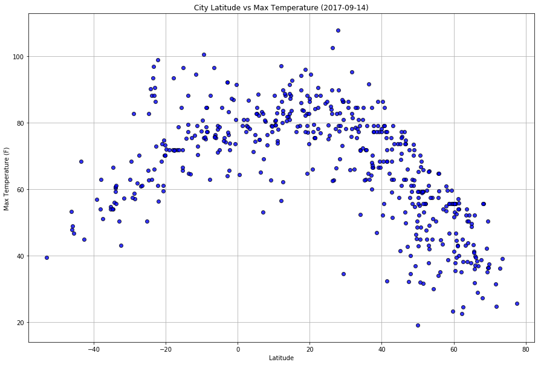

## WeatherPy
### - Cities that are in the range of +- 20 degrees of the equator (0 degree latitude) are the hottest.
### - Cities that are above 60 degree latitude are more likely to be humid.
### - Hard to deduce any info regarding wind speed or cloudiness compared to latitude with this data.


```python
# dependencies
import requests as req
import datetime
import time
import json
import getpass
from citipy import citipy
import matplotlib.pyplot as plt
import pandas as pd
import random
```


```python
# base url & personal api key
url = "http://api.openweathermap.org/data/2.5/weather"
api_key = getpass.getpass("copy and paste your openweathermap.com api key: ")
df = pd.DataFrame(columns = ['City','Country','Date','Latitude','Longitude',
                            'Max_Temp','Humidity','Cloudiness','Wind_Speed'])
df
```

    copy and paste your openweathermap.com api key: ········
    


<div>
<style>
    .dataframe thead tr:only-child th {
        text-align: right;
    }

    .dataframe thead th {
        text-align: left;
    }

    .dataframe tbody tr th {
        vertical-align: top;
    }
</style>
<table border="1" class="dataframe">
  <thead>
    <tr style="text-align: right;">
      <th></th>
      <th>City</th>
      <th>Country</th>
      <th>Date</th>
      <th>Latitude</th>
      <th>Longitude</th>
      <th>Max_Temp</th>
      <th>Humidity</th>
      <th>Cloudiness</th>
      <th>Wind_Speed</th>
    </tr>
  </thead>
  <tbody>
  </tbody>
</table>
</div>


## Generate Cities List


```python
# 3000 sets of lat & long
lat_list = map(lambda x: x / 100, random.sample(range(-9000,9000), 3000))
lng_list = map(lambda x: x / 100, random.sample(range(-18000,18000), 3000))
latlng = list(zip(lat_list,lng_list))

# UNIQUE list of cities from above 3000 sets of lat & long
cities = list(set(list(
    map(lambda x: x.city_name, 
        [citipy.nearest_city(latlng[i][0],latlng[i][1]) for i in range(len(latlng))]))))
```

## Perform API Calls


```python
# api calls of 500 unique cities and adding necessary data to df
for i in range(500):
    query_url = "{}?appid={}&q={}".format(url,api_key,cities[i])
    if i%50 == 0:
        time.sleep(50)
        
    try:
        weather_json = req.get(query_url).json()
        print("*"*50)
        print("API Call {} | City Number: {}, City Name: {}".format(i+1,
                                    weather_json['id'],weather_json['name']))
        print(query_url)
    except:
        print("API call fail T.T")
        break
    
    try:
        df.set_value(i,'City',weather_json['name'])
        df.set_value(i,'Country',weather_json['sys']['country'])
        df.set_value(i,'Date',datetime.datetime.fromtimestamp(weather_json['dt']))
        df.set_value(i,'Latitude',weather_json['coord']['lat'])
        df.set_value(i,'Longitude',weather_json['coord']['lon'])
        df.set_value(i,'Max_Temp',weather_json['main']['temp_max'])
        df.set_value(i,'Humidity',weather_json['main']['humidity'])
        df.set_value(i,'Cloudiness',weather_json['clouds']['all'])
        df.set_value(i,'Wind_Speed',weather_json['wind']['speed'])
    except:
        print('error T.T')
        continue
        
# Save the DataFrame as a csv
df.to_csv("0_WeatherOf500Cities.csv", encoding="utf-8", index=False)
df.head()
```

    **************************************************
    API Call 1 | City Number: 2067089, City Name: Maningrida
    http://api.openweathermap.org/data/2.5/weather?appid=25bc90a1196e6f153eece0bc0b0fc9eb&q=maningrida
    **************************************************
    API Call 2 | City Number: 5983607, City Name: Inuvik
    http://api.openweathermap.org/data/2.5/weather?appid=25bc90a1196e6f153eece0bc0b0fc9eb&q=inuvik
    **************************************************
    API Call 3 | City Number: 3424607, City Name: Tasiilaq
    http://api.openweathermap.org/data/2.5/weather?appid=25bc90a1196e6f153eece0bc0b0fc9eb&q=tasiilaq
    **************************************************
    API Call 4 | City Number: 3461724, City Name: Gurupi
    http://api.openweathermap.org/data/2.5/weather?appid=25bc90a1196e6f153eece0bc0b0fc9eb&q=formoso do araguaia
    **************************************************
    API Call 5 | City Number: 2141305, City Name: Fayaoue
    http://api.openweathermap.org/data/2.5/weather?appid=25bc90a1196e6f153eece0bc0b0fc9eb&q=fayaoue
    **************************************************
    API Call 6 | City Number: 2021188, City Name: Kurumkan
    http://api.openweathermap.org/data/2.5/weather?appid=25bc90a1196e6f153eece0bc0b0fc9eb&q=kurumkan
    **************************************************
    API Call 7 | City Number: 1528998, City Name: Yumen
    http://api.openweathermap.org/data/2.5/weather?appid=25bc90a1196e6f153eece0bc0b0fc9eb&q=yumen
    **************************************************
    API Call 8 | City Number: 550902, City Name: Kez
    http://api.openweathermap.org/data/2.5/weather?appid=25bc90a1196e6f153eece0bc0b0fc9eb&q=kez
    **************************************************
    API Call 9 | City Number: 1732826, City Name: Mersing
    http://api.openweathermap.org/data/2.5/weather?appid=25bc90a1196e6f153eece0bc0b0fc9eb&q=mersing
    **************************************************
    API Call 10 | City Number: 1895695, City Name: Kushima
    http://api.openweathermap.org/data/2.5/weather?appid=25bc90a1196e6f153eece0bc0b0fc9eb&q=kushima
    **************************************************
    API Call 11 | City Number: 215605, City Name: Kabare
    http://api.openweathermap.org/data/2.5/weather?appid=25bc90a1196e6f153eece0bc0b0fc9eb&q=kabare
    **************************************************
    API Call 12 | City Number: 87205, City Name: Darnah
    http://api.openweathermap.org/data/2.5/weather?appid=25bc90a1196e6f153eece0bc0b0fc9eb&q=darnah
    **************************************************
    API Call 13 | City Number: 2016910, City Name: Severobaykalsk
    http://api.openweathermap.org/data/2.5/weather?appid=25bc90a1196e6f153eece0bc0b0fc9eb&q=severobaykalsk
    **************************************************
    API Call 14 | City Number: 3893726, City Name: Constitucion
    http://api.openweathermap.org/data/2.5/weather?appid=25bc90a1196e6f153eece0bc0b0fc9eb&q=constitucion
    **************************************************
    API Call 15 | City Number: 3402648, City Name: Carutapera
    http://api.openweathermap.org/data/2.5/weather?appid=25bc90a1196e6f153eece0bc0b0fc9eb&q=carutapera
    **************************************************
    API Call 16 | City Number: 588409, City Name: Tallinn
    http://api.openweathermap.org/data/2.5/weather?appid=25bc90a1196e6f153eece0bc0b0fc9eb&q=yirol
    **************************************************
    API Call 17 | City Number: 3175096, City Name: Lasa
    http://api.openweathermap.org/data/2.5/weather?appid=25bc90a1196e6f153eece0bc0b0fc9eb&q=lasa
    **************************************************
    API Call 18 | City Number: 986717, City Name: Kruisfontein
    http://api.openweathermap.org/data/2.5/weather?appid=25bc90a1196e6f153eece0bc0b0fc9eb&q=kruisfontein
    **************************************************
    API Call 19 | City Number: 3408368, City Name: Acarau
    http://api.openweathermap.org/data/2.5/weather?appid=25bc90a1196e6f153eece0bc0b0fc9eb&q=acarau
    **************************************************
    API Call 20 | City Number: 3384937, City Name: Xarqueada
    http://api.openweathermap.org/data/2.5/weather?appid=25bc90a1196e6f153eece0bc0b0fc9eb&q=miranorte
    **************************************************
    API Call 21 | City Number: 2644605, City Name: Lerwick
    http://api.openweathermap.org/data/2.5/weather?appid=25bc90a1196e6f153eece0bc0b0fc9eb&q=scalloway
    **************************************************
    API Call 22 | City Number: 5468773, City Name: Gallup
    http://api.openweathermap.org/data/2.5/weather?appid=25bc90a1196e6f153eece0bc0b0fc9eb&q=gallup
    **************************************************
    API Call 23 | City Number: 4944903, City Name: Nantucket
    http://api.openweathermap.org/data/2.5/weather?appid=25bc90a1196e6f153eece0bc0b0fc9eb&q=nantucket
    **************************************************
    API Call 24 | City Number: 1256063, City Name: Sirpur
    http://api.openweathermap.org/data/2.5/weather?appid=25bc90a1196e6f153eece0bc0b0fc9eb&q=sirpur
    **************************************************
    API Call 25 | City Number: 3437653, City Name: Nueva Germania
    http://api.openweathermap.org/data/2.5/weather?appid=25bc90a1196e6f153eece0bc0b0fc9eb&q=nueva germania
    **************************************************
    API Call 26 | City Number: 3134327, City Name: Tonstad
    http://api.openweathermap.org/data/2.5/weather?appid=25bc90a1196e6f153eece0bc0b0fc9eb&q=tonstad
    **************************************************
    API Call 27 | City Number: 798536, City Name: Rabocheostrovsk
    http://api.openweathermap.org/data/2.5/weather?appid=25bc90a1196e6f153eece0bc0b0fc9eb&q=solovetskiy
    **************************************************
    API Call 28 | City Number: 943937, City Name: Villiers
    http://api.openweathermap.org/data/2.5/weather?appid=25bc90a1196e6f153eece0bc0b0fc9eb&q=villiers
    **************************************************
    API Call 29 | City Number: 1153783, City Name: Chaiya
    http://api.openweathermap.org/data/2.5/weather?appid=25bc90a1196e6f153eece0bc0b0fc9eb&q=chaiya
    **************************************************
    API Call 30 | City Number: 917688, City Name: Chongwe
    http://api.openweathermap.org/data/2.5/weather?appid=25bc90a1196e6f153eece0bc0b0fc9eb&q=chongwe
    **************************************************
    API Call 31 | City Number: 6174041, City Name: Victoria
    http://api.openweathermap.org/data/2.5/weather?appid=25bc90a1196e6f153eece0bc0b0fc9eb&q=victoria
    **************************************************
    API Call 32 | City Number: 1058381, City Name: Morondava
    http://api.openweathermap.org/data/2.5/weather?appid=25bc90a1196e6f153eece0bc0b0fc9eb&q=morondava
    **************************************************
    API Call 33 | City Number: 501091, City Name: Rovnoye
    http://api.openweathermap.org/data/2.5/weather?appid=25bc90a1196e6f153eece0bc0b0fc9eb&q=rovnoye
    **************************************************
    API Call 34 | City Number: 964090, City Name: Prieska
    http://api.openweathermap.org/data/2.5/weather?appid=25bc90a1196e6f153eece0bc0b0fc9eb&q=prieska
    **************************************************
    API Call 35 | City Number: 522902, City Name: Nekhayevskiy
    http://api.openweathermap.org/data/2.5/weather?appid=25bc90a1196e6f153eece0bc0b0fc9eb&q=nekhayevskiy
    **************************************************
    API Call 36 | City Number: 921786, City Name: Mitsamiouli
    http://api.openweathermap.org/data/2.5/weather?appid=25bc90a1196e6f153eece0bc0b0fc9eb&q=mitsamiouli
    **************************************************
    API Call 37 | City Number: 6620339, City Name: Karratha
    http://api.openweathermap.org/data/2.5/weather?appid=25bc90a1196e6f153eece0bc0b0fc9eb&q=karratha
    **************************************************
    API Call 38 | City Number: 1609476, City Name: Kosum Phisai
    http://api.openweathermap.org/data/2.5/weather?appid=25bc90a1196e6f153eece0bc0b0fc9eb&q=kosum phisai
    **************************************************
    API Call 39 | City Number: 4013728, City Name: Ciudad Acuna
    http://api.openweathermap.org/data/2.5/weather?appid=25bc90a1196e6f153eece0bc0b0fc9eb&q=acuna
    **************************************************
    API Call 40 | City Number: 5117949, City Name: Freeport
    http://api.openweathermap.org/data/2.5/weather?appid=25bc90a1196e6f153eece0bc0b0fc9eb&q=freeport
    **************************************************
    API Call 41 | City Number: 2065594, City Name: Mount Isa
    http://api.openweathermap.org/data/2.5/weather?appid=25bc90a1196e6f153eece0bc0b0fc9eb&q=mount isa
    **************************************************
    API Call 42 | City Number: 1282826, City Name: Salyan
    http://api.openweathermap.org/data/2.5/weather?appid=25bc90a1196e6f153eece0bc0b0fc9eb&q=halalo
    **************************************************
    API Call 43 | City Number: 2649738, City Name: Fairlie
    http://api.openweathermap.org/data/2.5/weather?appid=25bc90a1196e6f153eece0bc0b0fc9eb&q=fairlie
    **************************************************
    API Call 44 | City Number: 3108950, City Name: Silleda
    http://api.openweathermap.org/data/2.5/weather?appid=25bc90a1196e6f153eece0bc0b0fc9eb&q=silleda
    **************************************************
    API Call 45 | City Number: 2025630, City Name: Chara
    http://api.openweathermap.org/data/2.5/weather?appid=25bc90a1196e6f153eece0bc0b0fc9eb&q=chara
    **************************************************
    API Call 46 | City Number: 1790437, City Name: Zhuhai
    http://api.openweathermap.org/data/2.5/weather?appid=25bc90a1196e6f153eece0bc0b0fc9eb&q=zhuhai
    **************************************************
    API Call 47 | City Number: 1629974, City Name: Rantepao
    http://api.openweathermap.org/data/2.5/weather?appid=25bc90a1196e6f153eece0bc0b0fc9eb&q=rantepao
    **************************************************
    API Call 48 | City Number: 5380420, City Name: Pacifica
    http://api.openweathermap.org/data/2.5/weather?appid=25bc90a1196e6f153eece0bc0b0fc9eb&q=pacifica
    **************************************************
    API Call 49 | City Number: 2145554, City Name: Ulladulla
    http://api.openweathermap.org/data/2.5/weather?appid=25bc90a1196e6f153eece0bc0b0fc9eb&q=ulladulla
    **************************************************
    API Call 50 | City Number: 5275191, City Name: Superior
    http://api.openweathermap.org/data/2.5/weather?appid=25bc90a1196e6f153eece0bc0b0fc9eb&q=superior
    **************************************************
    API Call 51 | City Number: 2122850, City Name: Nikolayevsk-na-Amure
    http://api.openweathermap.org/data/2.5/weather?appid=25bc90a1196e6f153eece0bc0b0fc9eb&q=nikolayevsk-na-amure
    **************************************************
    API Call 52 | City Number: 4278471, City Name: Russell
    http://api.openweathermap.org/data/2.5/weather?appid=25bc90a1196e6f153eece0bc0b0fc9eb&q=russell
    **************************************************
    API Call 53 | City Number: 380173, City Name: Ed Damer
    http://api.openweathermap.org/data/2.5/weather?appid=25bc90a1196e6f153eece0bc0b0fc9eb&q=buqayq
    **************************************************
    API Call 54 | City Number: 3694112, City Name: Paita
    http://api.openweathermap.org/data/2.5/weather?appid=25bc90a1196e6f153eece0bc0b0fc9eb&q=paita
    **************************************************
    API Call 55 | City Number: 6145425, City Name: Shaunavon
    http://api.openweathermap.org/data/2.5/weather?appid=25bc90a1196e6f153eece0bc0b0fc9eb&q=shaunavon
    **************************************************
    API Call 56 | City Number: 483379, City Name: Teriberka
    http://api.openweathermap.org/data/2.5/weather?appid=25bc90a1196e6f153eece0bc0b0fc9eb&q=tumannyy
    **************************************************
    API Call 57 | City Number: 1519934, City Name: Qarqaraly
    http://api.openweathermap.org/data/2.5/weather?appid=25bc90a1196e6f153eece0bc0b0fc9eb&q=karkaralinsk
    **************************************************
    API Call 58 | City Number: 3698359, City Name: Chicama
    http://api.openweathermap.org/data/2.5/weather?appid=25bc90a1196e6f153eece0bc0b0fc9eb&q=chicama
    **************************************************
    API Call 59 | City Number: 3356832, City Name: Hentiesbaai
    http://api.openweathermap.org/data/2.5/weather?appid=25bc90a1196e6f153eece0bc0b0fc9eb&q=henties bay
    **************************************************
    API Call 60 | City Number: 866062, City Name: Iskateley
    http://api.openweathermap.org/data/2.5/weather?appid=25bc90a1196e6f153eece0bc0b0fc9eb&q=iskateley
    **************************************************
    API Call 61 | City Number: 496358, City Name: Severnyy
    http://api.openweathermap.org/data/2.5/weather?appid=25bc90a1196e6f153eece0bc0b0fc9eb&q=severnyy
    **************************************************
    API Call 62 | City Number: 1278532, City Name: Anta
    http://api.openweathermap.org/data/2.5/weather?appid=25bc90a1196e6f153eece0bc0b0fc9eb&q=anta
    **************************************************
    API Call 63 | City Number: 3559318, City Name: Esmeralda
    http://api.openweathermap.org/data/2.5/weather?appid=25bc90a1196e6f153eece0bc0b0fc9eb&q=esmeralda
    **************************************************
    API Call 64 | City Number: 240498, City Name: Bangassou
    http://api.openweathermap.org/data/2.5/weather?appid=25bc90a1196e6f153eece0bc0b0fc9eb&q=bangassou
    **************************************************
    API Call 65 | City Number: 2630299, City Name: Hofn
    http://api.openweathermap.org/data/2.5/weather?appid=25bc90a1196e6f153eece0bc0b0fc9eb&q=hofn
    **************************************************
    API Call 66 | City Number: 2172797, City Name: Cairns
    http://api.openweathermap.org/data/2.5/weather?appid=25bc90a1196e6f153eece0bc0b0fc9eb&q=cairns
    **************************************************
    API Call 67 | City Number: 921900, City Name: Dzaoudzi
    http://api.openweathermap.org/data/2.5/weather?appid=25bc90a1196e6f153eece0bc0b0fc9eb&q=dzaoudzi
    **************************************************
    API Call 68 | City Number: 2525362, City Name: Carbonia
    http://api.openweathermap.org/data/2.5/weather?appid=25bc90a1196e6f153eece0bc0b0fc9eb&q=carbonia
    **************************************************
    API Call 69 | City Number: 3874787, City Name: Punta Arenas
    http://api.openweathermap.org/data/2.5/weather?appid=25bc90a1196e6f153eece0bc0b0fc9eb&q=punta arenas
    **************************************************
    API Call 70 | City Number: 2068110, City Name: Kununurra
    http://api.openweathermap.org/data/2.5/weather?appid=25bc90a1196e6f153eece0bc0b0fc9eb&q=kununurra
    **************************************************
    API Call 71 | City Number: 3374210, City Name: Sao Filipe
    http://api.openweathermap.org/data/2.5/weather?appid=25bc90a1196e6f153eece0bc0b0fc9eb&q=sao filipe
    **************************************************
    API Call 72 | City Number: 3514783, City Name: Veracruz
    http://api.openweathermap.org/data/2.5/weather?appid=25bc90a1196e6f153eece0bc0b0fc9eb&q=veracruz
    **************************************************
    API Call 73 | City Number: 3388456, City Name: Sao Jose da Coroa Grande
    http://api.openweathermap.org/data/2.5/weather?appid=25bc90a1196e6f153eece0bc0b0fc9eb&q=sao jose da coroa grande
    **************************************************
    API Call 74 | City Number: 2635199, City Name: Ullapool
    http://api.openweathermap.org/data/2.5/weather?appid=25bc90a1196e6f153eece0bc0b0fc9eb&q=ullapool
    **************************************************
    API Call 75 | City Number: 1488903, City Name: Turukhansk
    http://api.openweathermap.org/data/2.5/weather?appid=25bc90a1196e6f153eece0bc0b0fc9eb&q=turukhansk
    **************************************************
    API Call 76 | City Number: 2122493, City Name: Omsukchan
    http://api.openweathermap.org/data/2.5/weather?appid=25bc90a1196e6f153eece0bc0b0fc9eb&q=omsukchan
    **************************************************
    API Call 77 | City Number: 1695546, City Name: Pandan
    http://api.openweathermap.org/data/2.5/weather?appid=25bc90a1196e6f153eece0bc0b0fc9eb&q=pandan
    **************************************************
    API Call 78 | City Number: 3412093, City Name: Vestmannaeyjar
    http://api.openweathermap.org/data/2.5/weather?appid=25bc90a1196e6f153eece0bc0b0fc9eb&q=vestmannaeyjar
    **************************************************
    API Call 79 | City Number: 5767918, City Name: Pierre
    http://api.openweathermap.org/data/2.5/weather?appid=25bc90a1196e6f153eece0bc0b0fc9eb&q=pierre
    **************************************************
    API Call 80 | City Number: 1696899, City Name: Ozamiz City
    http://api.openweathermap.org/data/2.5/weather?appid=25bc90a1196e6f153eece0bc0b0fc9eb&q=tabiauea
    **************************************************
    API Call 81 | City Number: 611583, City Name: Tqvarcheli
    http://api.openweathermap.org/data/2.5/weather?appid=25bc90a1196e6f153eece0bc0b0fc9eb&q=tkvarcheli
    **************************************************
    API Call 82 | City Number: 648057, City Name: Lieto
    http://api.openweathermap.org/data/2.5/weather?appid=25bc90a1196e6f153eece0bc0b0fc9eb&q=lieto
    **************************************************
    API Call 83 | City Number: 1914158, City Name: Xiasi
    http://api.openweathermap.org/data/2.5/weather?appid=25bc90a1196e6f153eece0bc0b0fc9eb&q=hanyang
    **************************************************
    API Call 84 | City Number: 6929460, City Name: Panzhihua
    http://api.openweathermap.org/data/2.5/weather?appid=25bc90a1196e6f153eece0bc0b0fc9eb&q=panzhihua
    **************************************************
    API Call 85 | City Number: 315530, City Name: Ercis
    http://api.openweathermap.org/data/2.5/weather?appid=25bc90a1196e6f153eece0bc0b0fc9eb&q=ercis
    **************************************************
    API Call 86 | City Number: 1856392, City Name: Muroto
    http://api.openweathermap.org/data/2.5/weather?appid=25bc90a1196e6f153eece0bc0b0fc9eb&q=muroto
    **************************************************
    API Call 87 | City Number: 2229798, City Name: Kousseri
    http://api.openweathermap.org/data/2.5/weather?appid=25bc90a1196e6f153eece0bc0b0fc9eb&q=kousseri
    **************************************************
    API Call 88 | City Number: 2137773, City Name: Vao
    http://api.openweathermap.org/data/2.5/weather?appid=25bc90a1196e6f153eece0bc0b0fc9eb&q=vao
    **************************************************
    API Call 89 | City Number: 2093967, City Name: Kimbe
    http://api.openweathermap.org/data/2.5/weather?appid=25bc90a1196e6f153eece0bc0b0fc9eb&q=kimbe
    **************************************************
    API Call 90 | City Number: 4845585, City Name: Westport
    http://api.openweathermap.org/data/2.5/weather?appid=25bc90a1196e6f153eece0bc0b0fc9eb&q=westport
    **************************************************
    API Call 91 | City Number: 2022064, City Name: Kirovskiy
    http://api.openweathermap.org/data/2.5/weather?appid=25bc90a1196e6f153eece0bc0b0fc9eb&q=kirovskiy
    **************************************************
    API Call 92 | City Number: 1786546, City Name: Zhongxiang
    http://api.openweathermap.org/data/2.5/weather?appid=25bc90a1196e6f153eece0bc0b0fc9eb&q=yingzhong
    **************************************************
    API Call 93 | City Number: 1855540, City Name: Naze
    http://api.openweathermap.org/data/2.5/weather?appid=25bc90a1196e6f153eece0bc0b0fc9eb&q=naze
    **************************************************
    API Call 94 | City Number: 4255151, City Name: Bud
    http://api.openweathermap.org/data/2.5/weather?appid=25bc90a1196e6f153eece0bc0b0fc9eb&q=bud
    **************************************************
    API Call 95 | City Number: 2079582, City Name: Alyangula
    http://api.openweathermap.org/data/2.5/weather?appid=25bc90a1196e6f153eece0bc0b0fc9eb&q=alyangula
    **************************************************
    API Call 96 | City Number: 5955902, City Name: Fort Nelson
    http://api.openweathermap.org/data/2.5/weather?appid=25bc90a1196e6f153eece0bc0b0fc9eb&q=fort nelson
    **************************************************
    API Call 97 | City Number: 1253694, City Name: Uri
    http://api.openweathermap.org/data/2.5/weather?appid=25bc90a1196e6f153eece0bc0b0fc9eb&q=uri
    **************************************************
    API Call 98 | City Number: 2094342, City Name: Kavieng
    http://api.openweathermap.org/data/2.5/weather?appid=25bc90a1196e6f153eece0bc0b0fc9eb&q=kavieng
    **************************************************
    API Call 99 | City Number: 3381041, City Name: Mana
    http://api.openweathermap.org/data/2.5/weather?appid=25bc90a1196e6f153eece0bc0b0fc9eb&q=mana
    **************************************************
    API Call 100 | City Number: 2743298, City Name: Agucadoura
    http://api.openweathermap.org/data/2.5/weather?appid=25bc90a1196e6f153eece0bc0b0fc9eb&q=agucadoura
    **************************************************
    API Call 101 | City Number: 3372783, City Name: Ponta Delgada
    http://api.openweathermap.org/data/2.5/weather?appid=25bc90a1196e6f153eece0bc0b0fc9eb&q=ponta delgada
    **************************************************
    API Call 102 | City Number: 1056899, City Name: Sambava
    http://api.openweathermap.org/data/2.5/weather?appid=25bc90a1196e6f153eece0bc0b0fc9eb&q=sambava
    **************************************************
    API Call 103 | City Number: 2377457, City Name: Nouadhibou
    http://api.openweathermap.org/data/2.5/weather?appid=25bc90a1196e6f153eece0bc0b0fc9eb&q=nouadhibou
    **************************************************
    API Call 104 | City Number: 510342, City Name: Pestretsy
    http://api.openweathermap.org/data/2.5/weather?appid=25bc90a1196e6f153eece0bc0b0fc9eb&q=pestretsy
    **************************************************
    API Call 105 | City Number: 336496, City Name: Gimbi
    http://api.openweathermap.org/data/2.5/weather?appid=25bc90a1196e6f153eece0bc0b0fc9eb&q=gimbi
    **************************************************
    API Call 106 | City Number: 219057, City Name: Beni
    http://api.openweathermap.org/data/2.5/weather?appid=25bc90a1196e6f153eece0bc0b0fc9eb&q=beni
    **************************************************
    API Call 107 | City Number: 2253354, City Name: Dakar
    http://api.openweathermap.org/data/2.5/weather?appid=25bc90a1196e6f153eece0bc0b0fc9eb&q=dakar
    **************************************************
    API Call 108 | City Number: 3414079, City Name: Ólafsvík
    http://api.openweathermap.org/data/2.5/weather?appid=25bc90a1196e6f153eece0bc0b0fc9eb&q=olafsvik
    **************************************************
    API Call 109 | City Number: 2155415, City Name: New Norfolk
    http://api.openweathermap.org/data/2.5/weather?appid=25bc90a1196e6f153eece0bc0b0fc9eb&q=new norfolk
    **************************************************
    API Call 110 | City Number: 1742667, City Name: Sungai Pelek New Village
    http://api.openweathermap.org/data/2.5/weather?appid=25bc90a1196e6f153eece0bc0b0fc9eb&q=jilmah
    **************************************************
    API Call 111 | City Number: 3366880, City Name: Hermanus
    http://api.openweathermap.org/data/2.5/weather?appid=25bc90a1196e6f153eece0bc0b0fc9eb&q=hermanus
    **************************************************
    API Call 112 | City Number: 2013727, City Name: Vanavara
    http://api.openweathermap.org/data/2.5/weather?appid=25bc90a1196e6f153eece0bc0b0fc9eb&q=vanavara
    **************************************************
    API Call 113 | City Number: 6555782, City Name: Friesenheim
    http://api.openweathermap.org/data/2.5/weather?appid=25bc90a1196e6f153eece0bc0b0fc9eb&q=friesenheim
    **************************************************
    API Call 114 | City Number: 606531, City Name: Boden
    http://api.openweathermap.org/data/2.5/weather?appid=25bc90a1196e6f153eece0bc0b0fc9eb&q=boden
    **************************************************
    API Call 115 | City Number: 1853174, City Name: Sakaiminato
    http://api.openweathermap.org/data/2.5/weather?appid=25bc90a1196e6f153eece0bc0b0fc9eb&q=sakaiminato
    **************************************************
    API Call 116 | City Number: 1162868, City Name: Usta Muhammad
    http://api.openweathermap.org/data/2.5/weather?appid=25bc90a1196e6f153eece0bc0b0fc9eb&q=usta muhammad
    **************************************************
    API Call 117 | City Number: 2075720, City Name: Broome
    http://api.openweathermap.org/data/2.5/weather?appid=25bc90a1196e6f153eece0bc0b0fc9eb&q=broome
    **************************************************
    API Call 118 | City Number: 591965, City Name: Jarvakandi
    http://api.openweathermap.org/data/2.5/weather?appid=25bc90a1196e6f153eece0bc0b0fc9eb&q=jarvakandi
    **************************************************
    API Call 119 | City Number: 3465329, City Name: Coruripe
    http://api.openweathermap.org/data/2.5/weather?appid=25bc90a1196e6f153eece0bc0b0fc9eb&q=coruripe
    **************************************************
    API Call 120 | City Number: 1293960, City Name: Taunggyi
    http://api.openweathermap.org/data/2.5/weather?appid=25bc90a1196e6f153eece0bc0b0fc9eb&q=taunggyi
    **************************************************
    API Call 121 | City Number: 217570, City Name: Buta
    http://api.openweathermap.org/data/2.5/weather?appid=25bc90a1196e6f153eece0bc0b0fc9eb&q=buta
    **************************************************
    API Call 122 | City Number: 6087579, City Name: New Glasgow
    http://api.openweathermap.org/data/2.5/weather?appid=25bc90a1196e6f153eece0bc0b0fc9eb&q=new glasgow
    **************************************************
    API Call 123 | City Number: 660083, City Name: Etu-Töölö
    http://api.openweathermap.org/data/2.5/weather?appid=25bc90a1196e6f153eece0bc0b0fc9eb&q=tall kayf
    **************************************************
    API Call 124 | City Number: 103630, City Name: Najran
    http://api.openweathermap.org/data/2.5/weather?appid=25bc90a1196e6f153eece0bc0b0fc9eb&q=najran
    **************************************************
    API Call 125 | City Number: 2641434, City Name: Northam
    http://api.openweathermap.org/data/2.5/weather?appid=25bc90a1196e6f153eece0bc0b0fc9eb&q=northam
    **************************************************
    API Call 126 | City Number: 3353383, City Name: Rundu
    http://api.openweathermap.org/data/2.5/weather?appid=25bc90a1196e6f153eece0bc0b0fc9eb&q=rundu
    **************************************************
    API Call 127 | City Number: 2018735, City Name: Nyurba
    http://api.openweathermap.org/data/2.5/weather?appid=25bc90a1196e6f153eece0bc0b0fc9eb&q=nyurba
    **************************************************
    API Call 128 | City Number: 4033356, City Name: Tiarei
    http://api.openweathermap.org/data/2.5/weather?appid=25bc90a1196e6f153eece0bc0b0fc9eb&q=tiarei
    **************************************************
    API Call 129 | City Number: 1817968, City Name: Anshun
    http://api.openweathermap.org/data/2.5/weather?appid=25bc90a1196e6f153eece0bc0b0fc9eb&q=anshun
    **************************************************
    API Call 130 | City Number: 2016757, City Name: Shelopugino
    http://api.openweathermap.org/data/2.5/weather?appid=25bc90a1196e6f153eece0bc0b0fc9eb&q=shelopugino
    **************************************************
    API Call 131 | City Number: 2191562, City Name: Dunedin
    http://api.openweathermap.org/data/2.5/weather?appid=25bc90a1196e6f153eece0bc0b0fc9eb&q=dunedin
    **************************************************
    API Call 132 | City Number: 3883457, City Name: Lebu
    http://api.openweathermap.org/data/2.5/weather?appid=25bc90a1196e6f153eece0bc0b0fc9eb&q=lebu
    **************************************************
    API Call 133 | City Number: 2399001, City Name: Mayumba
    http://api.openweathermap.org/data/2.5/weather?appid=25bc90a1196e6f153eece0bc0b0fc9eb&q=mayumba
    **************************************************
    API Call 134 | City Number: 1507390, City Name: Dikson
    http://api.openweathermap.org/data/2.5/weather?appid=25bc90a1196e6f153eece0bc0b0fc9eb&q=dikson
    **************************************************
    API Call 135 | City Number: 4224681, City Name: Stockbridge
    http://api.openweathermap.org/data/2.5/weather?appid=25bc90a1196e6f153eece0bc0b0fc9eb&q=stockbridge
    **************************************************
    API Call 136 | City Number: 3836669, City Name: San Rafael
    http://api.openweathermap.org/data/2.5/weather?appid=25bc90a1196e6f153eece0bc0b0fc9eb&q=san rafael
    **************************************************
    API Call 137 | City Number: 4006806, City Name: Empalme
    http://api.openweathermap.org/data/2.5/weather?appid=25bc90a1196e6f153eece0bc0b0fc9eb&q=empalme
    **************************************************
    API Call 138 | City Number: 5146286, City Name: Avon Lake
    http://api.openweathermap.org/data/2.5/weather?appid=25bc90a1196e6f153eece0bc0b0fc9eb&q=avon lake
    **************************************************
    API Call 139 | City Number: 2016405, City Name: Smolenka
    http://api.openweathermap.org/data/2.5/weather?appid=25bc90a1196e6f153eece0bc0b0fc9eb&q=smolenka
    **************************************************
    API Call 140 | City Number: 2126682, City Name: Bilibino
    http://api.openweathermap.org/data/2.5/weather?appid=25bc90a1196e6f153eece0bc0b0fc9eb&q=bilibino
    **************************************************
    API Call 141 | City Number: 2026861, City Name: Berdigestyakh
    http://api.openweathermap.org/data/2.5/weather?appid=25bc90a1196e6f153eece0bc0b0fc9eb&q=berdigestyakh
    **************************************************
    API Call 142 | City Number: 1861280, City Name: Itoman
    http://api.openweathermap.org/data/2.5/weather?appid=25bc90a1196e6f153eece0bc0b0fc9eb&q=itoman
    **************************************************
    API Call 143 | City Number: 2122104, City Name: Petropavlovsk-Kamchatskiy
    http://api.openweathermap.org/data/2.5/weather?appid=25bc90a1196e6f153eece0bc0b0fc9eb&q=petropavlovsk-kamchatskiy
    **************************************************
    API Call 144 | City Number: 1491230, City Name: Sovetskiy
    http://api.openweathermap.org/data/2.5/weather?appid=25bc90a1196e6f153eece0bc0b0fc9eb&q=sovetskiy
    **************************************************
    API Call 145 | City Number: 2032614, City Name: Baruun-Urt
    http://api.openweathermap.org/data/2.5/weather?appid=25bc90a1196e6f153eece0bc0b0fc9eb&q=baruun-urt
    **************************************************
    API Call 146 | City Number: 2446796, City Name: Bilma
    http://api.openweathermap.org/data/2.5/weather?appid=25bc90a1196e6f153eece0bc0b0fc9eb&q=bilma
    **************************************************
    API Call 147 | City Number: 6111696, City Name: Port-Cartier
    http://api.openweathermap.org/data/2.5/weather?appid=25bc90a1196e6f153eece0bc0b0fc9eb&q=port-cartier
    **************************************************
    API Call 148 | City Number: 3491161, City Name: Bull Savanna
    http://api.openweathermap.org/data/2.5/weather?appid=25bc90a1196e6f153eece0bc0b0fc9eb&q=bull savanna
    **************************************************
    API Call 149 | City Number: 244878, City Name: Biltine
    http://api.openweathermap.org/data/2.5/weather?appid=25bc90a1196e6f153eece0bc0b0fc9eb&q=biltine
    **************************************************
    API Call 150 | City Number: 6176823, City Name: Waterloo
    http://api.openweathermap.org/data/2.5/weather?appid=25bc90a1196e6f153eece0bc0b0fc9eb&q=waterloo
    **************************************************
    API Call 151 | City Number: 3652764, City Name: Puerto Ayora
    http://api.openweathermap.org/data/2.5/weather?appid=25bc90a1196e6f153eece0bc0b0fc9eb&q=puerto ayora
    **************************************************
    API Call 152 | City Number: 1283285, City Name: Jumla
    http://api.openweathermap.org/data/2.5/weather?appid=25bc90a1196e6f153eece0bc0b0fc9eb&q=jumla
    **************************************************
    API Call 153 | City Number: 5557293, City Name: Sitka
    http://api.openweathermap.org/data/2.5/weather?appid=25bc90a1196e6f153eece0bc0b0fc9eb&q=sitka
    **************************************************
    API Call 154 | City Number: 2508813, City Name: Adrar
    http://api.openweathermap.org/data/2.5/weather?appid=25bc90a1196e6f153eece0bc0b0fc9eb&q=adrar
    **************************************************
    API Call 155 | City Number: 2108502, City Name: Honiara
    http://api.openweathermap.org/data/2.5/weather?appid=25bc90a1196e6f153eece0bc0b0fc9eb&q=honiara
    **************************************************
    API Call 156 | City Number: 1283316, City Name: Janakpur Zone
    http://api.openweathermap.org/data/2.5/weather?appid=25bc90a1196e6f153eece0bc0b0fc9eb&q=dzhusaly
    **************************************************
    API Call 157 | City Number: 2440371, City Name: Ouallam
    http://api.openweathermap.org/data/2.5/weather?appid=25bc90a1196e6f153eece0bc0b0fc9eb&q=ouallam
    **************************************************
    API Call 158 | City Number: 3584003, City Name: Puerto El Triunfo
    http://api.openweathermap.org/data/2.5/weather?appid=25bc90a1196e6f153eece0bc0b0fc9eb&q=puerto el triunfo
    **************************************************
    API Call 159 | City Number: 2242001, City Name: Caxito
    http://api.openweathermap.org/data/2.5/weather?appid=25bc90a1196e6f153eece0bc0b0fc9eb&q=caxito
    **************************************************
    API Call 160 | City Number: 4470244, City Name: Havelock
    http://api.openweathermap.org/data/2.5/weather?appid=25bc90a1196e6f153eece0bc0b0fc9eb&q=havelock
    **************************************************
    API Call 161 | City Number: 3455553, City Name: Paicandu
    http://api.openweathermap.org/data/2.5/weather?appid=25bc90a1196e6f153eece0bc0b0fc9eb&q=paicandu
    **************************************************
    API Call 162 | City Number: 1542143, City Name: Kargapol’ye
    http://api.openweathermap.org/data/2.5/weather?appid=25bc90a1196e6f153eece0bc0b0fc9eb&q=kargapolye
    **************************************************
    API Call 163 | City Number: 1506676, City Name: Gari
    http://api.openweathermap.org/data/2.5/weather?appid=25bc90a1196e6f153eece0bc0b0fc9eb&q=gari
    **************************************************
    API Call 164 | City Number: 4020109, City Name: Atuona
    http://api.openweathermap.org/data/2.5/weather?appid=25bc90a1196e6f153eece0bc0b0fc9eb&q=atuona
    **************************************************
    API Call 165 | City Number: 80509, City Name: Bardiyah
    http://api.openweathermap.org/data/2.5/weather?appid=25bc90a1196e6f153eece0bc0b0fc9eb&q=bardiyah
    **************************************************
    API Call 166 | City Number: 5919850, City Name: Chapais
    http://api.openweathermap.org/data/2.5/weather?appid=25bc90a1196e6f153eece0bc0b0fc9eb&q=chapais
    **************************************************
    API Call 167 | City Number: 2177069, City Name: Ballina
    http://api.openweathermap.org/data/2.5/weather?appid=25bc90a1196e6f153eece0bc0b0fc9eb&q=ballina
    **************************************************
    API Call 168 | City Number: 1513491, City Name: Komsomolskiy
    http://api.openweathermap.org/data/2.5/weather?appid=25bc90a1196e6f153eece0bc0b0fc9eb&q=komsomolskiy
    **************************************************
    API Call 169 | City Number: 2045485, City Name: Jinhua
    http://api.openweathermap.org/data/2.5/weather?appid=25bc90a1196e6f153eece0bc0b0fc9eb&q=samusu
    **************************************************
    API Call 170 | City Number: 5911745, City Name: Burns Lake
    http://api.openweathermap.org/data/2.5/weather?appid=25bc90a1196e6f153eece0bc0b0fc9eb&q=burns lake
    **************************************************
    API Call 171 | City Number: 610298, City Name: Beyneu
    http://api.openweathermap.org/data/2.5/weather?appid=25bc90a1196e6f153eece0bc0b0fc9eb&q=beyneu
    **************************************************
    API Call 172 | City Number: 540761, City Name: Kropotkin
    http://api.openweathermap.org/data/2.5/weather?appid=25bc90a1196e6f153eece0bc0b0fc9eb&q=kropotkin
    **************************************************
    API Call 173 | City Number: 3456115, City Name: Nova Soure
    http://api.openweathermap.org/data/2.5/weather?appid=25bc90a1196e6f153eece0bc0b0fc9eb&q=nova soure
    **************************************************
    API Call 174 | City Number: 2017155, City Name: Saskylakh
    http://api.openweathermap.org/data/2.5/weather?appid=25bc90a1196e6f153eece0bc0b0fc9eb&q=saskylakh
    **************************************************
    API Call 175 | City Number: 1490256, City Name: Talnakh
    http://api.openweathermap.org/data/2.5/weather?appid=25bc90a1196e6f153eece0bc0b0fc9eb&q=talnakh
    **************************************************
    API Call 176 | City Number: 5861897, City Name: Fairbanks
    http://api.openweathermap.org/data/2.5/weather?appid=25bc90a1196e6f153eece0bc0b0fc9eb&q=fairbanks
    **************************************************
    API Call 177 | City Number: 2147714, City Name: Sydney
    http://api.openweathermap.org/data/2.5/weather?appid=25bc90a1196e6f153eece0bc0b0fc9eb&q=sydney
    **************************************************
    API Call 178 | City Number: 5789826, City Name: Chelan
    http://api.openweathermap.org/data/2.5/weather?appid=25bc90a1196e6f153eece0bc0b0fc9eb&q=cholan
    **************************************************
    API Call 179 | City Number: 1060283, City Name: Maroantsetra
    http://api.openweathermap.org/data/2.5/weather?appid=25bc90a1196e6f153eece0bc0b0fc9eb&q=maroantsetra
    **************************************************
    API Call 180 | City Number: 1805798, City Name: Jiangjin
    http://api.openweathermap.org/data/2.5/weather?appid=25bc90a1196e6f153eece0bc0b0fc9eb&q=jijiang
    **************************************************
    API Call 181 | City Number: 2214433, City Name: Nalut
    http://api.openweathermap.org/data/2.5/weather?appid=25bc90a1196e6f153eece0bc0b0fc9eb&q=nalut
    **************************************************
    API Call 182 | City Number: 544370, City Name: Koryazhma
    http://api.openweathermap.org/data/2.5/weather?appid=25bc90a1196e6f153eece0bc0b0fc9eb&q=koryazhma
    **************************************************
    API Call 183 | City Number: 6167817, City Name: Torbay
    http://api.openweathermap.org/data/2.5/weather?appid=25bc90a1196e6f153eece0bc0b0fc9eb&q=torbay
    **************************************************
    API Call 184 | City Number: 5147097, City Name: Berea
    http://api.openweathermap.org/data/2.5/weather?appid=25bc90a1196e6f153eece0bc0b0fc9eb&q=berea
    **************************************************
    API Call 185 | City Number: 3655131, City Name: La Libertad
    http://api.openweathermap.org/data/2.5/weather?appid=25bc90a1196e6f153eece0bc0b0fc9eb&q=la libertad
    **************************************************
    API Call 186 | City Number: 1503153, City Name: Klyuchi
    http://api.openweathermap.org/data/2.5/weather?appid=25bc90a1196e6f153eece0bc0b0fc9eb&q=klyuchi
    **************************************************
    API Call 187 | City Number: 2522325, City Name: Aguimes
    http://api.openweathermap.org/data/2.5/weather?appid=25bc90a1196e6f153eece0bc0b0fc9eb&q=aguimes
    **************************************************
    API Call 188 | City Number: 6138282, City Name: Saint-Georges
    http://api.openweathermap.org/data/2.5/weather?appid=25bc90a1196e6f153eece0bc0b0fc9eb&q=saint-georges
    **************************************************
    API Call 189 | City Number: 964712, City Name: Plettenberg Bay
    http://api.openweathermap.org/data/2.5/weather?appid=25bc90a1196e6f153eece0bc0b0fc9eb&q=plettenberg bay
    **************************************************
    API Call 190 | City Number: 3466594, City Name: Cavalcante
    http://api.openweathermap.org/data/2.5/weather?appid=25bc90a1196e6f153eece0bc0b0fc9eb&q=cavalcante
    **************************************************
    API Call 191 | City Number: 2031964, City Name: Darhan
    http://api.openweathermap.org/data/2.5/weather?appid=25bc90a1196e6f153eece0bc0b0fc9eb&q=darhan
    **************************************************
    API Call 192 | City Number: 1445310, City Name: Balapur
    http://api.openweathermap.org/data/2.5/weather?appid=25bc90a1196e6f153eece0bc0b0fc9eb&q=saleaula
    **************************************************
    API Call 193 | City Number: 1861416, City Name: Ishigaki
    http://api.openweathermap.org/data/2.5/weather?appid=25bc90a1196e6f153eece0bc0b0fc9eb&q=ishigaki
    **************************************************
    API Call 194 | City Number: 2115627, City Name: Ust-Kamchatsk Staryy
    http://api.openweathermap.org/data/2.5/weather?appid=25bc90a1196e6f153eece0bc0b0fc9eb&q=ust-kamchatsk
    **************************************************
    API Call 195 | City Number: 1492499, City Name: Shagonar
    http://api.openweathermap.org/data/2.5/weather?appid=25bc90a1196e6f153eece0bc0b0fc9eb&q=shagonar
    **************************************************
    API Call 196 | City Number: 541826, City Name: Krasnyy Bor
    http://api.openweathermap.org/data/2.5/weather?appid=25bc90a1196e6f153eece0bc0b0fc9eb&q=nikolskoye
    **************************************************
    API Call 197 | City Number: 2514301, City Name: Mao
    http://api.openweathermap.org/data/2.5/weather?appid=25bc90a1196e6f153eece0bc0b0fc9eb&q=mahon
    **************************************************
    API Call 198 | City Number: 2521857, City Name: Almonte
    http://api.openweathermap.org/data/2.5/weather?appid=25bc90a1196e6f153eece0bc0b0fc9eb&q=almonte
    **************************************************
    API Call 199 | City Number: 146214, City Name: Paphos
    http://api.openweathermap.org/data/2.5/weather?appid=25bc90a1196e6f153eece0bc0b0fc9eb&q=pafos
    **************************************************
    API Call 200 | City Number: 543737, City Name: Kotelnich
    http://api.openweathermap.org/data/2.5/weather?appid=25bc90a1196e6f153eece0bc0b0fc9eb&q=karaul
    **************************************************
    API Call 201 | City Number: 639248, City Name: Ristiina
    http://api.openweathermap.org/data/2.5/weather?appid=25bc90a1196e6f153eece0bc0b0fc9eb&q=satitoa
    **************************************************
    API Call 202 | City Number: 1525988, City Name: Ayagoz
    http://api.openweathermap.org/data/2.5/weather?appid=25bc90a1196e6f153eece0bc0b0fc9eb&q=ayagoz
    **************************************************
    API Call 203 | City Number: 3154704, City Name: Grua
    http://api.openweathermap.org/data/2.5/weather?appid=25bc90a1196e6f153eece0bc0b0fc9eb&q=grua
    **************************************************
    API Call 204 | City Number: 338726, City Name: Dodola
    http://api.openweathermap.org/data/2.5/weather?appid=25bc90a1196e6f153eece0bc0b0fc9eb&q=dodola
    **************************************************
    API Call 205 | City Number: 6545720, City Name: Temara
    http://api.openweathermap.org/data/2.5/weather?appid=25bc90a1196e6f153eece0bc0b0fc9eb&q=temaraia
    **************************************************
    API Call 206 | City Number: 2014624, City Name: Udachnyy
    http://api.openweathermap.org/data/2.5/weather?appid=25bc90a1196e6f153eece0bc0b0fc9eb&q=udachnyy
    **************************************************
    API Call 207 | City Number: 2240449, City Name: Luanda
    http://api.openweathermap.org/data/2.5/weather?appid=25bc90a1196e6f153eece0bc0b0fc9eb&q=luanda
    **************************************************
    API Call 208 | City Number: 1735902, City Name: Sibu
    http://api.openweathermap.org/data/2.5/weather?appid=25bc90a1196e6f153eece0bc0b0fc9eb&q=sibu
    **************************************************
    API Call 209 | City Number: 6355222, City Name: Yulara
    http://api.openweathermap.org/data/2.5/weather?appid=25bc90a1196e6f153eece0bc0b0fc9eb&q=yulara
    **************************************************
    API Call 210 | City Number: 1489656, City Name: Teya
    http://api.openweathermap.org/data/2.5/weather?appid=25bc90a1196e6f153eece0bc0b0fc9eb&q=teya
    **************************************************
    API Call 211 | City Number: 2013392, City Name: Vilyuysk
    http://api.openweathermap.org/data/2.5/weather?appid=25bc90a1196e6f153eece0bc0b0fc9eb&q=vilyuysk
    **************************************************
    API Call 212 | City Number: 1168700, City Name: Ormara
    http://api.openweathermap.org/data/2.5/weather?appid=25bc90a1196e6f153eece0bc0b0fc9eb&q=ormara
    **************************************************
    API Call 213 | City Number: 2236967, City Name: Soio
    http://api.openweathermap.org/data/2.5/weather?appid=25bc90a1196e6f153eece0bc0b0fc9eb&q=soyo
    **************************************************
    API Call 214 | City Number: 2025339, City Name: Chita
    http://api.openweathermap.org/data/2.5/weather?appid=25bc90a1196e6f153eece0bc0b0fc9eb&q=chita
    **************************************************
    API Call 215 | City Number: 3998291, City Name: Loreto
    http://api.openweathermap.org/data/2.5/weather?appid=25bc90a1196e6f153eece0bc0b0fc9eb&q=loreto
    **************************************************
    API Call 216 | City Number: 863061, City Name: Usinsk
    http://api.openweathermap.org/data/2.5/weather?appid=25bc90a1196e6f153eece0bc0b0fc9eb&q=usinsk
    **************************************************
    API Call 217 | City Number: 1254367, City Name: Tirumullaivasal
    http://api.openweathermap.org/data/2.5/weather?appid=25bc90a1196e6f153eece0bc0b0fc9eb&q=tirumullaivasal
    **************************************************
    API Call 218 | City Number: 3393692, City Name: Olho d’Agua
    http://api.openweathermap.org/data/2.5/weather?appid=25bc90a1196e6f153eece0bc0b0fc9eb&q=itarema
    **************************************************
    API Call 219 | City Number: 2180815, City Name: Tuatapere
    http://api.openweathermap.org/data/2.5/weather?appid=25bc90a1196e6f153eece0bc0b0fc9eb&q=tuatapere
    **************************************************
    API Call 220 | City Number: 3985168, City Name: San Patricio
    http://api.openweathermap.org/data/2.5/weather?appid=25bc90a1196e6f153eece0bc0b0fc9eb&q=san patricio
    **************************************************
    API Call 221 | City Number: 660129, City Name: Espoo
    http://api.openweathermap.org/data/2.5/weather?appid=25bc90a1196e6f153eece0bc0b0fc9eb&q=solsvik
    **************************************************
    API Call 222 | City Number: 3372707, City Name: Ribeira Grande
    http://api.openweathermap.org/data/2.5/weather?appid=25bc90a1196e6f153eece0bc0b0fc9eb&q=ribeira grande
    **************************************************
    API Call 223 | City Number: 6173864, City Name: Vernon
    http://api.openweathermap.org/data/2.5/weather?appid=25bc90a1196e6f153eece0bc0b0fc9eb&q=vernon
    **************************************************
    API Call 224 | City Number: 1712961, City Name: Gigmoto
    http://api.openweathermap.org/data/2.5/weather?appid=25bc90a1196e6f153eece0bc0b0fc9eb&q=gigmoto
    **************************************************
    API Call 225 | City Number: 2139521, City Name: Noumea
    http://api.openweathermap.org/data/2.5/weather?appid=25bc90a1196e6f153eece0bc0b0fc9eb&q=noumea
    **************************************************
    API Call 226 | City Number: 5879400, City Name: Anchorage
    http://api.openweathermap.org/data/2.5/weather?appid=25bc90a1196e6f153eece0bc0b0fc9eb&q=anchorage
    **************************************************
    API Call 227 | City Number: 5423092, City Name: Glenwood Springs
    http://api.openweathermap.org/data/2.5/weather?appid=25bc90a1196e6f153eece0bc0b0fc9eb&q=glenwood springs
    **************************************************
    API Call 228 | City Number: 4032243, City Name: Vaini
    http://api.openweathermap.org/data/2.5/weather?appid=25bc90a1196e6f153eece0bc0b0fc9eb&q=vaini
    **************************************************
    API Call 229 | City Number: 6096551, City Name: Pangnirtung
    http://api.openweathermap.org/data/2.5/weather?appid=25bc90a1196e6f153eece0bc0b0fc9eb&q=pangnirtung
    **************************************************
    API Call 230 | City Number: 1163054, City Name: Turbat
    http://api.openweathermap.org/data/2.5/weather?appid=25bc90a1196e6f153eece0bc0b0fc9eb&q=turbat
    **************************************************
    API Call 231 | City Number: 2444995, City Name: Filingue
    http://api.openweathermap.org/data/2.5/weather?appid=25bc90a1196e6f153eece0bc0b0fc9eb&q=filingue
    **************************************************
    API Call 232 | City Number: 5379439, City Name: Ontario
    http://api.openweathermap.org/data/2.5/weather?appid=25bc90a1196e6f153eece0bc0b0fc9eb&q=ontario
    **************************************************
    API Call 233 | City Number: 97270, City Name: Muḩāfaz̧at Dahūk
    http://api.openweathermap.org/data/2.5/weather?appid=25bc90a1196e6f153eece0bc0b0fc9eb&q=bargal
    **************************************************
    API Call 234 | City Number: 5354943, City Name: Half Moon Bay
    http://api.openweathermap.org/data/2.5/weather?appid=25bc90a1196e6f153eece0bc0b0fc9eb&q=half moon bay
    **************************************************
    API Call 235 | City Number: 2271968, City Name: Aljezur
    http://api.openweathermap.org/data/2.5/weather?appid=25bc90a1196e6f153eece0bc0b0fc9eb&q=aljezur
    **************************************************
    API Call 236 | City Number: 32723, City Name: Istgah-e Garmsar
    http://api.openweathermap.org/data/2.5/weather?appid=25bc90a1196e6f153eece0bc0b0fc9eb&q=garmsar
    **************************************************
    API Call 237 | City Number: 2019118, City Name: Nizhniy Tsasuchey
    http://api.openweathermap.org/data/2.5/weather?appid=25bc90a1196e6f153eece0bc0b0fc9eb&q=nizhniy tsasuchey
    **************************************************
    API Call 238 | City Number: 2291087, City Name: Bonoua
    http://api.openweathermap.org/data/2.5/weather?appid=25bc90a1196e6f153eece0bc0b0fc9eb&q=bonoua
    **************************************************
    API Call 239 | City Number: 486848, City Name: Sudislavl
    http://api.openweathermap.org/data/2.5/weather?appid=25bc90a1196e6f153eece0bc0b0fc9eb&q=sudislavl
    **************************************************
    API Call 240 | City Number: 3792394, City Name: Mapiripan
    http://api.openweathermap.org/data/2.5/weather?appid=25bc90a1196e6f153eece0bc0b0fc9eb&q=mapiripan
    **************************************************
    API Call 241 | City Number: 543133, City Name: Kozlovka
    http://api.openweathermap.org/data/2.5/weather?appid=25bc90a1196e6f153eece0bc0b0fc9eb&q=kozlovka
    **************************************************
    API Call 242 | City Number: 3470338, City Name: Bataipora
    http://api.openweathermap.org/data/2.5/weather?appid=25bc90a1196e6f153eece0bc0b0fc9eb&q=bataipora
    **************************************************
    API Call 243 | City Number: 3353540, City Name: Rehoboth
    http://api.openweathermap.org/data/2.5/weather?appid=25bc90a1196e6f153eece0bc0b0fc9eb&q=rehoboth
    **************************************************
    API Call 244 | City Number: 1516048, City Name: Hovd
    http://api.openweathermap.org/data/2.5/weather?appid=25bc90a1196e6f153eece0bc0b0fc9eb&q=hovd
    **************************************************
    API Call 245 | City Number: 1529484, City Name: Hami
    http://api.openweathermap.org/data/2.5/weather?appid=25bc90a1196e6f153eece0bc0b0fc9eb&q=hami
    **************************************************
    API Call 246 | City Number: 3831208, City Name: Qaanaaq
    http://api.openweathermap.org/data/2.5/weather?appid=25bc90a1196e6f153eece0bc0b0fc9eb&q=qaanaaq
    **************************************************
    API Call 247 | City Number: 2243271, City Name: Cabinda
    http://api.openweathermap.org/data/2.5/weather?appid=25bc90a1196e6f153eece0bc0b0fc9eb&q=cabinda
    **************************************************
    API Call 248 | City Number: 2303611, City Name: Axim
    http://api.openweathermap.org/data/2.5/weather?appid=25bc90a1196e6f153eece0bc0b0fc9eb&q=axim
    **************************************************
    API Call 249 | City Number: 286987, City Name: Nizwa
    http://api.openweathermap.org/data/2.5/weather?appid=25bc90a1196e6f153eece0bc0b0fc9eb&q=nizwa
    **************************************************
    API Call 250 | City Number: 1510842, City Name: Barsovo
    http://api.openweathermap.org/data/2.5/weather?appid=25bc90a1196e6f153eece0bc0b0fc9eb&q=barsovo
    **************************************************
    API Call 251 | City Number: 1544819, City Name: Rudnik
    http://api.openweathermap.org/data/2.5/weather?appid=25bc90a1196e6f153eece0bc0b0fc9eb&q=amderma
    **************************************************
    API Call 252 | City Number: 4035249, City Name: Lufilufi
    http://api.openweathermap.org/data/2.5/weather?appid=25bc90a1196e6f153eece0bc0b0fc9eb&q=lufilufi
    **************************************************
    API Call 253 | City Number: 1246294, City Name: Galle
    http://api.openweathermap.org/data/2.5/weather?appid=25bc90a1196e6f153eece0bc0b0fc9eb&q=galle
    **************************************************
    API Call 254 | City Number: 4031637, City Name: Lavrentiya
    http://api.openweathermap.org/data/2.5/weather?appid=25bc90a1196e6f153eece0bc0b0fc9eb&q=lavrentiya
    **************************************************
    API Call 255 | City Number: 336454, City Name: Ginir
    http://api.openweathermap.org/data/2.5/weather?appid=25bc90a1196e6f153eece0bc0b0fc9eb&q=ginir
    **************************************************
    API Call 256 | City Number: 332288, City Name: Lalibela
    http://api.openweathermap.org/data/2.5/weather?appid=25bc90a1196e6f153eece0bc0b0fc9eb&q=lalibela
    **************************************************
    API Call 257 | City Number: 1786855, City Name: Yatou
    http://api.openweathermap.org/data/2.5/weather?appid=25bc90a1196e6f153eece0bc0b0fc9eb&q=yatou
    **************************************************
    API Call 258 | City Number: 3455777, City Name: Ortigueira
    http://api.openweathermap.org/data/2.5/weather?appid=25bc90a1196e6f153eece0bc0b0fc9eb&q=ortigueira
    **************************************************
    API Call 259 | City Number: 3006787, City Name: La Rochelle
    http://api.openweathermap.org/data/2.5/weather?appid=25bc90a1196e6f153eece0bc0b0fc9eb&q=la rochelle
    **************************************************
    API Call 260 | City Number: 2082539, City Name: Merauke
    http://api.openweathermap.org/data/2.5/weather?appid=25bc90a1196e6f153eece0bc0b0fc9eb&q=merauke
    **************************************************
    API Call 261 | City Number: 5122534, City Name: Jamestown
    http://api.openweathermap.org/data/2.5/weather?appid=25bc90a1196e6f153eece0bc0b0fc9eb&q=jamestown
    **************************************************
    API Call 262 | City Number: 2119283, City Name: Zyryanka
    http://api.openweathermap.org/data/2.5/weather?appid=25bc90a1196e6f153eece0bc0b0fc9eb&q=zyryanka
    **************************************************
    API Call 263 | City Number: 3354071, City Name: Oranjemund
    http://api.openweathermap.org/data/2.5/weather?appid=25bc90a1196e6f153eece0bc0b0fc9eb&q=oranjemund
    **************************************************
    API Call 264 | City Number: 2019867, City Name: Mokhsogollokh
    http://api.openweathermap.org/data/2.5/weather?appid=25bc90a1196e6f153eece0bc0b0fc9eb&q=mokhsogollokh
    **************************************************
    API Call 265 | City Number: 3685223, City Name: Dibulla
    http://api.openweathermap.org/data/2.5/weather?appid=25bc90a1196e6f153eece0bc0b0fc9eb&q=dibulla
    **************************************************
    API Call 266 | City Number: 6690297, City Name: Saint-Leu
    http://api.openweathermap.org/data/2.5/weather?appid=25bc90a1196e6f153eece0bc0b0fc9eb&q=saint-leu
    **************************************************
    API Call 267 | City Number: 2654728, City Name: Bridlington
    http://api.openweathermap.org/data/2.5/weather?appid=25bc90a1196e6f153eece0bc0b0fc9eb&q=bridlington
    **************************************************
    API Call 268 | City Number: 2128815, City Name: Obihiro
    http://api.openweathermap.org/data/2.5/weather?appid=25bc90a1196e6f153eece0bc0b0fc9eb&q=obihiro
    **************************************************
    API Call 269 | City Number: 3418910, City Name: Upernavik
    http://api.openweathermap.org/data/2.5/weather?appid=25bc90a1196e6f153eece0bc0b0fc9eb&q=upernavik
    **************************************************
    API Call 270 | City Number: 1052373, City Name: Beira
    http://api.openweathermap.org/data/2.5/weather?appid=25bc90a1196e6f153eece0bc0b0fc9eb&q=beira
    **************************************************
    API Call 271 | City Number: 1309611, City Name: Myeik
    http://api.openweathermap.org/data/2.5/weather?appid=25bc90a1196e6f153eece0bc0b0fc9eb&q=mergui
    **************************************************
    API Call 272 | City Number: 379102, City Name: Al Mijlad
    http://api.openweathermap.org/data/2.5/weather?appid=25bc90a1196e6f153eece0bc0b0fc9eb&q=babanusah
    **************************************************
    API Call 273 | City Number: 5850554, City Name: Makakilo City
    http://api.openweathermap.org/data/2.5/weather?appid=25bc90a1196e6f153eece0bc0b0fc9eb&q=makakilo city
    **************************************************
    API Call 274 | City Number: 1855425, City Name: Niihama
    http://api.openweathermap.org/data/2.5/weather?appid=25bc90a1196e6f153eece0bc0b0fc9eb&q=niihama
    **************************************************
    API Call 275 | City Number: 6115187, City Name: Quesnel
    http://api.openweathermap.org/data/2.5/weather?appid=25bc90a1196e6f153eece0bc0b0fc9eb&q=quesnel
    **************************************************
    API Call 276 | City Number: 961226, City Name: Ritchie
    http://api.openweathermap.org/data/2.5/weather?appid=25bc90a1196e6f153eece0bc0b0fc9eb&q=ritchie
    **************************************************
    API Call 277 | City Number: 1283742, City Name: Achham
    http://api.openweathermap.org/data/2.5/weather?appid=25bc90a1196e6f153eece0bc0b0fc9eb&q=warqla
    **************************************************
    API Call 278 | City Number: 4036284, City Name: Alofi
    http://api.openweathermap.org/data/2.5/weather?appid=25bc90a1196e6f153eece0bc0b0fc9eb&q=alofi
    **************************************************
    API Call 279 | City Number: 1624725, City Name: Tarakan
    http://api.openweathermap.org/data/2.5/weather?appid=25bc90a1196e6f153eece0bc0b0fc9eb&q=tarakan
    **************************************************
    API Call 280 | City Number: 293842, City Name: Qiryat Gat
    http://api.openweathermap.org/data/2.5/weather?appid=25bc90a1196e6f153eece0bc0b0fc9eb&q=gat
    **************************************************
    API Call 281 | City Number: 2021618, City Name: Krasnokamensk
    http://api.openweathermap.org/data/2.5/weather?appid=25bc90a1196e6f153eece0bc0b0fc9eb&q=krasnokamensk
    **************************************************
    API Call 282 | City Number: 361055, City Name: Ismailia
    http://api.openweathermap.org/data/2.5/weather?appid=25bc90a1196e6f153eece0bc0b0fc9eb&q=ismailia
    **************************************************
    API Call 283 | City Number: 5972762, City Name: Hay River
    http://api.openweathermap.org/data/2.5/weather?appid=25bc90a1196e6f153eece0bc0b0fc9eb&q=hay river
    **************************************************
    API Call 284 | City Number: 3346015, City Name: Sumbe
    http://api.openweathermap.org/data/2.5/weather?appid=25bc90a1196e6f153eece0bc0b0fc9eb&q=sumbe
    **************************************************
    API Call 285 | City Number: 3740016, City Name: Ti Port-de-Paix
    http://api.openweathermap.org/data/2.5/weather?appid=25bc90a1196e6f153eece0bc0b0fc9eb&q=port-de-paix
    **************************************************
    API Call 286 | City Number: 240210, City Name: Birao
    http://api.openweathermap.org/data/2.5/weather?appid=25bc90a1196e6f153eece0bc0b0fc9eb&q=birao
    **************************************************
    API Call 287 | City Number: 5882953, City Name: Aklavik
    http://api.openweathermap.org/data/2.5/weather?appid=25bc90a1196e6f153eece0bc0b0fc9eb&q=aklavik
    **************************************************
    API Call 288 | City Number: 5977046, City Name: Hornepayne
    http://api.openweathermap.org/data/2.5/weather?appid=25bc90a1196e6f153eece0bc0b0fc9eb&q=hornepayne
    **************************************************
    API Call 289 | City Number: 1337613, City Name: Kulhudhuffushi
    http://api.openweathermap.org/data/2.5/weather?appid=25bc90a1196e6f153eece0bc0b0fc9eb&q=kulhudhuffushi
    **************************************************
    API Call 290 | City Number: 1651531, City Name: Ambon
    http://api.openweathermap.org/data/2.5/weather?appid=25bc90a1196e6f153eece0bc0b0fc9eb&q=ambon
    **************************************************
    API Call 291 | City Number: 1271439, City Name: Gaya
    http://api.openweathermap.org/data/2.5/weather?appid=25bc90a1196e6f153eece0bc0b0fc9eb&q=gaya
    **************************************************
    API Call 292 | City Number: 2287778, City Name: Jacqueville
    http://api.openweathermap.org/data/2.5/weather?appid=25bc90a1196e6f153eece0bc0b0fc9eb&q=jacqueville
    **************************************************
    API Call 293 | City Number: 3480780, City Name: Horqueta
    http://api.openweathermap.org/data/2.5/weather?appid=25bc90a1196e6f153eece0bc0b0fc9eb&q=horqueta
    **************************************************
    API Call 294 | City Number: 3687972, City Name: Calamar
    http://api.openweathermap.org/data/2.5/weather?appid=25bc90a1196e6f153eece0bc0b0fc9eb&q=calamar
    **************************************************
    API Call 295 | City Number: 2094027, City Name: Kieta
    http://api.openweathermap.org/data/2.5/weather?appid=25bc90a1196e6f153eece0bc0b0fc9eb&q=kieta
    **************************************************
    API Call 296 | City Number: 3421765, City Name: Nanortalik
    http://api.openweathermap.org/data/2.5/weather?appid=25bc90a1196e6f153eece0bc0b0fc9eb&q=nanortalik
    **************************************************
    API Call 297 | City Number: 3453060, City Name: Pontes e Lacerda
    http://api.openweathermap.org/data/2.5/weather?appid=25bc90a1196e6f153eece0bc0b0fc9eb&q=pontes e lacerda
    **************************************************
    API Call 298 | City Number: 3355672, City Name: Luderitz
    http://api.openweathermap.org/data/2.5/weather?appid=25bc90a1196e6f153eece0bc0b0fc9eb&q=luderitz
    **************************************************
    API Call 299 | City Number: 1791779, City Name: Wanning
    http://api.openweathermap.org/data/2.5/weather?appid=25bc90a1196e6f153eece0bc0b0fc9eb&q=wanning
    **************************************************
    API Call 300 | City Number: 5063646, City Name: Beatrice
    http://api.openweathermap.org/data/2.5/weather?appid=25bc90a1196e6f153eece0bc0b0fc9eb&q=beatrice
    **************************************************
    API Call 301 | City Number: 3435734, City Name: Candelaria
    http://api.openweathermap.org/data/2.5/weather?appid=25bc90a1196e6f153eece0bc0b0fc9eb&q=cambyreta
    **************************************************
    API Call 302 | City Number: 1263752, City Name: Mangrol
    http://api.openweathermap.org/data/2.5/weather?appid=25bc90a1196e6f153eece0bc0b0fc9eb&q=mangrol
    **************************************************
    API Call 303 | City Number: 3380290, City Name: Sinnamary
    http://api.openweathermap.org/data/2.5/weather?appid=25bc90a1196e6f153eece0bc0b0fc9eb&q=sinnamary
    **************************************************
    API Call 304 | City Number: 3460362, City Name: Jacarezinho
    http://api.openweathermap.org/data/2.5/weather?appid=25bc90a1196e6f153eece0bc0b0fc9eb&q=jacarezinho
    **************************************************
    API Call 305 | City Number: 6166739, City Name: Timmins
    http://api.openweathermap.org/data/2.5/weather?appid=25bc90a1196e6f153eece0bc0b0fc9eb&q=timmins
    **************************************************
    API Call 306 | City Number: 236901, City Name: Ouadda
    http://api.openweathermap.org/data/2.5/weather?appid=25bc90a1196e6f153eece0bc0b0fc9eb&q=ouadda
    **************************************************
    API Call 307 | City Number: 6185377, City Name: Yellowknife
    http://api.openweathermap.org/data/2.5/weather?appid=25bc90a1196e6f153eece0bc0b0fc9eb&q=yellowknife
    **************************************************
    API Call 308 | City Number: 2911298, City Name: Hamburg
    http://api.openweathermap.org/data/2.5/weather?appid=25bc90a1196e6f153eece0bc0b0fc9eb&q=hamburg
    **************************************************
    API Call 309 | City Number: 470905, City Name: Vuktyl
    http://api.openweathermap.org/data/2.5/weather?appid=25bc90a1196e6f153eece0bc0b0fc9eb&q=vuktyl
    **************************************************
    API Call 310 | City Number: 2185763, City Name: Okato
    http://api.openweathermap.org/data/2.5/weather?appid=25bc90a1196e6f153eece0bc0b0fc9eb&q=okato
    **************************************************
    API Call 311 | City Number: 934322, City Name: Mahebourg
    http://api.openweathermap.org/data/2.5/weather?appid=25bc90a1196e6f153eece0bc0b0fc9eb&q=mahebourg
    **************************************************
    API Call 312 | City Number: 2449893, City Name: Tessalit
    http://api.openweathermap.org/data/2.5/weather?appid=25bc90a1196e6f153eece0bc0b0fc9eb&q=tessalit
    **************************************************
    API Call 313 | City Number: 2112802, City Name: Hasaki
    http://api.openweathermap.org/data/2.5/weather?appid=25bc90a1196e6f153eece0bc0b0fc9eb&q=hasaki
    **************************************************
    API Call 314 | City Number: 2270385, City Name: Camacha
    http://api.openweathermap.org/data/2.5/weather?appid=25bc90a1196e6f153eece0bc0b0fc9eb&q=camacha
    **************************************************
    API Call 315 | City Number: 5410144, City Name: Winton
    http://api.openweathermap.org/data/2.5/weather?appid=25bc90a1196e6f153eece0bc0b0fc9eb&q=winton
    **************************************************
    API Call 316 | City Number: 6696686, City Name: Pyt-Yakh
    http://api.openweathermap.org/data/2.5/weather?appid=25bc90a1196e6f153eece0bc0b0fc9eb&q=sentyabrskiy
    **************************************************
    API Call 317 | City Number: 3531732, City Name: Campeche
    http://api.openweathermap.org/data/2.5/weather?appid=25bc90a1196e6f153eece0bc0b0fc9eb&q=campeche
    **************************************************
    API Call 318 | City Number: 3401148, City Name: Cururupu
    http://api.openweathermap.org/data/2.5/weather?appid=25bc90a1196e6f153eece0bc0b0fc9eb&q=cururupu
    **************************************************
    API Call 319 | City Number: 2431573, City Name: Guelendeng
    http://api.openweathermap.org/data/2.5/weather?appid=25bc90a1196e6f153eece0bc0b0fc9eb&q=guelengdeng
    **************************************************
    API Call 320 | City Number: 3458049, City Name: Mandaguari
    http://api.openweathermap.org/data/2.5/weather?appid=25bc90a1196e6f153eece0bc0b0fc9eb&q=mandaguari
    **************************************************
    API Call 321 | City Number: 3573374, City Name: The Valley
    http://api.openweathermap.org/data/2.5/weather?appid=25bc90a1196e6f153eece0bc0b0fc9eb&q=the valley
    **************************************************
    API Call 322 | City Number: 5993072, City Name: Kitimat
    http://api.openweathermap.org/data/2.5/weather?appid=25bc90a1196e6f153eece0bc0b0fc9eb&q=kitimat
    **************************************************
    API Call 323 | City Number: 3665210, City Name: Arenal
    http://api.openweathermap.org/data/2.5/weather?appid=25bc90a1196e6f153eece0bc0b0fc9eb&q=rodrigues alves
    **************************************************
    API Call 324 | City Number: 3115824, City Name: Muros
    http://api.openweathermap.org/data/2.5/weather?appid=25bc90a1196e6f153eece0bc0b0fc9eb&q=muros
    **************************************************
    API Call 325 | City Number: 5866063, City Name: Kenai
    http://api.openweathermap.org/data/2.5/weather?appid=25bc90a1196e6f153eece0bc0b0fc9eb&q=kenai
    **************************************************
    API Call 326 | City Number: 877153, City Name: Kosheshe
    http://api.openweathermap.org/data/2.5/weather?appid=25bc90a1196e6f153eece0bc0b0fc9eb&q=kachikau
    **************************************************
    API Call 327 | City Number: 3987619, City Name: San Bartolo
    http://api.openweathermap.org/data/2.5/weather?appid=25bc90a1196e6f153eece0bc0b0fc9eb&q=san bartolo
    **************************************************
    API Call 328 | City Number: 3369157, City Name: Cape Town
    http://api.openweathermap.org/data/2.5/weather?appid=25bc90a1196e6f153eece0bc0b0fc9eb&q=cape town
    **************************************************
    API Call 329 | City Number: 3932145, City Name: Pisco
    http://api.openweathermap.org/data/2.5/weather?appid=25bc90a1196e6f153eece0bc0b0fc9eb&q=pisco
    **************************************************
    API Call 330 | City Number: 3894426, City Name: Coihaique
    http://api.openweathermap.org/data/2.5/weather?appid=25bc90a1196e6f153eece0bc0b0fc9eb&q=coihaique
    **************************************************
    API Call 331 | City Number: 2649715, City Name: Falmouth
    http://api.openweathermap.org/data/2.5/weather?appid=25bc90a1196e6f153eece0bc0b0fc9eb&q=falmouth
    **************************************************
    API Call 332 | City Number: 2519234, City Name: Coria
    http://api.openweathermap.org/data/2.5/weather?appid=25bc90a1196e6f153eece0bc0b0fc9eb&q=coria
    **************************************************
    API Call 333 | City Number: 1795632, City Name: Shenjiamen
    http://api.openweathermap.org/data/2.5/weather?appid=25bc90a1196e6f153eece0bc0b0fc9eb&q=shenjiamen
    **************************************************
    API Call 334 | City Number: 4362001, City Name: Mayo
    http://api.openweathermap.org/data/2.5/weather?appid=25bc90a1196e6f153eece0bc0b0fc9eb&q=mayo
    **************************************************
    API Call 335 | City Number: 6170031, City Name: Tuktoyaktuk
    http://api.openweathermap.org/data/2.5/weather?appid=25bc90a1196e6f153eece0bc0b0fc9eb&q=tuktoyaktuk
    **************************************************
    API Call 336 | City Number: 6067747, City Name: Matagami
    http://api.openweathermap.org/data/2.5/weather?appid=25bc90a1196e6f153eece0bc0b0fc9eb&q=matagami
    **************************************************
    API Call 337 | City Number: 2015852, City Name: Svetlaya
    http://api.openweathermap.org/data/2.5/weather?appid=25bc90a1196e6f153eece0bc0b0fc9eb&q=svetlaya
    **************************************************
    API Call 338 | City Number: 2988507, City Name: Paris
    http://api.openweathermap.org/data/2.5/weather?appid=25bc90a1196e6f153eece0bc0b0fc9eb&q=paris
    **************************************************
    API Call 339 | City Number: 5329649, City Name: Blythe
    http://api.openweathermap.org/data/2.5/weather?appid=25bc90a1196e6f153eece0bc0b0fc9eb&q=blythe
    **************************************************
    API Call 340 | City Number: 5856516, City Name: Ahuimanu
    http://api.openweathermap.org/data/2.5/weather?appid=25bc90a1196e6f153eece0bc0b0fc9eb&q=ahuimanu
    **************************************************
    API Call 341 | City Number: 2879994, City Name: Lauta Dorf
    http://api.openweathermap.org/data/2.5/weather?appid=25bc90a1196e6f153eece0bc0b0fc9eb&q=labutta
    **************************************************
    API Call 342 | City Number: 2036670, City Name: Hulan Ergi
    http://api.openweathermap.org/data/2.5/weather?appid=25bc90a1196e6f153eece0bc0b0fc9eb&q=hulan ergi
    **************************************************
    API Call 343 | City Number: 2347758, City Name: Bara
    http://api.openweathermap.org/data/2.5/weather?appid=25bc90a1196e6f153eece0bc0b0fc9eb&q=bara
    **************************************************
    API Call 344 | City Number: 6559559, City Name: Komsomolsk
    http://api.openweathermap.org/data/2.5/weather?appid=25bc90a1196e6f153eece0bc0b0fc9eb&q=komsomolsk
    **************************************************
    API Call 345 | City Number: 4837648, City Name: Ledyard Center
    http://api.openweathermap.org/data/2.5/weather?appid=25bc90a1196e6f153eece0bc0b0fc9eb&q=ledyard
    **************************************************
    API Call 346 | City Number: 1852357, City Name: Shimoda
    http://api.openweathermap.org/data/2.5/weather?appid=25bc90a1196e6f153eece0bc0b0fc9eb&q=shimoda
    **************************************************
    API Call 347 | City Number: 1254046, City Name: Tura
    http://api.openweathermap.org/data/2.5/weather?appid=25bc90a1196e6f153eece0bc0b0fc9eb&q=tura
    **************************************************
    API Call 348 | City Number: 1714733, City Name: Dingle
    http://api.openweathermap.org/data/2.5/weather?appid=25bc90a1196e6f153eece0bc0b0fc9eb&q=dingle
    **************************************************
    API Call 349 | City Number: 2511174, City Name: Santa Cruz de Tenerife
    http://api.openweathermap.org/data/2.5/weather?appid=25bc90a1196e6f153eece0bc0b0fc9eb&q=santa cruz de tenerife
    **************************************************
    API Call 350 | City Number: 5563839, City Name: Fortuna
    http://api.openweathermap.org/data/2.5/weather?appid=25bc90a1196e6f153eece0bc0b0fc9eb&q=fortuna
    **************************************************
    API Call 351 | City Number: 2641598, City Name: Newport
    http://api.openweathermap.org/data/2.5/weather?appid=25bc90a1196e6f153eece0bc0b0fc9eb&q=newport
    **************************************************
    API Call 352 | City Number: 2024261, City Name: Fevral’sk
    http://api.openweathermap.org/data/2.5/weather?appid=25bc90a1196e6f153eece0bc0b0fc9eb&q=fevralsk
    **************************************************
    API Call 353 | City Number: 1282256, City Name: Hithadhoo
    http://api.openweathermap.org/data/2.5/weather?appid=25bc90a1196e6f153eece0bc0b0fc9eb&q=hithadhoo
    **************************************************
    API Call 354 | City Number: 804310, City Name: Tashlinskiy
    http://api.openweathermap.org/data/2.5/weather?appid=25bc90a1196e6f153eece0bc0b0fc9eb&q=staromaryevka
    **************************************************
    API Call 355 | City Number: 2022773, City Name: Khandyga
    http://api.openweathermap.org/data/2.5/weather?appid=25bc90a1196e6f153eece0bc0b0fc9eb&q=khandyga
    **************************************************
    API Call 356 | City Number: 3421982, City Name: Maniitsoq
    http://api.openweathermap.org/data/2.5/weather?appid=25bc90a1196e6f153eece0bc0b0fc9eb&q=maniitsoq
    **************************************************
    API Call 357 | City Number: 2012530, City Name: Zhigansk
    http://api.openweathermap.org/data/2.5/weather?appid=25bc90a1196e6f153eece0bc0b0fc9eb&q=zhigansk
    **************************************************
    API Call 358 | City Number: 5097801, City Name: Fairview
    http://api.openweathermap.org/data/2.5/weather?appid=25bc90a1196e6f153eece0bc0b0fc9eb&q=fairview
    **************************************************
    API Call 359 | City Number: 1730622, City Name: Anito
    http://api.openweathermap.org/data/2.5/weather?appid=25bc90a1196e6f153eece0bc0b0fc9eb&q=anito
    **************************************************
    API Call 360 | City Number: 1735634, City Name: Kuching
    http://api.openweathermap.org/data/2.5/weather?appid=25bc90a1196e6f153eece0bc0b0fc9eb&q=kuching
    **************************************************
    API Call 361 | City Number: 1640344, City Name: Kendari
    http://api.openweathermap.org/data/2.5/weather?appid=25bc90a1196e6f153eece0bc0b0fc9eb&q=kendari
    **************************************************
    API Call 362 | City Number: 2192362, City Name: Christchurch
    http://api.openweathermap.org/data/2.5/weather?appid=25bc90a1196e6f153eece0bc0b0fc9eb&q=christchurch
    **************************************************
    API Call 363 | City Number: 3576994, City Name: Cockburn Town
    http://api.openweathermap.org/data/2.5/weather?appid=25bc90a1196e6f153eece0bc0b0fc9eb&q=cockburn town
    **************************************************
    API Call 364 | City Number: 1762882, City Name: Kampong Tengah
    http://api.openweathermap.org/data/2.5/weather?appid=25bc90a1196e6f153eece0bc0b0fc9eb&q=sri aman
    **************************************************
    API Call 365 | City Number: 2155472, City Name: Newcastle
    http://api.openweathermap.org/data/2.5/weather?appid=25bc90a1196e6f153eece0bc0b0fc9eb&q=newcastle
    **************************************************
    API Call 366 | City Number: 3522164, City Name: Palenque
    http://api.openweathermap.org/data/2.5/weather?appid=25bc90a1196e6f153eece0bc0b0fc9eb&q=palenque
    **************************************************
    API Call 367 | City Number: 2084442, City Name: Vanimo
    http://api.openweathermap.org/data/2.5/weather?appid=25bc90a1196e6f153eece0bc0b0fc9eb&q=vanimo
    **************************************************
    API Call 368 | City Number: 1267390, City Name: Kavaratti
    http://api.openweathermap.org/data/2.5/weather?appid=25bc90a1196e6f153eece0bc0b0fc9eb&q=kavaratti
    **************************************************
    API Call 369 | City Number: 4166673, City Name: Ocala
    http://api.openweathermap.org/data/2.5/weather?appid=25bc90a1196e6f153eece0bc0b0fc9eb&q=ocala
    **************************************************
    API Call 370 | City Number: 2122090, City Name: Pevek
    http://api.openweathermap.org/data/2.5/weather?appid=25bc90a1196e6f153eece0bc0b0fc9eb&q=pevek
    **************************************************
    API Call 371 | City Number: 658225, City Name: Helsinki
    http://api.openweathermap.org/data/2.5/weather?appid=25bc90a1196e6f153eece0bc0b0fc9eb&q=lolua
    **************************************************
    API Call 372 | City Number: 658225, City Name: Helsinki
    http://api.openweathermap.org/data/2.5/weather?appid=25bc90a1196e6f153eece0bc0b0fc9eb&q=yanan
    **************************************************
    API Call 373 | City Number: 3388847, City Name: Sao Felix do Xingu
    http://api.openweathermap.org/data/2.5/weather?appid=25bc90a1196e6f153eece0bc0b0fc9eb&q=sao felix do xingu
    **************************************************
    API Call 374 | City Number: 467084, City Name: Yertsevo
    http://api.openweathermap.org/data/2.5/weather?appid=25bc90a1196e6f153eece0bc0b0fc9eb&q=yertsevo
    **************************************************
    API Call 375 | City Number: 2015306, City Name: Tiksi
    http://api.openweathermap.org/data/2.5/weather?appid=25bc90a1196e6f153eece0bc0b0fc9eb&q=tiksi
    **************************************************
    API Call 376 | City Number: 5380437, City Name: Pacific Grove
    http://api.openweathermap.org/data/2.5/weather?appid=25bc90a1196e6f153eece0bc0b0fc9eb&q=pacific grove
    **************************************************
    API Call 377 | City Number: 6050066, City Name: La Ronge
    http://api.openweathermap.org/data/2.5/weather?appid=25bc90a1196e6f153eece0bc0b0fc9eb&q=la ronge
    **************************************************
    API Call 378 | City Number: 2071059, City Name: Gawler
    http://api.openweathermap.org/data/2.5/weather?appid=25bc90a1196e6f153eece0bc0b0fc9eb&q=gawler
    **************************************************
    API Call 379 | City Number: 6295613, City Name: Kilo
    http://api.openweathermap.org/data/2.5/weather?appid=25bc90a1196e6f153eece0bc0b0fc9eb&q=bur gabo
    **************************************************
    API Call 380 | City Number: 934475, City Name: Grande Riviere Sud Est
    http://api.openweathermap.org/data/2.5/weather?appid=25bc90a1196e6f153eece0bc0b0fc9eb&q=grand river south east
    **************************************************
    API Call 381 | City Number: 2542997, City Name: Marrakesh
    http://api.openweathermap.org/data/2.5/weather?appid=25bc90a1196e6f153eece0bc0b0fc9eb&q=marrakesh
    **************************************************
    API Call 382 | City Number: 236844, City Name: Ouango
    http://api.openweathermap.org/data/2.5/weather?appid=25bc90a1196e6f153eece0bc0b0fc9eb&q=ouango
    **************************************************
    API Call 383 | City Number: 1235846, City Name: Matara
    http://api.openweathermap.org/data/2.5/weather?appid=25bc90a1196e6f153eece0bc0b0fc9eb&q=matara
    **************************************************
    API Call 384 | City Number: 3580733, City Name: Bodden Town
    http://api.openweathermap.org/data/2.5/weather?appid=25bc90a1196e6f153eece0bc0b0fc9eb&q=bodden town
    **************************************************
    API Call 385 | City Number: 4220629, City Name: Saint Marys
    http://api.openweathermap.org/data/2.5/weather?appid=25bc90a1196e6f153eece0bc0b0fc9eb&q=saint marys
    **************************************************
    API Call 386 | City Number: 2439155, City Name: Tanout
    http://api.openweathermap.org/data/2.5/weather?appid=25bc90a1196e6f153eece0bc0b0fc9eb&q=tanout
    **************************************************
    API Call 387 | City Number: 654706, City Name: Kallio
    http://api.openweathermap.org/data/2.5/weather?appid=25bc90a1196e6f153eece0bc0b0fc9eb&q=kleck
    **************************************************
    API Call 388 | City Number: 3430863, City Name: Mar del Plata
    http://api.openweathermap.org/data/2.5/weather?appid=25bc90a1196e6f153eece0bc0b0fc9eb&q=mar del plata
    **************************************************
    API Call 389 | City Number: 4552707, City Name: Tahlequah
    http://api.openweathermap.org/data/2.5/weather?appid=25bc90a1196e6f153eece0bc0b0fc9eb&q=tahlequah
    **************************************************
    API Call 390 | City Number: 3126369, City Name: Carballo
    http://api.openweathermap.org/data/2.5/weather?appid=25bc90a1196e6f153eece0bc0b0fc9eb&q=carballo
    **************************************************
    API Call 391 | City Number: 4034551, City Name: Faanui
    http://api.openweathermap.org/data/2.5/weather?appid=25bc90a1196e6f153eece0bc0b0fc9eb&q=faanui
    **************************************************
    API Call 392 | City Number: 1012080, City Name: Dalton
    http://api.openweathermap.org/data/2.5/weather?appid=25bc90a1196e6f153eece0bc0b0fc9eb&q=faya
    **************************************************
    API Call 393 | City Number: 2127060, City Name: Arman
    http://api.openweathermap.org/data/2.5/weather?appid=25bc90a1196e6f153eece0bc0b0fc9eb&q=arman
    **************************************************
    API Call 394 | City Number: 1632694, City Name: Pangkalanbuun
    http://api.openweathermap.org/data/2.5/weather?appid=25bc90a1196e6f153eece0bc0b0fc9eb&q=pangkalanbuun
    **************************************************
    API Call 395 | City Number: 5970873, City Name: Hare Bay
    http://api.openweathermap.org/data/2.5/weather?appid=25bc90a1196e6f153eece0bc0b0fc9eb&q=hare bay
    **************************************************
    API Call 396 | City Number: 1106643, City Name: Quatre Cocos
    http://api.openweathermap.org/data/2.5/weather?appid=25bc90a1196e6f153eece0bc0b0fc9eb&q=quatre cocos
    **************************************************
    API Call 397 | City Number: 86049, City Name: Gialo
    http://api.openweathermap.org/data/2.5/weather?appid=25bc90a1196e6f153eece0bc0b0fc9eb&q=jalu
    **************************************************
    API Call 398 | City Number: 5847486, City Name: Kailua
    http://api.openweathermap.org/data/2.5/weather?appid=25bc90a1196e6f153eece0bc0b0fc9eb&q=kailua
    **************************************************
    API Call 399 | City Number: 6137462, City Name: Saint-Augustin
    http://api.openweathermap.org/data/2.5/weather?appid=25bc90a1196e6f153eece0bc0b0fc9eb&q=saint-augustin
    **************************************************
    API Call 400 | City Number: 1220576, City Name: Shahritus
    http://api.openweathermap.org/data/2.5/weather?appid=25bc90a1196e6f153eece0bc0b0fc9eb&q=shaartuz
    **************************************************
    API Call 401 | City Number: 767605, City Name: Krasnystaw
    http://api.openweathermap.org/data/2.5/weather?appid=25bc90a1196e6f153eece0bc0b0fc9eb&q=krasnystaw
    **************************************************
    API Call 402 | City Number: 2078025, City Name: Adelaide
    http://api.openweathermap.org/data/2.5/weather?appid=25bc90a1196e6f153eece0bc0b0fc9eb&q=adelaide
    **************************************************
    API Call 403 | City Number: 2754669, City Name: Heerenveen
    http://api.openweathermap.org/data/2.5/weather?appid=25bc90a1196e6f153eece0bc0b0fc9eb&q=heerenveen
    **************************************************
    API Call 404 | City Number: 974670, City Name: Mondlo
    http://api.openweathermap.org/data/2.5/weather?appid=25bc90a1196e6f153eece0bc0b0fc9eb&q=mondlo
    **************************************************
    API Call 405 | City Number: 1270996, City Name: Gonda
    http://api.openweathermap.org/data/2.5/weather?appid=25bc90a1196e6f153eece0bc0b0fc9eb&q=ginda
    **************************************************
    API Call 406 | City Number: 4197055, City Name: Gibson
    http://api.openweathermap.org/data/2.5/weather?appid=25bc90a1196e6f153eece0bc0b0fc9eb&q=avera
    **************************************************
    API Call 407 | City Number: 3547930, City Name: Mantua
    http://api.openweathermap.org/data/2.5/weather?appid=25bc90a1196e6f153eece0bc0b0fc9eb&q=mantua
    **************************************************
    API Call 408 | City Number: 1493756, City Name: Razdolinsk
    http://api.openweathermap.org/data/2.5/weather?appid=25bc90a1196e6f153eece0bc0b0fc9eb&q=yuzhno-yeniseyskiy
    **************************************************
    API Call 409 | City Number: 1263364, City Name: Mathura
    http://api.openweathermap.org/data/2.5/weather?appid=25bc90a1196e6f153eece0bc0b0fc9eb&q=mataura
    **************************************************
    API Call 410 | City Number: 1515029, City Name: Ulaangom
    http://api.openweathermap.org/data/2.5/weather?appid=25bc90a1196e6f153eece0bc0b0fc9eb&q=ulaangom
    **************************************************
    API Call 411 | City Number: 7303783, City Name: Sydney Mines
    http://api.openweathermap.org/data/2.5/weather?appid=25bc90a1196e6f153eece0bc0b0fc9eb&q=sydney mines
    **************************************************
    API Call 412 | City Number: 1173889, City Name: Khipro
    http://api.openweathermap.org/data/2.5/weather?appid=25bc90a1196e6f153eece0bc0b0fc9eb&q=khipro
    **************************************************
    API Call 413 | City Number: 2314705, City Name: Kikwit
    http://api.openweathermap.org/data/2.5/weather?appid=25bc90a1196e6f153eece0bc0b0fc9eb&q=kikwit
    **************************************************
    API Call 414 | City Number: 3985710, City Name: Cabo San Lucas
    http://api.openweathermap.org/data/2.5/weather?appid=25bc90a1196e6f153eece0bc0b0fc9eb&q=cabo san lucas
    **************************************************
    API Call 415 | City Number: 6098717, City Name: Parrsboro
    http://api.openweathermap.org/data/2.5/weather?appid=25bc90a1196e6f153eece0bc0b0fc9eb&q=parrsboro
    **************************************************
    API Call 416 | City Number: 1500399, City Name: Lokosovo
    http://api.openweathermap.org/data/2.5/weather?appid=25bc90a1196e6f153eece0bc0b0fc9eb&q=lokosovo
    **************************************************
    API Call 417 | City Number: 1506268, City Name: Gornopravdinsk
    http://api.openweathermap.org/data/2.5/weather?appid=25bc90a1196e6f153eece0bc0b0fc9eb&q=gornopravdinsk
    **************************************************
    API Call 418 | City Number: 336014, City Name: Gonder
    http://api.openweathermap.org/data/2.5/weather?appid=25bc90a1196e6f153eece0bc0b0fc9eb&q=gondar
    **************************************************
    API Call 419 | City Number: 3466704, City Name: Castro
    http://api.openweathermap.org/data/2.5/weather?appid=25bc90a1196e6f153eece0bc0b0fc9eb&q=castro
    **************************************************
    API Call 420 | City Number: 4013679, City Name: Coahuayana
    http://api.openweathermap.org/data/2.5/weather?appid=25bc90a1196e6f153eece0bc0b0fc9eb&q=coahuayana
    **************************************************
    API Call 421 | City Number: 3893629, City Name: Coquimbo
    http://api.openweathermap.org/data/2.5/weather?appid=25bc90a1196e6f153eece0bc0b0fc9eb&q=coquimbo
    **************************************************
    API Call 422 | City Number: 2501152, City Name: Constantine
    http://api.openweathermap.org/data/2.5/weather?appid=25bc90a1196e6f153eece0bc0b0fc9eb&q=constantine
    **************************************************
    API Call 423 | City Number: 7839408, City Name: Roper Gulf
    http://api.openweathermap.org/data/2.5/weather?appid=25bc90a1196e6f153eece0bc0b0fc9eb&q=ngukurr
    **************************************************
    API Call 424 | City Number: 364933, City Name: Umm Kaddadah
    http://api.openweathermap.org/data/2.5/weather?appid=25bc90a1196e6f153eece0bc0b0fc9eb&q=umm kaddadah
    **************************************************
    API Call 425 | City Number: 898912, City Name: Serenje
    http://api.openweathermap.org/data/2.5/weather?appid=25bc90a1196e6f153eece0bc0b0fc9eb&q=serenje
    **************************************************
    API Call 426 | City Number: 3130131, City Name: Amposta
    http://api.openweathermap.org/data/2.5/weather?appid=25bc90a1196e6f153eece0bc0b0fc9eb&q=amposta
    **************************************************
    API Call 427 | City Number: 3654541, City Name: Macas
    http://api.openweathermap.org/data/2.5/weather?appid=25bc90a1196e6f153eece0bc0b0fc9eb&q=macas
    **************************************************
    API Call 428 | City Number: 3416888, City Name: Grindavik
    http://api.openweathermap.org/data/2.5/weather?appid=25bc90a1196e6f153eece0bc0b0fc9eb&q=grindavik
    **************************************************
    API Call 429 | City Number: 5746545, City Name: Portland
    http://api.openweathermap.org/data/2.5/weather?appid=25bc90a1196e6f153eece0bc0b0fc9eb&q=portland
    **************************************************
    API Call 430 | City Number: 3947322, City Name: Arequipa
    http://api.openweathermap.org/data/2.5/weather?appid=25bc90a1196e6f153eece0bc0b0fc9eb&q=arequipa
    **************************************************
    API Call 431 | City Number: 1501377, City Name: Kungurtug
    http://api.openweathermap.org/data/2.5/weather?appid=25bc90a1196e6f153eece0bc0b0fc9eb&q=kungurtug
    **************************************************
    API Call 432 | City Number: 2015701, City Name: Taksimo
    http://api.openweathermap.org/data/2.5/weather?appid=25bc90a1196e6f153eece0bc0b0fc9eb&q=taksimo
    **************************************************
    API Call 433 | City Number: 2122414, City Name: Orotukan
    http://api.openweathermap.org/data/2.5/weather?appid=25bc90a1196e6f153eece0bc0b0fc9eb&q=orotukan
    **************************************************
    API Call 434 | City Number: 510911, City Name: Pervomayskiy
    http://api.openweathermap.org/data/2.5/weather?appid=25bc90a1196e6f153eece0bc0b0fc9eb&q=pervomayskiy
    **************************************************
    API Call 435 | City Number: 1498027, City Name: Nalobikha
    http://api.openweathermap.org/data/2.5/weather?appid=25bc90a1196e6f153eece0bc0b0fc9eb&q=nalobikha
    **************************************************
    API Call 436 | City Number: 1857260, City Name: Mikuni
    http://api.openweathermap.org/data/2.5/weather?appid=25bc90a1196e6f153eece0bc0b0fc9eb&q=mikuni
    **************************************************
    API Call 437 | City Number: 1651103, City Name: Atambua
    http://api.openweathermap.org/data/2.5/weather?appid=25bc90a1196e6f153eece0bc0b0fc9eb&q=atambua
    **************************************************
    API Call 438 | City Number: 1517060, City Name: Zaysan
    http://api.openweathermap.org/data/2.5/weather?appid=25bc90a1196e6f153eece0bc0b0fc9eb&q=zaysan
    **************************************************
    API Call 439 | City Number: 1259184, City Name: Puri
    http://api.openweathermap.org/data/2.5/weather?appid=25bc90a1196e6f153eece0bc0b0fc9eb&q=puri
    **************************************************
    API Call 440 | City Number: 3662489, City Name: Santa Isabel do Rio Negro
    http://api.openweathermap.org/data/2.5/weather?appid=25bc90a1196e6f153eece0bc0b0fc9eb&q=santa isabel do rio negro
    **************************************************
    API Call 441 | City Number: 1250161, City Name: Batticaloa
    http://api.openweathermap.org/data/2.5/weather?appid=25bc90a1196e6f153eece0bc0b0fc9eb&q=batticaloa
    **************************************************
    API Call 442 | City Number: 2359608, City Name: Kaya
    http://api.openweathermap.org/data/2.5/weather?appid=25bc90a1196e6f153eece0bc0b0fc9eb&q=kaya
    **************************************************
    API Call 443 | City Number: 554297, City Name: Kalikino
    http://api.openweathermap.org/data/2.5/weather?appid=25bc90a1196e6f153eece0bc0b0fc9eb&q=kalikino
    **************************************************
    API Call 444 | City Number: 2171099, City Name: Codrington
    http://api.openweathermap.org/data/2.5/weather?appid=25bc90a1196e6f153eece0bc0b0fc9eb&q=codrington
    **************************************************
    API Call 445 | City Number: 6943832, City Name: Riviere-au-Renard
    http://api.openweathermap.org/data/2.5/weather?appid=25bc90a1196e6f153eece0bc0b0fc9eb&q=riviere-au-renard
    **************************************************
    API Call 446 | City Number: 2016307, City Name: Solnechnyy
    http://api.openweathermap.org/data/2.5/weather?appid=25bc90a1196e6f153eece0bc0b0fc9eb&q=solnechnyy
    **************************************************
    API Call 447 | City Number: 3670218, City Name: San Andres
    http://api.openweathermap.org/data/2.5/weather?appid=25bc90a1196e6f153eece0bc0b0fc9eb&q=san andres
    **************************************************
    API Call 448 | City Number: 6148373, City Name: Sioux Lookout
    http://api.openweathermap.org/data/2.5/weather?appid=25bc90a1196e6f153eece0bc0b0fc9eb&q=sioux lookout
    **************************************************
    API Call 449 | City Number: 255229, City Name: Pyrgos
    http://api.openweathermap.org/data/2.5/weather?appid=25bc90a1196e6f153eece0bc0b0fc9eb&q=pirgos
    **************************************************
    API Call 450 | City Number: 4696233, City Name: Harlingen
    http://api.openweathermap.org/data/2.5/weather?appid=25bc90a1196e6f153eece0bc0b0fc9eb&q=harlingen
    **************************************************
    API Call 451 | City Number: 3372472, City Name: Vila Franca do Campo
    http://api.openweathermap.org/data/2.5/weather?appid=25bc90a1196e6f153eece0bc0b0fc9eb&q=vila franca do campo
    **************************************************
    API Call 452 | City Number: 5888001, City Name: Atikokan
    http://api.openweathermap.org/data/2.5/weather?appid=25bc90a1196e6f153eece0bc0b0fc9eb&q=atikokan
    **************************************************
    API Call 453 | City Number: 2173323, City Name: Bundaberg
    http://api.openweathermap.org/data/2.5/weather?appid=25bc90a1196e6f153eece0bc0b0fc9eb&q=bundaberg
    **************************************************
    API Call 454 | City Number: 2074865, City Name: Carnarvon
    http://api.openweathermap.org/data/2.5/weather?appid=25bc90a1196e6f153eece0bc0b0fc9eb&q=carnarvon
    **************************************************
    API Call 455 | City Number: 6067472, City Name: Marystown
    http://api.openweathermap.org/data/2.5/weather?appid=25bc90a1196e6f153eece0bc0b0fc9eb&q=marystown
    **************************************************
    API Call 456 | City Number: 5887214, City Name: Arnprior
    http://api.openweathermap.org/data/2.5/weather?appid=25bc90a1196e6f153eece0bc0b0fc9eb&q=arnprior
    **************************************************
    API Call 457 | City Number: 578263, City Name: Bekovo
    http://api.openweathermap.org/data/2.5/weather?appid=25bc90a1196e6f153eece0bc0b0fc9eb&q=bekovo
    **************************************************
    API Call 458 | City Number: 2063056, City Name: Port Augusta
    http://api.openweathermap.org/data/2.5/weather?appid=25bc90a1196e6f153eece0bc0b0fc9eb&q=port augusta
    **************************************************
    API Call 459 | City Number: 3598787, City Name: Champerico
    http://api.openweathermap.org/data/2.5/weather?appid=25bc90a1196e6f153eece0bc0b0fc9eb&q=champerico
    **************************************************
    API Call 460 | City Number: 2109701, City Name: Auki
    http://api.openweathermap.org/data/2.5/weather?appid=25bc90a1196e6f153eece0bc0b0fc9eb&q=auki
    **************************************************
    API Call 461 | City Number: 3691954, City Name: Sechura
    http://api.openweathermap.org/data/2.5/weather?appid=25bc90a1196e6f153eece0bc0b0fc9eb&q=sechura
    **************************************************
    API Call 462 | City Number: 2123814, City Name: Leningradskiy
    http://api.openweathermap.org/data/2.5/weather?appid=25bc90a1196e6f153eece0bc0b0fc9eb&q=leningradskiy
    **************************************************
    API Call 463 | City Number: 7671223, City Name: Kloulklubed
    http://api.openweathermap.org/data/2.5/weather?appid=25bc90a1196e6f153eece0bc0b0fc9eb&q=kloulklubed
    **************************************************
    API Call 464 | City Number: 1645528, City Name: Denpasar
    http://api.openweathermap.org/data/2.5/weather?appid=25bc90a1196e6f153eece0bc0b0fc9eb&q=denpasar
    **************************************************
    API Call 465 | City Number: 686090, City Name: Asau
    http://api.openweathermap.org/data/2.5/weather?appid=25bc90a1196e6f153eece0bc0b0fc9eb&q=asau
    **************************************************
    API Call 466 | City Number: 6064704, City Name: Malartic
    http://api.openweathermap.org/data/2.5/weather?appid=25bc90a1196e6f153eece0bc0b0fc9eb&q=malartic
    **************************************************
    API Call 467 | City Number: 1805733, City Name: Jinchang
    http://api.openweathermap.org/data/2.5/weather?appid=25bc90a1196e6f153eece0bc0b0fc9eb&q=jinchang
    **************************************************
    API Call 468 | City Number: 2652861, City Name: Clevedon
    http://api.openweathermap.org/data/2.5/weather?appid=25bc90a1196e6f153eece0bc0b0fc9eb&q=clevedon
    **************************************************
    API Call 469 | City Number: 1512019, City Name: Aksarka
    http://api.openweathermap.org/data/2.5/weather?appid=25bc90a1196e6f153eece0bc0b0fc9eb&q=aksarka
    **************************************************
    API Call 470 | City Number: 5855927, City Name: Hilo
    http://api.openweathermap.org/data/2.5/weather?appid=25bc90a1196e6f153eece0bc0b0fc9eb&q=hilo
    **************************************************
    API Call 471 | City Number: 3359736, City Name: Vredendal
    http://api.openweathermap.org/data/2.5/weather?appid=25bc90a1196e6f153eece0bc0b0fc9eb&q=vredendal
    **************************************************
    API Call 472 | City Number: 1337618, City Name: Manadhoo
    http://api.openweathermap.org/data/2.5/weather?appid=25bc90a1196e6f153eece0bc0b0fc9eb&q=manadhoo
    **************************************************
    API Call 473 | City Number: 964420, City Name: Port Elizabeth
    http://api.openweathermap.org/data/2.5/weather?appid=25bc90a1196e6f153eece0bc0b0fc9eb&q=port elizabeth
    **************************************************
    API Call 474 | City Number: 970341, City Name: Nkowakowa
    http://api.openweathermap.org/data/2.5/weather?appid=25bc90a1196e6f153eece0bc0b0fc9eb&q=nkowakowa
    **************************************************
    API Call 475 | City Number: 3580279, City Name: Gouyave
    http://api.openweathermap.org/data/2.5/weather?appid=25bc90a1196e6f153eece0bc0b0fc9eb&q=gouyave
    **************************************************
    API Call 476 | City Number: 64435, City Name: Berbera
    http://api.openweathermap.org/data/2.5/weather?appid=25bc90a1196e6f153eece0bc0b0fc9eb&q=berbera
    **************************************************
    API Call 477 | City Number: 2258984, City Name: Kinkala
    http://api.openweathermap.org/data/2.5/weather?appid=25bc90a1196e6f153eece0bc0b0fc9eb&q=kinkala
    **************************************************
    API Call 478 | City Number: 5106834, City Name: Albany
    http://api.openweathermap.org/data/2.5/weather?appid=25bc90a1196e6f153eece0bc0b0fc9eb&q=albany
    **************************************************
    API Call 479 | City Number: 2027296, City Name: Aykhal
    http://api.openweathermap.org/data/2.5/weather?appid=25bc90a1196e6f153eece0bc0b0fc9eb&q=aykhal
    **************************************************
    API Call 480 | City Number: 2409914, City Name: Bonthe
    http://api.openweathermap.org/data/2.5/weather?appid=25bc90a1196e6f153eece0bc0b0fc9eb&q=bonthe
    **************************************************
    API Call 481 | City Number: 2208248, City Name: Balclutha
    http://api.openweathermap.org/data/2.5/weather?appid=25bc90a1196e6f153eece0bc0b0fc9eb&q=kaitangata
    **************************************************
    API Call 482 | City Number: 3516171, City Name: Tecoanapa
    http://api.openweathermap.org/data/2.5/weather?appid=25bc90a1196e6f153eece0bc0b0fc9eb&q=tecoanapa
    **************************************************
    API Call 483 | City Number: 1635164, City Name: Mlonggo
    http://api.openweathermap.org/data/2.5/weather?appid=25bc90a1196e6f153eece0bc0b0fc9eb&q=mlonggo
    **************************************************
    API Call 484 | City Number: 3471451, City Name: Arraial do Cabo
    http://api.openweathermap.org/data/2.5/weather?appid=25bc90a1196e6f153eece0bc0b0fc9eb&q=arraial do cabo
    **************************************************
    API Call 485 | City Number: 656130, City Name: Jakobstad
    http://api.openweathermap.org/data/2.5/weather?appid=25bc90a1196e6f153eece0bc0b0fc9eb&q=pietarsaari
    **************************************************
    API Call 486 | City Number: 5712169, City Name: Baker City
    http://api.openweathermap.org/data/2.5/weather?appid=25bc90a1196e6f153eece0bc0b0fc9eb&q=baker city
    **************************************************
    API Call 487 | City Number: 755474, City Name: Wlodawa
    http://api.openweathermap.org/data/2.5/weather?appid=25bc90a1196e6f153eece0bc0b0fc9eb&q=wlodawa
    **************************************************
    API Call 488 | City Number: 1687894, City Name: Santa Rosa
    http://api.openweathermap.org/data/2.5/weather?appid=25bc90a1196e6f153eece0bc0b0fc9eb&q=santa rosa
    **************************************************
    API Call 489 | City Number: 64814, City Name: Bandarbeyla
    http://api.openweathermap.org/data/2.5/weather?appid=25bc90a1196e6f153eece0bc0b0fc9eb&q=bandarbeyla
    **************************************************
    API Call 490 | City Number: 3622537, City Name: Parrita
    http://api.openweathermap.org/data/2.5/weather?appid=25bc90a1196e6f153eece0bc0b0fc9eb&q=parrita
    **************************************************
    API Call 491 | City Number: 107304, City Name: Buraydah
    http://api.openweathermap.org/data/2.5/weather?appid=25bc90a1196e6f153eece0bc0b0fc9eb&q=buraydah
    **************************************************
    API Call 492 | City Number: 3421319, City Name: Nuuk
    http://api.openweathermap.org/data/2.5/weather?appid=25bc90a1196e6f153eece0bc0b0fc9eb&q=nuuk
    **************************************************
    API Call 493 | City Number: 5894642, City Name: Bassano
    http://api.openweathermap.org/data/2.5/weather?appid=25bc90a1196e6f153eece0bc0b0fc9eb&q=bassano
    **************************************************
    API Call 494 | City Number: 2339631, City Name: Hadejia
    http://api.openweathermap.org/data/2.5/weather?appid=25bc90a1196e6f153eece0bc0b0fc9eb&q=hadejia
    **************************************************
    API Call 495 | City Number: 337853, City Name: Felege Neway
    http://api.openweathermap.org/data/2.5/weather?appid=25bc90a1196e6f153eece0bc0b0fc9eb&q=kuche
    **************************************************
    API Call 496 | City Number: 2315026, City Name: Kasongo-Lunda
    http://api.openweathermap.org/data/2.5/weather?appid=25bc90a1196e6f153eece0bc0b0fc9eb&q=kasongo-lunda
    **************************************************
    API Call 497 | City Number: 4735638, City Name: Tarrant County
    http://api.openweathermap.org/data/2.5/weather?appid=25bc90a1196e6f153eece0bc0b0fc9eb&q=tarudant
    **************************************************
    API Call 498 | City Number: 2801858, City Name: Blankenberge
    http://api.openweathermap.org/data/2.5/weather?appid=25bc90a1196e6f153eece0bc0b0fc9eb&q=blankenberge
    **************************************************
    API Call 499 | City Number: 6104820, City Name: Pinawa
    http://api.openweathermap.org/data/2.5/weather?appid=25bc90a1196e6f153eece0bc0b0fc9eb&q=pinawa
    **************************************************
    API Call 500 | City Number: 2976258, City Name: Sanary-sur-Mer
    http://api.openweathermap.org/data/2.5/weather?appid=25bc90a1196e6f153eece0bc0b0fc9eb&q=sanary-sur-mer
    


<div>
<style>
    .dataframe thead tr:only-child th {
        text-align: right;
    }

    .dataframe thead th {
        text-align: left;
    }

    .dataframe tbody tr th {
        vertical-align: top;
    }
</style>
<table border="1" class="dataframe">
  <thead>
    <tr style="text-align: right;">
      <th></th>
      <th>City</th>
      <th>Country</th>
      <th>Date</th>
      <th>Latitude</th>
      <th>Longitude</th>
      <th>Max_Temp</th>
      <th>Humidity</th>
      <th>Cloudiness</th>
      <th>Wind_Speed</th>
    </tr>
  </thead>
  <tbody>
    <tr>
      <th>0</th>
      <td>Maningrida</td>
      <td>AU</td>
      <td>2017-09-14 12:36:43</td>
      <td>-12.07</td>
      <td>134.27</td>
      <td>297.506</td>
      <td>70</td>
      <td>8</td>
      <td>6.71</td>
    </tr>
    <tr>
      <th>1</th>
      <td>Inuvik</td>
      <td>CA</td>
      <td>2017-09-14 12:00:00</td>
      <td>68.35</td>
      <td>-133.72</td>
      <td>286.15</td>
      <td>62</td>
      <td>75</td>
      <td>3.86</td>
    </tr>
    <tr>
      <th>2</th>
      <td>Tasiilaq</td>
      <td>GL</td>
      <td>2017-09-14 11:50:00</td>
      <td>65.61</td>
      <td>-37.64</td>
      <td>278.15</td>
      <td>80</td>
      <td>75</td>
      <td>5.1</td>
    </tr>
    <tr>
      <th>3</th>
      <td>Gurupi</td>
      <td>BR</td>
      <td>2017-09-14 12:36:45</td>
      <td>-11.73</td>
      <td>-49.07</td>
      <td>307.706</td>
      <td>33</td>
      <td>0</td>
      <td>3.66</td>
    </tr>
    <tr>
      <th>4</th>
      <td>Fayaoue</td>
      <td>NC</td>
      <td>2017-09-14 12:36:45</td>
      <td>-20.65</td>
      <td>166.53</td>
      <td>296.706</td>
      <td>100</td>
      <td>8</td>
      <td>3.46</td>
    </tr>
  </tbody>
</table>
</div>


## Latitude vs Temperature Plot


```python
plt.figure(figsize=(15,10))
for i in range(len(df['Latitude'])):
    plt.plot(df["Latitude"].iloc[i],(9/5 * (df["Max_Temp"].iloc[i]-273) + 32),marker="o",markeredgecolor='black',
             color='blue',alpha=0.8)
    
plt.title("City Latitude vs Max Temperature ({})".format(str(df['Date'].iloc[0]).split(' ')[0]))
plt.ylabel("Max Temperature (F)")
plt.xlabel("Latitude")
plt.grid(True)
plt.xlim([min(df['Latitude'])- 5, max(df['Latitude'])+ 5])
plt.ylim([min(9/5 * (df['Max_Temp']-273) + 32) - 5, max(9/5 * (df['Max_Temp']-273) + 32) + 5])

plt.savefig("1_LatvsTemp.png")
plt.show()
```





## Latitude vs Humidity Plot


```python
plt.figure(figsize=(15,10))
for i in range(len(df['Latitude'])):
    plt.plot(df["Latitude"].iloc[i],df['Humidity'].iloc[i],marker="o",markeredgecolor='black',
             color='blue',alpha=0.8)
    
plt.title("City Latitude vs Humidity ({})".format(str(df['Date'].iloc[0]).split(' ')[0]))
plt.ylabel("Humidity (%)")
plt.xlabel("Latitude")
plt.grid(True)
plt.xlim([min(df['Latitude']) - 5, max(df['Latitude']) + 5])
plt.ylim([min(df['Humidity']) - 5, max(df['Humidity']) + 5])

plt.savefig("2_LatvsHum.png")
plt.show()
```


## Latitude vs Cloudiness Plot


```python
plt.figure(figsize=(15,10))
for i in range(len(df['Latitude'])):
    plt.plot(df["Latitude"].iloc[i],df['Cloudiness'].iloc[i],marker="o",markeredgecolor='black',
             color='blue',alpha=0.8)
    
plt.title("City Latitude vs Cloudiness ({})".format(str(df['Date'].iloc[0]).split(' ')[0]))
plt.ylabel("Cloudiness (%)")
plt.xlabel("Latitude")
plt.grid(True)
plt.xlim([min(df['Latitude']) - 5, max(df['Latitude']) + 5])
plt.ylim([min(df['Cloudiness']) - 5, max(df['Cloudiness']) + 5])

plt.savefig("3_LatvsCloud.png")
plt.show()
```


## Latitude vs Wind Speed Plot


```python
plt.figure(figsize=(15,10))
for i in range(len(df['Latitude'])):
    plt.plot(df["Latitude"].iloc[i],df['Wind_Speed'].iloc[i],marker="o", markeredgecolor='black',
             color='blue',alpha=0.8)
    
plt.title("City Latitude vs Wind Speed ({})".format(str(df['Date'].iloc[0]).split(' ')[0]))
plt.ylabel("Wind Speed (mph)")
plt.xlabel("Latitude")
plt.grid(True)
plt.xlim([min(df['Latitude']) - 5, max(df['Latitude']) + 5])
plt.ylim([min(df['Wind_Speed']) - 5, max(df['Wind_Speed']) + 5])

plt.savefig("4_LatvsWind.png")
plt.show()
```


